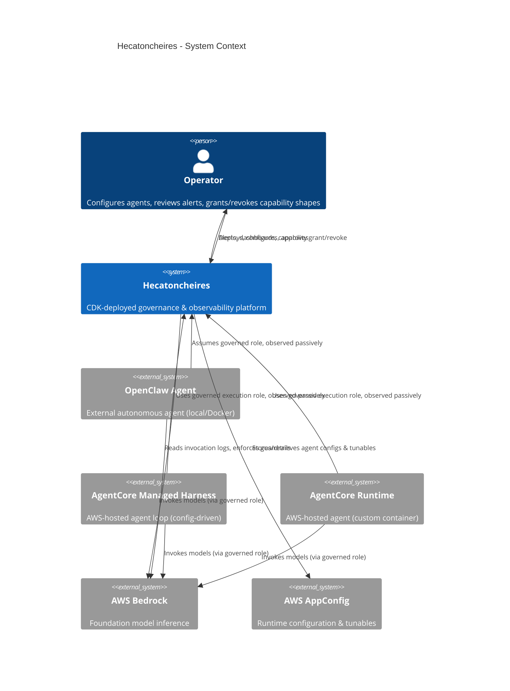
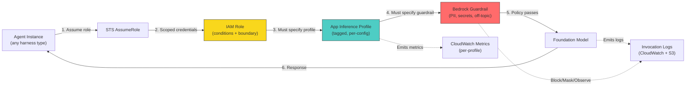
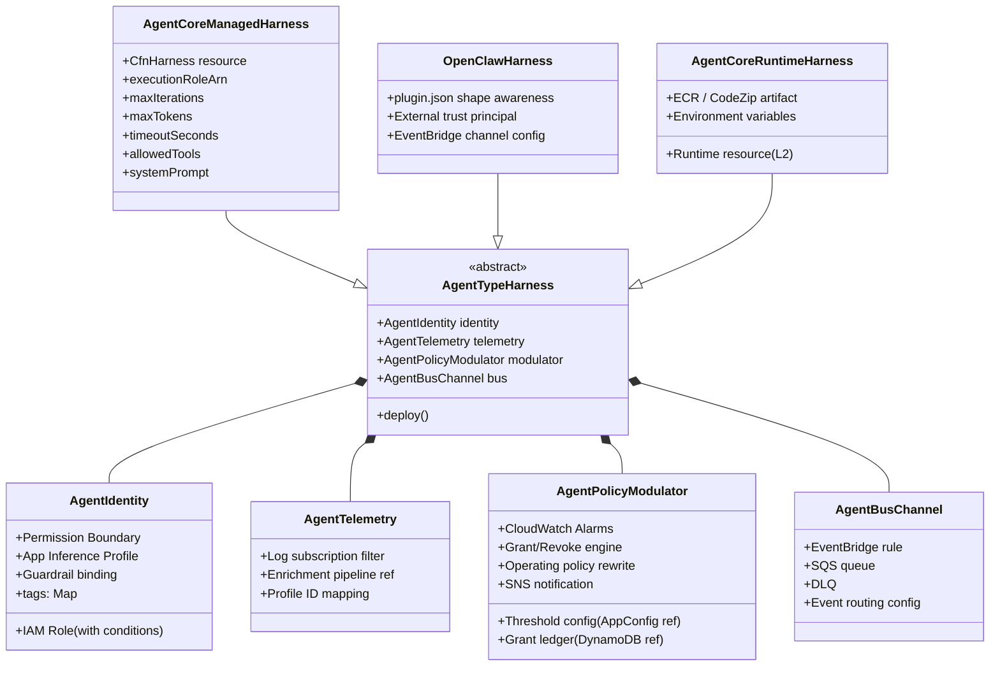
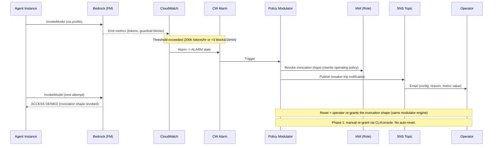
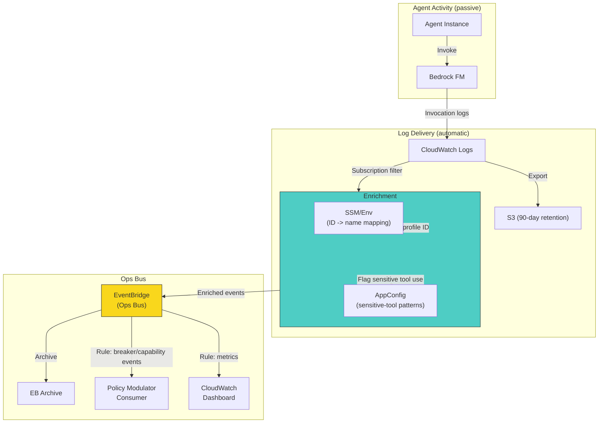
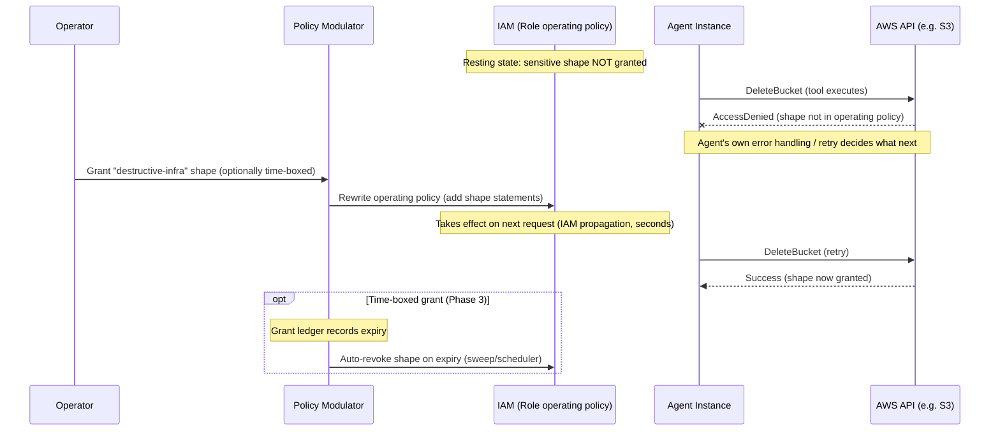
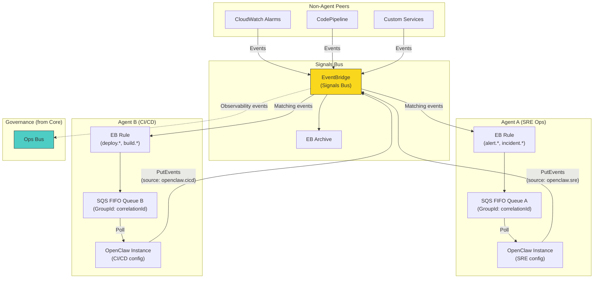
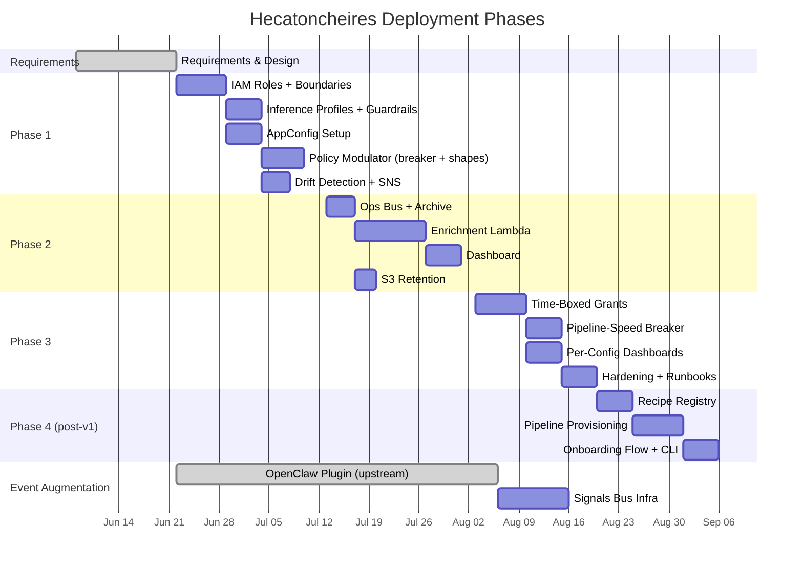
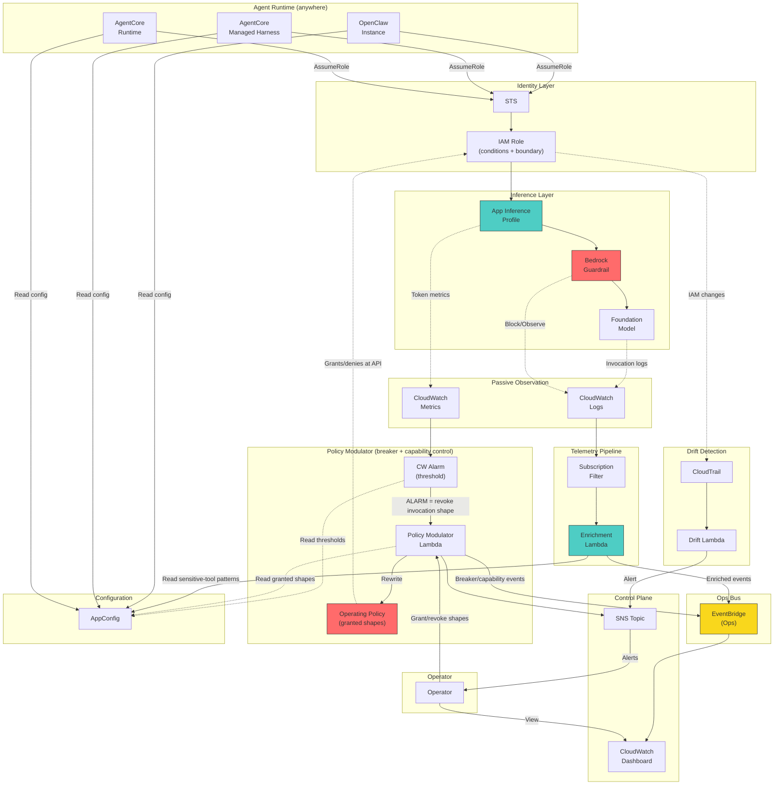

# Architecture diagrams

Mermaid diagrams for the Hecatoncheires platform. Renders natively in Obsidian.

---

## 1. System context (high-level)

What Hecatoncheires is and what surrounds it.

---

## 2. Agent invocation path (enforced boundaries)

How an agent reaches a foundation model through the governance layer.

---

## 3. CDK construct hierarchy

How the CDK constructs compose.

---

## 4. Circuit breaker flow (Phase 1 - alarm-based)

What happens when an agent exceeds thresholds.

---

## 5. Telemetry pipeline (Phase 2)

How invocation logs become structured ops events.

---

## 6. Capability control flow (operating-policy modulation)

How a sensitive AWS-backed capability is gated and granted. Replaces the earlier HITL approval flow (see [[ADR-0001-iam-operating-policy-modulator-over-hitl]]). There is no pause-resume: the capability is simply absent until granted, and its absence fails the AWS call.

---

## 7. Event augmentation module (parallel workstream)

How agents become bus-native signal processors.

---

## 8. Phase deployment progression

What exists after each phase deploys.

---

## 9. Data flow overview (complete system)

All components, all flows, at steady state after Phase 3.

