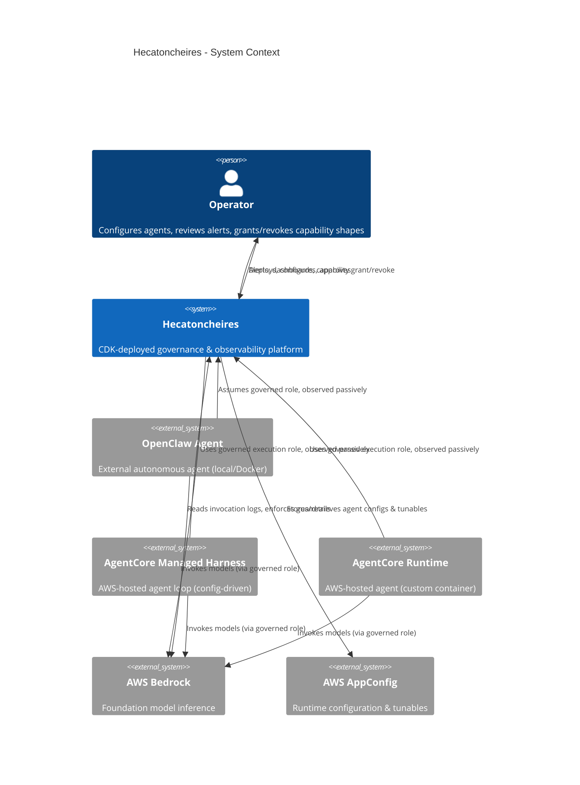
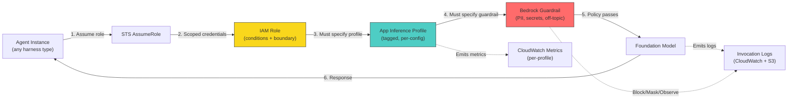
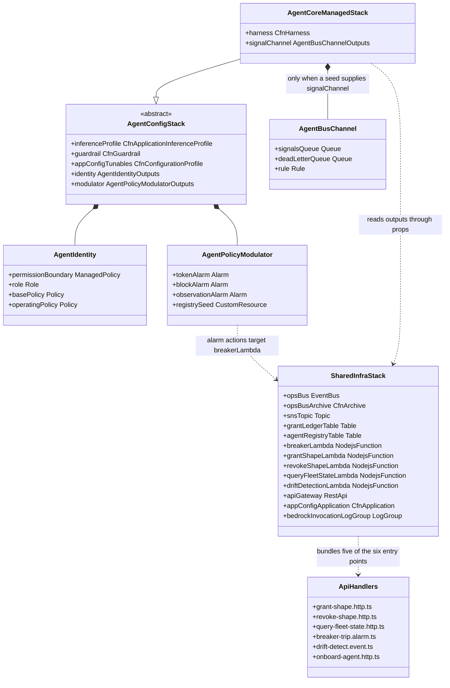
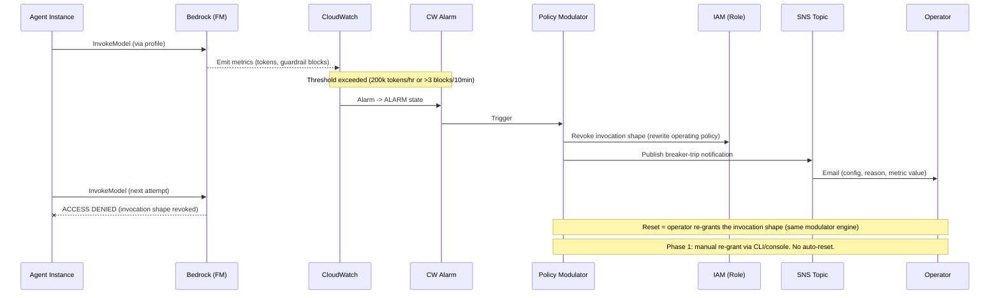
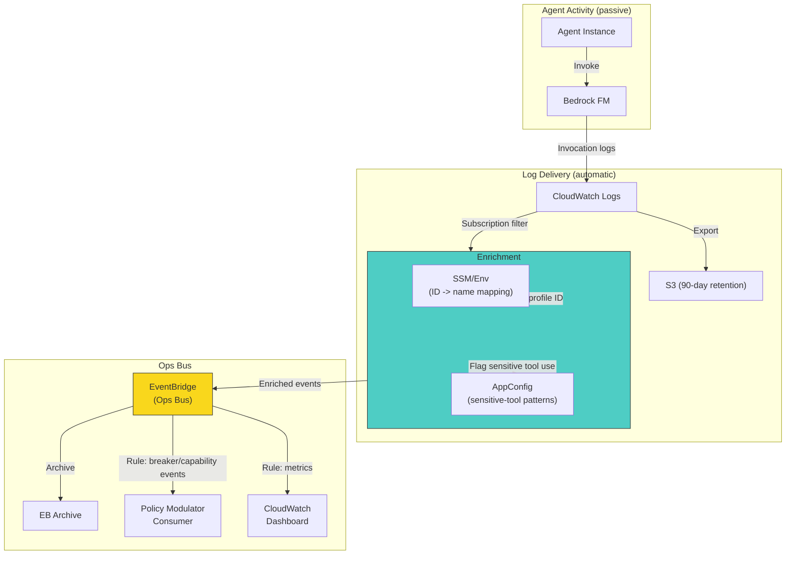
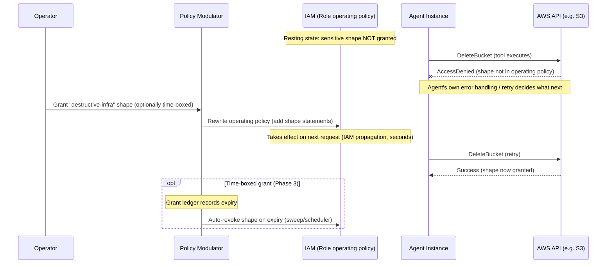
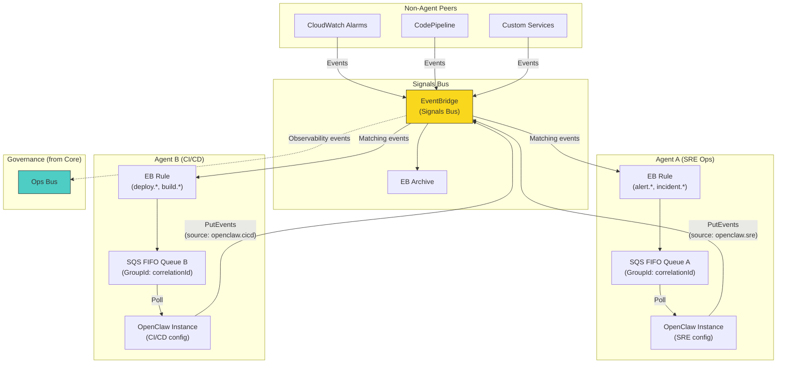
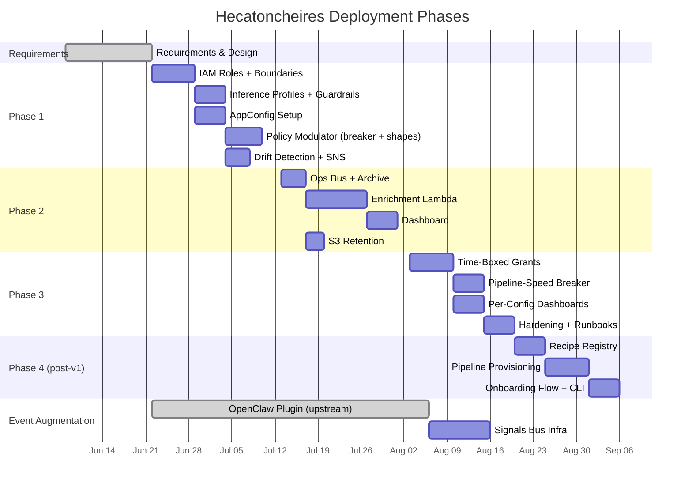
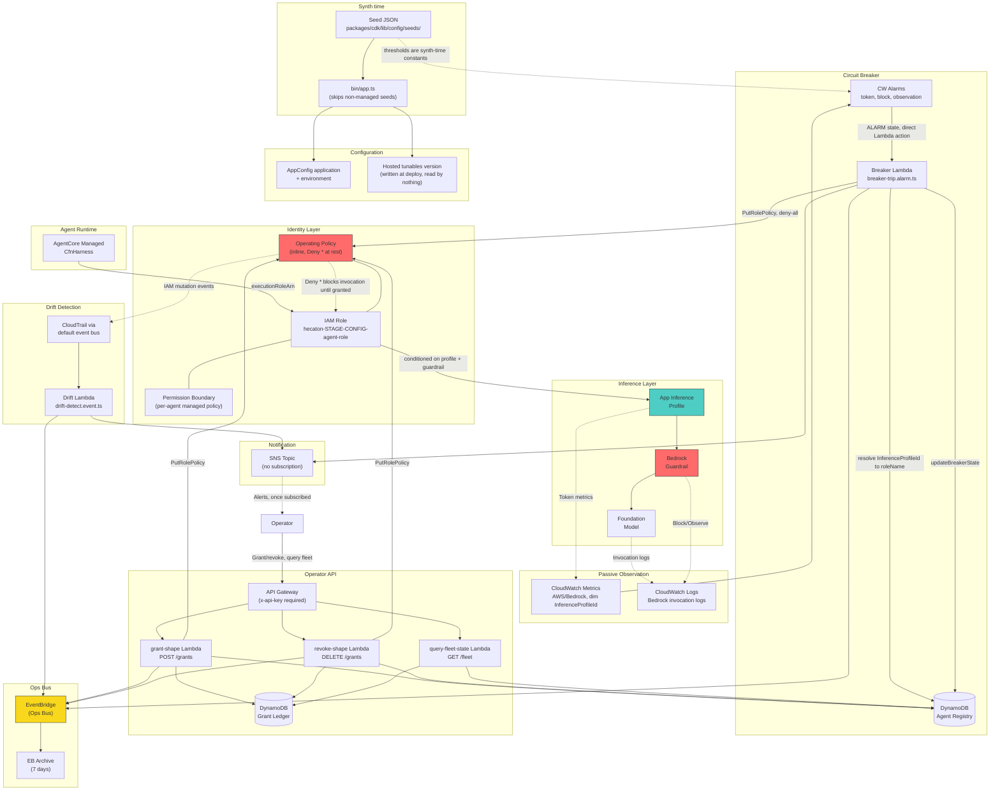

> [!note] Maintaining this document
> The copy in this repository is the one to edit. The Obsidian vault copy is a read-only archive and is no longer synchronised.
>
> Every diagram carries a status callout above its Mermaid block saying what is built and what is still specification. When you implement one of the specified paths, move it from the `Specification:` line to the `Built:` line in the same commit that lands the code. A stale status line is worse than an undated diagram, because it reads as current.
>
> Diagrams 3 and 9 are transcriptions of the code. Rewrite them from the code rather than annotating them. Closed decisions live in [decisions.md](./decisions.md).

# Architecture diagrams

Mermaid diagrams for the Hecatoncheires platform. Renders natively in Obsidian. Closed decisions are recorded in [decisions.md](./decisions.md).

---

## 1. System context (high-level)

What Hecatoncheires is and what surrounds it.

> [!note] Status: partly built
> Built: the operator, the platform, the AgentCore Managed harness leg, Bedrock, and the guardrail enforcement edge. Bedrock invocation logging is enabled by `packages/cdk/lib/stacks/shared-infra.stack.ts` and writes to a log group the platform owns.
> Specification: the OpenClaw and AgentCore Runtime legs. `AgentIdentity` builds a trust policy for both types, but neither has a stack, and `packages/cdk/bin/app.ts` skips any seed whose `agentType` is not `agentcore-managed`.
> Gap: two edges run one way in practice. "Reads invocation logs" does not happen; the log group exists and Bedrock writes to it, and nothing consumes it. "Stores/retrieves agent configs & tunables" stores only.

---

## 2. Agent invocation path (enforced boundaries)

How an agent reaches a foundation model through the governance layer.

> [!note] Status: built
> Built: all six numbered steps. `AgentIdentity` conditions every Bedrock inference action on `bedrock:InferenceProfileArn` and `bedrock:GuardrailIdentifier`, so the profile and guardrail hops are enforced rather than conventional. Per-profile metrics and invocation logs are both live.
> Specification: none.
> Gap: the diagram reads as though assuming the role is enough to reach the model. The operating policy that `AgentIdentity` attaches is `Deny *` at rest, so no model invocation is possible until a `core-invocation` grant is written into that policy. Steps 3 to 6 describe the ceiling, not the resting state.

---

## 3. CDK construct hierarchy

How the CDK constructs compose.

> [!note] Status: built
> Built: everything drawn. The diagram is a transcription of `packages/cdk/lib/` and `packages/api/src/handlers/`, so it carries no specification content by construction.
> Specification: none.
> Gap: `onboard-agent.http.ts` is in the handler folder and `packages/cdk/` contains no reference to it. There is no Lambda for it and no route to it. `AgentBusChannel` is drawn as a conditional child because the one seed in the repository supplies no signals bus ARN, so it is never synthesised.

---

## 4. Circuit breaker flow (Phase 1 - alarm-based)

What happens when an agent exceeds thresholds.

> [!note] Status: partly built
> Built: the alarm to Lambda to IAM to SNS sequence. The three alarms in `AgentPolicyModulator` are dimensioned on `InferenceProfileId` and name the shared breaker Lambda directly as their alarm action. `packages/api/src/handlers/breaker-trip.alarm.ts` resolves that dimension to a role name through the agent registry table, a participant the diagram does not show.
> Specification: nothing automates the reset. Re-granting is a manual `POST /grants` call, which is what the diagram's closing notes already say.
> Gap: the diagram says the breaker revokes the invocation shape. `packages/api/src/use-cases/trip-breaker.ts` writes a full deny-all policy to the operating policy instead, so a trip removes every granted shape rather than only invocation. The SNS publish happens, but the topic has no subscription, so no email is delivered.

---

## 5. Telemetry pipeline (Phase 2)

How invocation logs become structured ops events.

> [!note] Status: specification
> Built: two edges. Bedrock to CloudWatch Logs, which the shared stack enables through the Bedrock model invocation logging configuration, and the ops bus to its archive, a seven-day EventBridge archive. The ops bus itself exists and receives events from the breaker, grant, revoke, and drift Lambdas.
> Specification: every other edge. There is no subscription filter, no enrichment Lambda, no S3 export, no profile-ID mapping lookup, and no dashboard. The rule feeding a policy modulator consumer does not exist either; the Lambdas publish to the ops bus rather than consuming from it.
> Gap: the AppConfig node implies a runtime read of sensitive-tool patterns. `packages/api/src/adapters/appconfig/` contains only a `.gitkeep`.

---

## 6. Capability control flow (operating-policy modulation)

How a sensitive AWS-backed capability is gated and granted. Replaces an earlier stateful HITL approval flow, which was dropped as more machinery than the problem warranted. There is no pause-resume: the capability is simply absent until granted, and its absence fails the AWS call.

> [!note] Status: partly built
> Built: the grant path. The participant labelled "Policy Modulator" is API Gateway fronting a grant-shape Lambda: `POST /grants` reaches `packages/api/src/handlers/grant-shape.http.ts`, which resolves the agent through the registry, writes the grant to the ledger, and rewrites the operating policy. `DELETE /grants` is the revoke half. The deny-by-default resting state and the absence of any pause-resume step are both accurate.
> Specification: the time-boxed grant block at the end. There is no expiry sweep and no scheduler.
> Gap: the grant ledger has TTL on `expiresAt`, so DynamoDB deletes an expired grant row, and no code rewrites the operating policy when that happens. An expired grant keeps its IAM permissions after its ledger row is gone.

---

## 7. Event augmentation module (parallel workstream)

How agents become bus-native signal processors.

> [!note] Status: specification
> Built: the per-agent leg only. `AgentBusChannel` creates the FIFO queue, the dead-letter queue, and the rule, with `MessageGroupId` taken from the event's `correlationId`.
> Specification: the shared signals bus, its archive, the non-agent peers, and the observability edge to the ops bus. None of it is deployed.
> Gap: `AgentBusChannel` is unreachable from `packages/cdk/bin/app.ts`. It is instantiated only when a seed supplies a signals bus ARN, and the one seed in `packages/cdk/lib/config/seeds/` supplies none. The per-agent leg is written and never synthesised.

---

## 8. Phase deployment progression

What exists after each phase deploys.

> [!note] Status: partly built
> Built: the Phase 1 bars for IAM roles and boundaries, inference profiles and guardrails, the policy modulator, and drift detection with SNS. The AppConfig bar is built as a deploy-time write only.
> Specification: every Phase 2, Phase 3, and Phase 4 bar, and the signals bus infrastructure bar.
> Gap: the dates are the plan as drafted in June and are not maintained. Current milestone status is in the milestone table in [Hecatoncheires.md](./Hecatoncheires.md).

---

## 9. Data flow overview (as deployed)

Every component and edge that a `cdk deploy --all` currently creates.

> [!note] Status: built
> Built: everything drawn, on the same transcription basis as diagram 3. Alarm thresholds are synth-time constants taken from the seed JSON, so the alarms have no runtime configuration input.
> Specification: the telemetry pipeline, the fleet dashboard, and S3 retention are removed from this diagram rather than drawn as future work. They are in diagram 5. The signals bus is in diagram 7.
> Gap: the AppConfig nodes are written at deploy time and read by nothing. The SNS topic has no subscription, so the operator edge from it delivers nothing yet.

