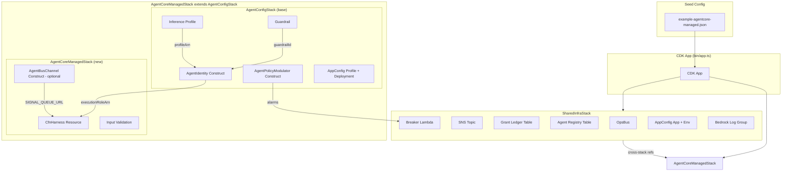
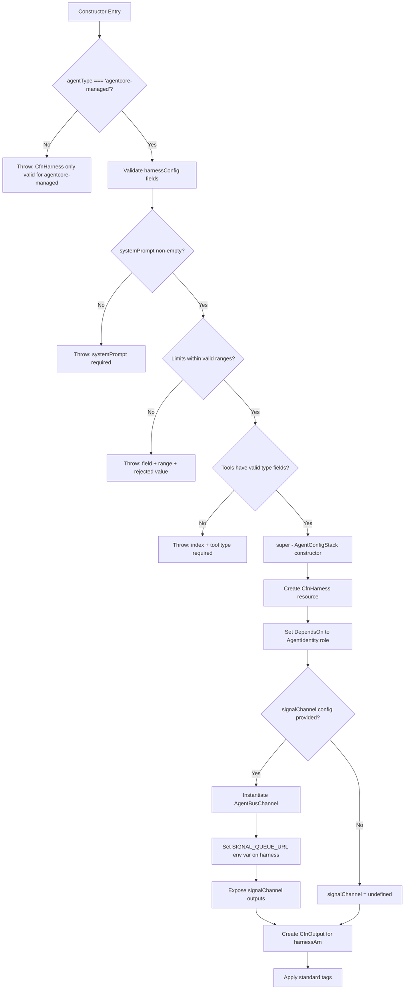

# Design Document: AgentCore Managed Harness

## Overview

This design describes the implementation of `AgentCoreManagedStack` — a concrete CDK stack subclass that extends the existing abstract `AgentConfigStack` to deploy an AWS BedrockAgentCore `CfnHarness` resource fully integrated with the Hecatoncheires governance plane.

The `AgentConfigStack` base class already provisions the foundational governance infrastructure: inference profile, guardrail, three-layer IAM role model (AgentIdentity), CloudWatch alarm-based circuit breakers (AgentPolicyModulator), and AppConfig runtime tunables. The `AgentCoreManagedStack` extends this with:

1. A `CfnHarness` resource bound to the governed IAM role
2. Harness-native per-invocation limits (maxIterations, maxTokens, timeoutSeconds)
3. Tool and skill configuration pass-through
4. Optional signal channel integration via `AgentBusChannel`
5. Input validation that fails early at synthesis time
6. A seed configuration JSON file for development deployment

**Key Design Decision:** The stack is a *thin composition layer*. All governance logic lives in existing constructs (AgentIdentity, AgentPolicyModulator, AgentBusChannel). The new stack only validates harness-specific config, creates the CfnHarness resource, and wires optional signal delivery.

## Architecture



### Layered Defense Model

The CfnHarness operates within a two-tier defense perimeter:

| Layer | Mechanism | Response Time | Scope |
|-------|-----------|---------------|-------|
| First-line | Harness-native limits (maxIterations, maxTokens, timeoutSeconds) | Immediate (per-invocation) | Single invocation |
| Second-line | Platform alarms → Breaker Lambda → operating policy deny | Minutes (alarm evaluation period) | All future invocations |

### Dependency Flow

```
SharedInfraStack (must deploy first)
    └── AgentCoreManagedStack
            ├── AgentConfigStack.constructor() [inference profile, guardrail, identity, modulator, appconfig]
            ├── Input validation (harness-specific fields)
            ├── CfnHarness resource (depends on AgentIdentity role)
            └── AgentBusChannel (optional, if signalChannel config provided)
```

## Components and Interfaces

### AgentCoreManagedStackProps

Extends `AgentConfigStackProps` with harness-specific configuration:

```typescript
import * as cdk from 'aws-cdk-lib';
import { AgentConfigStackProps } from './agent-config.stack.js';
import { AgentBusChannelOutputs } from '../constructs/agent-bus-channel.construct.js';

/** Tool definition for the CfnHarness. */
export interface HarnessToolConfig {
  /** Tool type identifier (e.g., 'codeInterpreter', 'userInput', 'http'). */
  type: string;
  /** Tool name for reference in allowedTools. */
  name: string;
  /** Tool-specific configuration (varies by type). */
  config?: Record<string, unknown>;
}

/** Skill source definition for the CfnHarness. */
export interface HarnessSkillConfig {
  /** Skill source type. */
  sourceType: 'awsSkills' | 'git' | 's3' | 'filesystem';
  /** Source location (path, URI, or bucket reference). */
  location: string;
  /** Additional source-specific fields. */
  config?: Record<string, unknown>;
}

/** Harness-specific configuration for AgentCoreManagedStack. */
export interface HarnessConfig {
  /** System prompt text (required, non-empty). */
  systemPrompt: string;
  /** Max iterations per invocation (1–1000). Optional — omitted means service default. */
  maxIterations?: number;
  /** Max output tokens per invocation (1–128000). Optional — omitted means service default. */
  maxTokens?: number;
  /** Timeout in seconds per invocation (1–3600). Optional — omitted means service default. */
  timeoutSeconds?: number;
  /** Tools available to the agent. Optional. */
  tools?: HarnessToolConfig[];
  /** Allowed tool names (whitelist). Optional. */
  allowedTools?: string[];
  /** Skills available to the agent. Optional. */
  skills?: HarnessSkillConfig[];
}

/** Signal channel configuration (optional). */
export interface SignalChannelConfig {
  /** ARN of the signals EventBridge bus. */
  signalsBusArn: string;
  /** Source namespace for event filtering. */
  sourceNamespace: string;
  /** Optional subscription patterns for filtering events. */
  subscriptionPatterns?: import('aws-cdk-lib/aws-events').EventPattern[];
}

/** Props for AgentCoreManagedStack. */
export interface AgentCoreManagedStackProps extends AgentConfigStackProps {
  /** Harness-specific configuration (required). */
  harnessConfig: HarnessConfig;
  /** Optional signal channel configuration. */
  signalChannel?: SignalChannelConfig;
}
```

### AgentCoreManagedStack Class

```typescript
import * as cdk from 'aws-cdk-lib';
import * as bedrockagentcore from 'aws-cdk-lib/aws-bedrockagentcore';
import { Construct } from 'constructs';
import { NamingGenerator } from '@hecaton/core';
import { AgentConfigStack } from './agent-config.stack.js';
import { AgentBusChannel, AgentBusChannelOutputs } from '../constructs/agent-bus-channel.construct.js';

export class AgentCoreManagedStack extends AgentConfigStack {
  /** The deterministic harness name. */
  readonly harnessName: string;
  /** Signal channel outputs (undefined if signal channel not configured). */
  readonly signalChannel: AgentBusChannelOutputs | undefined;

  constructor(scope: Construct, id: string, props: AgentCoreManagedStackProps) {
    // 1. Validate agentType is 'agentcore-managed'
    // 2. Validate harness config fields
    // 3. Call super() — creates identity, modulator, appconfig, etc.
    // 4. Create CfnHarness resource
    // 5. Optionally create AgentBusChannel
    // 6. Set up DependsOn and outputs
  }
}
```

### Constructor Flow (Detailed)



### Validation Rules (Ordered)

Validation is performed sequentially. The first failing check throws and halts synthesis:

| Order | Field | Condition | Error Message Pattern |
|-------|-------|-----------|---------------------|
| 1 | `agentType` | Must be `'agentcore-managed'` | `AgentCoreManagedStack: CfnHarness creation is only valid for agentType 'agentcore-managed'` |
| 2 | `harnessConfig.systemPrompt` | Non-empty, non-whitespace string | `AgentCoreManagedStack: systemPrompt must be a non-empty, non-whitespace string` |
| 3 | `harnessConfig.maxIterations` | If present: positive integer, 1–1000 | `AgentCoreManagedStack: maxIterations must be a positive integer (1–1000), got {value}` |
| 4 | `harnessConfig.maxTokens` | If present: positive integer, 1–128000 | `AgentCoreManagedStack: maxTokens must be a positive integer (1–128000), got {value}` |
| 5 | `harnessConfig.timeoutSeconds` | If present: positive integer, 1–3600 | `AgentCoreManagedStack: timeoutSeconds must be a positive integer (1–3600), got {value}` |
| 6 | `harnessConfig.tools[i].type` | Each tool entry must have non-empty `type` | `AgentCoreManagedStack: tools[{index}].type is required and must be non-empty` |

### CfnHarness Resource Mapping

| HarnessConfig field | CfnHarness property | Conditional |
|--------------------|--------------------|-------------|
| `systemPrompt` | `systemPrompt: [{ text }]` | Always (required) |
| `maxIterations` | `maxIterations` | Only if provided |
| `maxTokens` | `model.bedrockModelConfig.maxTokens` | Only if provided |
| `timeoutSeconds` | `timeoutSeconds` | Only if provided |
| `tools` | `tools` (mapped 1:1) | Only if non-empty |
| `allowedTools` | `allowedTools` | Only if non-empty |
| `skills` | `skills` (mapped 1:1) | Only if non-empty |

Additionally, these are always set from base stack props/constructs:
- `executionRoleArn` ← `this.identity.role.roleArn`
- `harnessName` ← `naming.harnessName(configName)`
- `model.bedrockModelConfig.modelId` ← `props.modelId`

## Data Models

### Seed Configuration JSON Schema

File location: `packages/cdk/lib/config/seeds/example-agentcore-managed.json`

```typescript
/** TypeScript interface the seed JSON must satisfy. */
interface SeedConfig {
  configName: string;           // 2–40 chars, matches ConfigNamePattern
  agentType: 'agentcore-managed';
  modelId: string;              // Non-empty Bedrock model identifier
  thresholds: {
    outputTokensPerHour: number;          // Positive integer, ≤1000 for dev
    guardrailBlocksPer10Min: number;      // Positive integer, ≤5 for dev
    guardrailObservationsPerHour: number; // Positive integer, ≤50 for dev
  };
  harnessConfig: {
    systemPrompt: string;       // Non-empty system instructions
    maxIterations?: number;     // Optional, 1–1000
    maxTokens?: number;         // Optional, 1–128000
    timeoutSeconds?: number;    // Optional, 1–3600
    tools?: HarnessToolConfig[];
    allowedTools?: string[];
    skills?: HarnessSkillConfig[];
  };
  signalChannel?: {
    signalsBusArn: string;
    sourceNamespace: string;
    subscriptionPatterns?: EventPattern[];
  };
  guardrailOverrides?: Partial<GuardrailPolicyConfig>;
}
```

### Example Seed File

```json
{
  "configName": "test-managed",
  "agentType": "agentcore-managed",
  "modelId": "us.anthropic.claude-sonnet-4-20250514-v1:0",
  "thresholds": {
    "outputTokensPerHour": 500,
    "guardrailBlocksPer10Min": 3,
    "guardrailObservationsPerHour": 20
  },
  "harnessConfig": {
    "systemPrompt": "You are a test agent governed by the Hecatoncheires platform. Follow all instructions within your assigned capability boundaries.",
    "maxIterations": 10,
    "maxTokens": 4096,
    "timeoutSeconds": 120
  }
}
```

### CDK App Entry Point Changes (bin/app.ts)

The entry point will:
1. Glob or statically import seed JSON files from `lib/config/seeds/`
2. Filter for `agentType === 'agentcore-managed'`
3. Instantiate an `AgentCoreManagedStack` per matching seed
4. Add explicit CDK dependency from each agent stack to SharedInfraStack

Stack naming convention: `Hecaton-{Stage}-AgentConfig-{ConfigNameCapitalized}`
- Example: stage `dev`, configName `test-managed` → `Hecaton-Dev-AgentConfig-TestManaged`

The `ConfigNameCapitalized` transform: split on hyphens, capitalize each segment, join without separator.

```typescript
function toStackSuffix(configName: string): string {
  return configName
    .split('-')
    .map((s) => s.charAt(0).toUpperCase() + s.slice(1))
    .join('');
}
// 'test-managed' → 'TestManaged'
```

### CloudFormation Resource Outputs

| Output | Export Name | Value |
|--------|------------|-------|
| Harness ARN | `{stackId}-harnessArn` | `harness.attrHarnessArn` |

## Error Handling

### Synthesis-Time Validation Errors

All validation occurs before resource creation (fail-fast). Errors are thrown as standard JavaScript `Error` instances with descriptive messages that include:
- The stack/construct name prefix (`AgentCoreManagedStack:`)
- The specific field that failed
- The constraint that was violated
- The rejected value (for limits)

### Error Ordering Guarantee

Validation checks execute in a fixed order (agentType → systemPrompt → maxIterations → maxTokens → timeoutSeconds → tools). The first failure halts execution. This produces deterministic error messages for the same invalid input.

### Base Class Validation

The parent `AgentConfigStack.constructor()` performs its own validation (configName, modelId) which executes after harness-specific validation. This means:
- If agentType is wrong → harness validation catches it first
- If configName is invalid → base class catches it (after harness validation passes)
- If modelId is empty → base class catches it

### Runtime Errors (Deploy-Time)

CloudFormation deployment errors are not handled by this stack — they are surfaced by the CDK CLI. The stack's responsibility ends at producing a valid CloudFormation template.

## Testing Strategy

### Why Property-Based Testing Does NOT Apply

This feature is pure Infrastructure as Code (CDK constructs and stacks). Testing validates:
- CloudFormation template structure (declarative output)
- Resource presence/absence based on configuration
- Validation error messages for invalid inputs

These are best served by CDK assertion tests using `Template.fromStack()` and `Match` utilities — the standard approach already established in this project.

### Test Architecture

```
packages/cdk/test/
├── setup.ts                              (existing mock for NodejsFunction)
├── stacks/
│   ├── test-agent-config.stack.ts        (existing test helper)
│   ├── agent-config.stack.test.ts        (existing base tests)
│   └── agentcore-managed.stack.test.ts   (NEW)
└── constructs/
    └── ...                               (existing construct tests)
```

### Test Helper Pattern

Following the existing `createTestStacks()` pattern, the new test file will define:

```typescript
function createManagedTestStacks(overrides?: Partial<{
  stage: string;
  configName: string;
  modelId: string;
  harnessConfig: Partial<HarnessConfig>;
  signalChannel: SignalChannelConfig;
}>) {
  const app = new cdk.App();
  const sharedInfra = new SharedInfraStack(app, 'SharedInfra', { stage: overrides?.stage ?? 'test' });
  const managedStack = new AgentCoreManagedStack(app, 'ManagedStack', {
    stage: overrides?.stage ?? 'test',
    configName: overrides?.configName ?? 'test-managed',
    agentType: 'agentcore-managed',
    modelId: overrides?.modelId ?? 'us.anthropic.claude-sonnet-4-20250514-v1:0',
    thresholds: { outputTokensPerHour: 500, guardrailBlocksPer10Min: 3, guardrailObservationsPerHour: 20 },
    harnessConfig: {
      systemPrompt: 'Test system prompt.',
      ...overrides?.harnessConfig,
    },
    signalChannel: overrides?.signalChannel,
    sharedInfra: { /* all cross-stack refs from sharedInfra */ },
  });

  return { app, sharedInfra, managedStack, template: Template.fromStack(managedStack) };
}
```

### Test Cases by Requirement

#### Requirement 1: CfnHarness Resource Creation
- **Positive:** Template contains exactly 1 `AWS::BedrockAgentCore::Harness` resource
- **Positive:** `executionRoleArn` references the AgentIdentity role (via Fn::GetAtt)
- **Positive:** `harnessName` matches NamingGenerator pattern
- **Positive:** `model.bedrockModelConfig.modelId` matches provided modelId
- **Positive:** `systemPrompt` contains content block with text
- **Negative:** Omitting systemPrompt → omitted from resource (covered by Req 8 validation which requires it)
- **Positive:** Standard tags applied to CfnHarness resource

#### Requirement 2: Harness-Native Limits
- **Positive:** Each limit property appears when provided
- **Negative:** Each limit property is `Match.absent()` when not provided
- **Positive:** All three limits can be set independently/together
- **Negative:** Invalid limit values throw synthesis errors

#### Requirement 3: Tool and Skill Configuration
- **Positive:** Tools array maps 1:1 preserving order
- **Positive:** AllowedTools array preserved in order
- **Positive:** Skills array maps 1:1
- **Negative:** Empty/absent tools → property absent from template
- **Positive:** Independent configuration (tools presence doesn't affect skills)

#### Requirement 4: Governance Composition
- **Positive:** CfnHarness has DependsOn to IAM role logical ID
- **Positive:** CfnOutput exists with harnessArn export
- **Positive:** `harnessName` property on stack instance matches pattern
- **Positive:** executionRoleArn references role with permission boundary
- **Negative:** agentType !== 'agentcore-managed' throws error

#### Requirement 5: Signal Channel Integration
- **Positive with channel:** Template contains SQS FIFO queue + DLQ + EventBridge rule
- **Positive with channel:** SIGNAL_QUEUE_URL environment variable set
- **Negative without channel:** Zero signal-related resources in template

#### Requirement 6: Seed Configuration
- **Positive:** JSON file parses successfully
- **Positive:** Parsed config satisfies TypeScript interface (compile-time check)
- **Positive:** configName passes ConfigNamePattern validation

#### Requirement 7: CDK App Instantiation
- **Positive:** `cdk synth` exits with code 0
- **Positive:** Both SharedInfra and AgentCoreManagedStack templates produced
- **Positive:** Stack naming follows pattern

#### Requirement 8: Input Validation
- **Negative:** Empty systemPrompt throws
- **Negative:** Whitespace-only systemPrompt throws
- **Negative:** Invalid maxIterations throws (0, negative, >1000, non-integer)
- **Negative:** Invalid maxTokens throws
- **Negative:** Invalid timeoutSeconds throws
- **Negative:** Tool with empty type throws (includes index in error)
- **Positive:** Validation fails before resource creation

#### Requirement 9: CDK Assertion Tests
- Meta: tests themselves satisfy coverage requirements

#### Requirement 10: Successful CDK Synthesis
- **Integration:** Full `cdk synth` produces valid templates
- **Positive:** Template contains all expected resource types
- **Positive:** No circular dependencies

### Test Execution

```bash
# Run all CDK package tests (includes the new test file)
pnpm --filter @hecaton/cdk test

# Run only the new test file
pnpm --filter @hecaton/cdk test -- agentcore-managed.stack.test
```

Tests use the existing `test/setup.ts` vitest mock that replaces `NodejsFunction` with inline Lambda code to avoid esbuild invocations during test synthesis.
