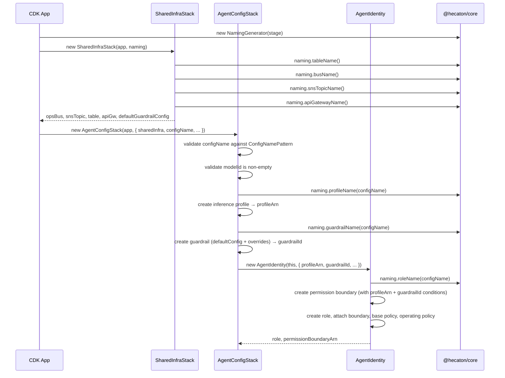

# Design Document

## Overview

This design covers the CDK infrastructure layer for the Hecatoncheires governance platform — specifically the SharedInfraStack (deployed once per account/stage), the AgentConfigStack base class (one per agent configuration), and the AgentIdentity construct (the three-layer IAM role model). These are architecture steps 7-8 from the project plan, building on the complete `@hecaton/core` foundation.

The SharedInfraStack provisions account-level shared resources: the ops EventBridge bus, SNS notification topic, grant ledger DynamoDB table, API Gateway shell, and a default guardrail configuration object (typed data, not an AWS resource). The AgentConfigStack is the orchestrating base class that each agent configuration extends — it validates configuration, creates the inference profile and guardrail resources, then instantiates the AgentIdentity construct passing the resolved `profileArn` and `guardrailId`. AgentIdentity is purely IAM-focused: it creates the permission boundary, IAM role with trust policy, base policy, and deny-by-default operating policy.

A `TestAgentConfigStack` is included as a concrete implementation of AgentConfigStack for assertion testing — it proves out the full pattern without requiring real seed configs.

All resource names and tags are generated using `NamingGenerator` from `@hecaton/core`, ensuring consistency between the domain layer and infrastructure.

## Architecture

```mermaid
graph TD
    subgraph SharedInfraStack
        OB[Ops EventBridge Bus]
        AR[Bus Archive 7-day]
        SNS[SNS Notification Topic]
        GL[Grant Ledger DynamoDB Table]
        APIGW[API Gateway REST API]
        DGC[Default Guardrail Config typed object]
    end

    subgraph "AgentConfigStack (per config)"
        IP[Inference Profile]
        GR[Guardrail]
        subgraph AgentIdentity Construct
            PB[Permission Boundary per-agent]
            ROLE[IAM Role]
            BP[Base Policy]
            OP[Operating Policy deny-by-default]
        end
    end

    OB --> AR
    PB -.-> ROLE
    ROLE --> BP
    ROLE --> OP
    IP -.->|profileArn| AgentIdentity Construct
    GR -.->|guardrailId| AgentIdentity Construct
    DGC -.->|default config| GR
    SharedInfraStack -.->|cross-stack refs| AgentConfigStack
```



## Components and Interfaces

### Component 1: SharedInfraStack

**Purpose**: Deploy-once shared resources that all agent configurations reference. Provides the foundational infrastructure other stacks (AgentConfigStack, TelemetryStack) depend on via cross-stack references. Also defines the default guardrail configuration as a typed object for consumption by AgentConfigStacks.

**Interface**:

```typescript
/** Typed guardrail policy configuration — data only, not an AWS resource. */
interface GuardrailPolicyConfig {
  contentFilters: {
    type: 'SEXUAL' | 'VIOLENCE' | 'HATE' | 'INSULTS' | 'MISCONDUCT' | 'PROMPT_ATTACK';
    inputStrength: 'NONE' | 'LOW' | 'MEDIUM' | 'HIGH';
    outputStrength: 'NONE' | 'LOW' | 'MEDIUM' | 'HIGH';
  }[];
  deniedTopics: {
    name: string;
    definition: string;
    examples: string[];
  }[];
}

interface SharedInfraStackProps extends cdk.StackProps {
  stage: string;
}

interface SharedInfraOutputs {
  opsBus: events.IEventBus;
  opsBusArn: string;
  snsTopic: sns.ITopic;
  snsTopicArn: string;
  grantLedgerTable: dynamodb.ITable;
  grantLedgerTableArn: string;
  grantLedgerTableName: string;
  apiGateway: apigateway.IRestApi;
  apiGatewayId: string;
  apiGatewayUrl: string;
  defaultGuardrailConfig: GuardrailPolicyConfig;
}
```

**Responsibilities**:
- Create and configure the ops EventBridge bus with a 7-day archive
- Create the SNS notification topic for operational alerts
- Create the grant ledger DynamoDB table (PK: `configName`, SK: `grantId`)
- Create the API Gateway REST API shell with `apiKeyRequired: true` at the stage level (no routes or methods)
- Define a default guardrail policy configuration as a typed object (NOT an AWS resource)
- Expose the default guardrail config as a typed reference for AgentConfigStacks to consume
- Export all outputs as CfnOutputs for cross-stack consumption
- Apply standard tags to all resources via `cdk.Tags.of(this)`

**Note**: The permission boundary is *not* in SharedInfraStack. Because boundary condition keys must reference the agent's specific inference profile ARN and guardrail ID (values that don't exist until AgentConfigStack creates them), the boundary is per-agent and lives inside the AgentIdentity construct. See Component 3 for details.

**Deferred to later phases** (listed in architecture doc but out of scope for this spec):
- EventBridge alarm-forwarding rule — deferred to the event work spec (event pattern not yet defined)
- Bedrock invocation logging enablement — requires cross-service log delivery configuration; deferred to TelemetryStack (Phase 2)
- Drift detection (CloudTrail rule + Lambda) — deferred to Phase 2 operational hardening
- AppConfig application + environments — deferred until the tunables reader adapter is implemented in `packages/api`
- SNS topic encryption (KMS) — future enhancement

### Component 2: AgentConfigStack (Base Class)

**Purpose**: Orchestrating abstract base for per-agent stacks. Validates configuration, creates the inference profile and guardrail resources, then instantiates AgentIdentity passing the resolved `profileArn` and `guardrailId`. Each real agent configuration (from a seed JSON) extends this class.

**Interface**:

```typescript
interface AgentConfigStackProps extends cdk.StackProps {
  stage: string;
  configName: string;
  agentType: 'agentcore-managed' | 'openclaw' | 'agentcore-runtime';
  modelId: string;
  guardrailOverrides?: Partial<GuardrailPolicyConfig>;
  /** Required when agentType === 'openclaw'. */
  externalPrincipalArn?: string;
  /** Cross-stack references from SharedInfraStack. */
  sharedInfra: {
    opsBus: events.IEventBus;
    snsTopic: sns.ITopic;
    grantLedgerTable: dynamodb.ITable;
    defaultGuardrailConfig: GuardrailPolicyConfig;
  };
}

abstract class AgentConfigStack extends cdk.Stack {
  /** The AgentIdentity outputs — always available after construction. */
  readonly identity: AgentIdentityOutputs;

  constructor(scope: Construct, id: string, props: AgentConfigStackProps) {
    super(scope, id, props);
    // 1. Validate configName against ConfigNamePattern
    // 2. Validate modelId is non-empty
    // 3. Create inference profile (CfnApplicationInferenceProfile) → profileArn
    // 4. Create guardrail (defaultGuardrailConfig + per-agent overrides) → guardrailId
    // 5. Instantiate AgentIdentity, passing profileArn and guardrailId
    // 6. Apply standard tags
  }
}
```

**Responsibilities**:
- Validate `configName` against `ConfigNamePattern` from `@hecaton/core` at synth time
- Validate `modelId` is non-empty at synth time
- Create a `CfnApplicationInferenceProfile` resource, tagged for cost attribution (`hecatoncheires:config={configName}`)
- Create a Bedrock guardrail resource using the default guardrail config from SharedInfraStack merged with per-agent overrides
- Instantiate AgentIdentity with the resolved `profileArn` and `guardrailId`
- Apply standard tags (`hecatoncheires:managed`, `hecatoncheires:config`, `hecatoncheires:stage`, `hecatoncheires:phase`)
- Expose `identity` outputs for subclasses and downstream stacks
- Provide a hook point for subclasses to add further constructs (policy modulator, bus channel, etc.)

**Resource creation order within the constructor**:
1. Validate `configName` and `modelId`
2. Create inference profile → yields `profileArn` (CDK token)
3. Create guardrail (merge `defaultGuardrailConfig` + `guardrailOverrides`) → yields `guardrailId` (CDK token)
4. Instantiate AgentIdentity, passing `profileArn` and `guardrailId`
5. Apply standard tags via `cdk.Tags.of(this)`

Because inference profile, guardrail, and AgentIdentity resources all reside in the same stack, CDK handles the dependency graph automatically via token references. No explicit `addDependency` calls needed.

### Component 3: AgentIdentity Construct

**Purpose**: Encapsulate the three-layer IAM role model for a single agent configuration. Receives `profileArn` and `guardrailId` as inputs (created by AgentConfigStack) and produces a fully governed role with a per-agent permission boundary (with resolved condition keys), base permissions, and deny-by-default operating policy. AgentIdentity is purely IAM-focused — it does not create inference profiles or guardrails.

**Interface**:

```typescript
interface AgentIdentityProps {
  configName: string;
  agentType: 'agentcore-managed' | 'openclaw' | 'agentcore-runtime';
  /** The ARN of the inference profile, created by AgentConfigStack. */
  profileArn: string;
  /** The ID of the guardrail, created by AgentConfigStack. */
  guardrailId: string;
  /** Required when agentType === 'openclaw'. The IAM principal ARN trusted to assume this role. */
  externalPrincipalArn?: string;
  tags: Record<string, string>;
}

interface AgentIdentityOutputs {
  role: iam.IRole;
  permissionBoundaryArn: string;
}
```

**Responsibilities**:
- Create the per-agent permission boundary managed policy with condition keys resolved using the `profileArn` and `guardrailId` passed as props
- Create IAM role with trust policy varying by `agentType`:
  - `agentcore-managed` / `agentcore-runtime`: trust `bedrock-agentcore.amazonaws.com`
  - `openclaw`: trust the principal specified by `externalPrincipalArn` (validated as non-empty when `agentType === 'openclaw'`)
- Attach the per-agent permission boundary to the role
- Attach a base inline policy (CloudWatch Logs write, own-profile describe)
- Attach an operating policy inline (deny-by-default: `{"Effect":"Deny","Action":"*","Resource":"*"}`)
- Expose outputs (`role`, `permissionBoundaryArn`) for downstream constructs

**Resource creation order within the construct**:
1. Permission Boundary → references `profileArn` and `guardrailId` in condition keys (received as props)
2. IAM Role → boundary attached, trust policy set
3. Base Policy → attached as inline policy on the role
4. Operating Policy → attached as inline policy on the role

Because `profileArn` and `guardrailId` are CDK tokens passed from AgentConfigStack (where the resources were created), CloudFormation resolves them at deploy time. No cross-stack references are needed — all resources (profile, guardrail, boundary, role) live in the same AgentConfigStack.

**Note on condition key enforcement**: Condition keys (`bedrock:InferenceProfileArn`, `bedrock:GuardrailIdentifier`) are enforced at the **permission boundary** level, not on the base or operating policy. This ensures that regardless of what the operating policy grants, the boundary's conditions constrain all Bedrock inference calls to the assigned profile and guardrail. See the Permission Boundary Policy section for the concrete statements.

### Component 4: TestAgentConfigStack

**Purpose**: A concrete, minimal implementation of AgentConfigStack used exclusively in CDK assertion tests. Proves out the full pattern (SharedInfraStack → AgentConfigStack → inference profile → guardrail → AgentIdentity → IAM resources) without requiring real seed configs or additional constructs (policy modulator, bus channel, etc.).

**Interface**:

```typescript
class TestAgentConfigStack extends AgentConfigStack {
  constructor(scope: Construct, id: string, props: AgentConfigStackProps) {
    super(scope, id, props);
    // No additional constructs — identity is sufficient for pattern validation
  }
}
```

**Test usage**:

```typescript
import { App } from 'aws-cdk-lib';
import { Template } from 'aws-cdk-lib/assertions';
import { SharedInfraStack } from '../lib/stacks/shared-infra.stack.js';
import { TestAgentConfigStack } from '../test/stacks/test-agent-config.stack.js';

const app = new App();
const sharedInfra = new SharedInfraStack(app, 'Hecaton-Test-SharedInfra', {
  stage: 'test',
});

const agentStack = new TestAgentConfigStack(app, 'Hecaton-Test-AgentConfig-SreOps', {
  stage: 'test',
  configName: 'sre-ops',
  agentType: 'agentcore-managed',
  modelId: 'us.anthropic.claude-sonnet-4-20250514-v1:0',
  sharedInfra: {
    opsBus: sharedInfra.opsBus,
    snsTopic: sharedInfra.snsTopic,
    grantLedgerTable: sharedInfra.grantLedgerTable,
    defaultGuardrailConfig: sharedInfra.defaultGuardrailConfig,
  },
});

const template = Template.fromStack(agentStack);
// Assert: inference profile, guardrail, IAM role, boundary, policies...
```

**What it validates**:
- AgentConfigStack base correctly creates inference profile and guardrail before AgentIdentity
- AgentIdentity receives `profileArn` and `guardrailId` and produces IAM resources
- The full resource creation chain works: profile → guardrail → boundary → role
- Cross-stack references from SharedInfraStack (including `defaultGuardrailConfig`) are consumable
- Standard tags propagate through the base class
- Naming patterns from `NamingGenerator` are applied

**File location**: `packages/cdk/test/stacks/test-agent-config.stack.ts`

### Component 5: CDK App Entry Point

**Purpose**: Instantiate stacks for the target stage.

```typescript
// bin/app.ts
const app = new App();
const stage = app.node.tryGetContext('stage') ?? 'dev';
const env = { account: process.env.CDK_DEFAULT_ACCOUNT, region: process.env.CDK_DEFAULT_REGION };

// Shared infrastructure — deployed once
const sharedInfra = new SharedInfraStack(app, `Hecaton-${capitalize(stage)}-SharedInfra`, {
  stage,
  env,
});

// Per-agent stacks — one per seed config
// (In production these are generated from seed JSON files;
//  for now we show the manual pattern)
const sreOps = new SreOpsAgentConfigStack(app, `Hecaton-${capitalize(stage)}-AgentConfig-SreOps`, {
  stage,
  configName: 'sre-ops',
  agentType: 'agentcore-managed',
  modelId: 'us.anthropic.claude-sonnet-4-20250514-v1:0',
  sharedInfra: {
    opsBus: sharedInfra.opsBus,
    snsTopic: sharedInfra.snsTopic,
    grantLedgerTable: sharedInfra.grantLedgerTable,
    defaultGuardrailConfig: sharedInfra.defaultGuardrailConfig,
  },
  env,
});
```

## Data Models

### Grant Ledger Table Schema

```typescript
// DynamoDB single-table design
interface GrantLedgerKey {
  configName: string;  // Partition key (S)
  grantId: string;     // Sort key (S) — UUIDv7, K-sortable
}

// Attributes match GrantRecord from @hecaton/core
interface GrantLedgerItem extends GrantLedgerKey {
  shapeName: string;
  parameters: Record<string, string>;
  grantedAt: string;   // ISO 8601
  grantedBy: string;
  expiresAt?: string;  // ISO 8601, optional TTL source
}
```

**Table Configuration**:
- Billing: PAY_PER_REQUEST (on-demand)
- Point-in-time recovery: enabled
- Removal policy: RETAIN (data preservation)
- TTL attribute: `expiresAt` (for automatic grant expiry)

### Permission Boundary Policy (Per-Agent)

The permission boundary is the absolute ceiling, created by AgentIdentity for each agent configuration. It lives in the same stack as the role, profile, and guardrail — this allows CDK tokens to resolve the condition key values at deploy time. Each agent gets its own managed policy with condition keys pointing to its specific inference profile and guardrail.

```typescript
// The absolute ceiling for all agent roles
const permissionBoundaryStatements: iam.PolicyStatement[] = [
  // Allow Bedrock inference — conditioned on profile + guardrail binding
  new iam.PolicyStatement({
    effect: iam.Effect.ALLOW,
    actions: [
      'bedrock:InvokeModel',
      'bedrock:InvokeModelWithResponseStream',
      'bedrock:Converse',
      'bedrock:ConverseStream',
    ],
    resources: ['*'],
    conditions: {
      StringEquals: {
        'bedrock:InferenceProfileArn': '${inferenceProfileArn}', // resolved per-agent at synth
        'bedrock:GuardrailIdentifier': '${guardrailId}',         // resolved per-agent at synth
      },
    },
  }),
  // Allow guardrail application (content validation by agent or runtime)
  new iam.PolicyStatement({
    effect: iam.Effect.ALLOW,
    actions: ['bedrock:ApplyGuardrail'],
    resources: ['*'],
    conditions: {
      StringEquals: {
        'bedrock:GuardrailIdentifier': '${guardrailId}',
      },
    },
  }),
  // Allow describing own inference profile (unconditional, read-only)
  new iam.PolicyStatement({
    effect: iam.Effect.ALLOW,
    actions: ['bedrock:GetInferenceProfile'],
    resources: ['*'],
    conditions: {
      StringEquals: {
        'aws:ResourceTag/hecatoncheires:managed': 'true',
      },
    },
  }),
  // Allow CloudWatch Logs write (agent observability)
  new iam.PolicyStatement({
    effect: iam.Effect.ALLOW,
    actions: [
      'logs:CreateLogGroup',
      'logs:CreateLogStream',
      'logs:PutLogEvents',
    ],
    resources: ['arn:aws:logs:*:*:log-group:/aws/bedrock/*'],
  }),
  // Allow CloudWatch Logs read (for cloudwatch-logs-read shape)
  new iam.PolicyStatement({
    effect: iam.Effect.ALLOW,
    actions: [
      'logs:GetLogEvents',
      'logs:FilterLogEvents',
      'logs:DescribeLogGroups',
      'logs:DescribeLogStreams',
    ],
    resources: ['arn:aws:logs:*:*:log-group:/aws/bedrock/*'],
  }),
  // Allow S3 access scoped to hecatoncheires-managed buckets
  new iam.PolicyStatement({
    effect: iam.Effect.ALLOW,
    actions: ['s3:GetObject', 's3:PutObject', 's3:ListBucket'],
    resources: [
      'arn:aws:s3:::hecaton-*',    // bucket-level (ListBucket)
      'arn:aws:s3:::hecaton-*/*',  // object-level (Get/Put)
    ],
  }),
];
```

**Note on condition key resolution**: The `${inferenceProfileArn}` and `${guardrailId}` placeholders above represent CDK token references (e.g., `Fn::GetAtt` from the `CfnApplicationInferenceProfile` and guardrail resources created earlier in the same AgentConfigStack). These tokens are passed as props to AgentIdentity, which uses them in the permission boundary condition keys. At deploy time, CloudFormation resolves these to the actual ARNs. No cross-stack reference is needed because the profile, guardrail, boundary, and role all live in the same AgentConfigStack.

### Base Policy (Floor Permissions)

```typescript
// Minimal permissions every agent role needs — no Bedrock inference here;
// inference is gated through the operating policy + boundary conditions.
const basePolicyStatements: iam.PolicyStatement[] = [
  // Write to CloudWatch Logs
  new iam.PolicyStatement({
    effect: iam.Effect.ALLOW,
    actions: [
      'logs:CreateLogStream',
      'logs:PutLogEvents',
    ],
    resources: ['arn:aws:logs:*:*:log-group:/aws/bedrock/*'],
  }),
  // Describe own inference profile (read-only, for self-introspection)
  new iam.PolicyStatement({
    effect: iam.Effect.ALLOW,
    actions: ['bedrock:GetInferenceProfile'],
    resources: ['*'],
    conditions: {
      StringEquals: {
        'aws:ResourceTag/hecatoncheires:managed': 'true',
      },
    },
  }),
];
```

### Operating Policy (Deny-by-Default Resting State)

```typescript
// Single inline policy — rewritten by the modulator
const denyByDefaultPolicy: iam.PolicyDocument = new iam.PolicyDocument({
  statements: [
    new iam.PolicyStatement({
      effect: iam.Effect.DENY,
      actions: ['*'],
      resources: ['*'],
    }),
  ],
});
```

## Key Functions with Formal Specifications

### Function 1: SharedInfraStack Constructor

```typescript
constructor(scope: Construct, id: string, props: SharedInfraStackProps)
```

**Preconditions:**
- `props.stage` is a non-empty string
- `scope` is a valid CDK App or Stage
- `id` matches the pattern `Hecaton-{Stage}-SharedInfra`

**Postconditions:**
- All four shared resources are created (bus, archive, SNS, table, API GW)
- A default guardrail policy configuration is defined as a typed object (no AWS resource created)
- All resources are tagged with `hecatoncheires:managed=true`, `hecatoncheires:stage={stage}`, `hecatoncheires:phase=1`
- All CfnOutputs are exported for cross-stack references
- Resource names follow `NamingGenerator` patterns (busName, snsTopicName, tableName, apiGatewayName)
- `defaultGuardrailConfig` is exposed as a typed reference

### Function 2: AgentConfigStack Constructor

```typescript
constructor(scope: Construct, id: string, props: AgentConfigStackProps)
```

**Preconditions:**
- `props.stage` is a non-empty string
- `props.configName` matches ConfigNamePattern from `@hecaton/core`
- `props.modelId` is a non-empty string
- `props.sharedInfra` references are valid (non-null cross-stack imports, including `defaultGuardrailConfig`)
- `props.agentType` is one of the three valid harness types

**Postconditions:**
- An inference profile resource exists in this stack, tagged with `hecatoncheires:config={configName}`
- A guardrail resource exists in this stack, configured from `defaultGuardrailConfig` merged with any `guardrailOverrides`
- `this.identity` is populated with a fully-constructed AgentIdentity's outputs (`role`, `permissionBoundaryArn`)
- Standard tags are applied to the stack and all child resources
- The stack ID matches `Hecaton-{Stage}-AgentConfig-{ConfigName}`

**Error conditions:**
- If `configName` does not match `ConfigNamePattern`, throws a synthesis error
- If `modelId` is empty, throws a synthesis error

### Function 3: AgentIdentity Constructor

```typescript
constructor(scope: Construct, id: string, props: AgentIdentityProps)
```

**Preconditions:**
- `props.configName` matches ConfigNamePattern from `@hecaton/core`
- `props.agentType` is one of the three valid harness types
- `props.profileArn` is a non-empty string (CDK token from AgentConfigStack)
- `props.guardrailId` is a non-empty string (CDK token from AgentConfigStack)
- If `props.agentType === 'openclaw'`, `props.externalPrincipalArn` is a non-empty valid IAM ARN

**Postconditions:**
- A per-agent permission boundary managed policy exists with condition keys resolved to the `profileArn` and `guardrailId` received as props
- An IAM role exists with the correct trust policy for the given `agentType`
- The permission boundary is attached to the role
- A base inline policy is attached with floor permissions (logs write, profile describe)
- An operating inline policy is attached with deny-by-default
- All outputs (`role`, `permissionBoundaryArn`) are populated and accessible

**Loop Invariants:** N/A

### Function 4: Trust Policy Resolution

```typescript
function buildTrustPolicy(agentType: AgentIdentityProps['agentType'], externalPrincipalArn?: string): iam.IPrincipal
```

**Preconditions:**
- `agentType` is a valid enum value
- If `agentType === 'openclaw'`, `externalPrincipalArn` is a non-empty valid IAM ARN

**Postconditions:**
- `agentcore-managed` returns `new iam.ServicePrincipal('bedrock-agentcore.amazonaws.com')`
- `agentcore-runtime` returns `new iam.ServicePrincipal('bedrock-agentcore.amazonaws.com')`
- `openclaw` returns `new iam.ArnPrincipal(externalPrincipalArn)`
- No other principals are trusted

## Example Usage

```typescript
import { App } from 'aws-cdk-lib';
import { SharedInfraStack } from '../lib/stacks/shared-infra.stack.js';
import { AgentConfigStack, AgentConfigStackProps } from '../lib/stacks/agent-config.stack.js';

const app = new App();
const stage = 'dev';

// Deploy shared infrastructure
const sharedInfra = new SharedInfraStack(app, 'Hecaton-Dev-SharedInfra', { stage });

// A concrete agent config (in practice, generated from a seed JSON)
class SreOpsAgentConfigStack extends AgentConfigStack {
  constructor(scope: Construct, id: string, props: AgentConfigStackProps) {
    super(scope, id, props);
    // Additional constructs would go here:
    // - AgentPolicyModulator (alarms + breaker)
    // - AgentBusChannel (SQS FIFO queue for signals)
    // - CfnHarness for managed agents
  }
}

const sreOps = new SreOpsAgentConfigStack(app, 'Hecaton-Dev-AgentConfig-SreOps', {
  stage,
  configName: 'sre-ops',
  agentType: 'agentcore-managed',
  modelId: 'us.anthropic.claude-sonnet-4-20250514-v1:0',
  sharedInfra: {
    opsBus: sharedInfra.opsBus,
    snsTopic: sharedInfra.snsTopic,
    grantLedgerTable: sharedInfra.grantLedgerTable,
    defaultGuardrailConfig: sharedInfra.defaultGuardrailConfig,
  },
});

// Access identity outputs from the base class
console.log(sreOps.identity.role.roleArn);
console.log(sreOps.identity.permissionBoundaryArn);
```

## Error Handling

### Error Scenario 1: Invalid Stage

**Condition**: Empty or missing `stage` context value
**Response**: CDK synthesis fails with a clear error message before any resources are created
**Recovery**: User provides valid stage via `--context stage=dev`

### Error Scenario 2: Invalid ConfigName

**Condition**: `configName` doesn't match the ConfigNamePattern from `@hecaton/core`
**Response**: Construct validation throws during synthesis
**Recovery**: Fix the seed config to use a valid configName pattern

### Error Scenario 3: Invalid Model ID

**Condition**: `modelId` is empty or not a valid Bedrock model identifier
**Response**: AgentConfigStack validation fails during synthesis (before inference profile creation)
**Recovery**: Provide a valid Bedrock model ID (e.g., `us.anthropic.claude-sonnet-4-20250514-v1:0`)

### Error Scenario 4: Unknown Agent Type

**Condition**: `agentType` value is not one of the three valid types
**Response**: TypeScript compiler prevents this at build time (enum type)
**Recovery**: N/A — compile-time safety

### Error Scenario 5: Missing External Principal for OpenClaw

**Condition**: `agentType === 'openclaw'` but `externalPrincipalArn` is empty or undefined
**Response**: AgentIdentity construct throws during synthesis with a clear error message
**Recovery**: Provide a valid IAM ARN for the external principal that will assume this role

## Testing Strategy

### Unit Testing Approach

CDK assertion tests using `Template.fromStack()` and `Match` utilities from `aws-cdk-lib/assertions`.

**SharedInfraStack tests**:
- Verify resource counts (1 EventBridge bus, 1 archive, 1 SNS topic, 1 DynamoDB table, 1 REST API)
- Verify resource properties (table key schema, billing mode, archive retention)
- Verify API Gateway has `apiKeyRequired: true` at stage level
- Verify tag propagation on all resources
- Verify CfnOutput exports exist
- Verify `defaultGuardrailConfig` is a typed object (not an AWS resource)
- Verify no EventBridge rule is created (deferred to event work spec)

**AgentConfigStack tests** (via `TestAgentConfigStack`):
- Verify the base class creates inference profile before AgentIdentity
- Verify inference profile is tagged with `hecatoncheires:config={configName}`
- Verify guardrail is created using merged default + override config
- Verify guardrail is created before AgentIdentity instantiation
- Verify `this.identity` is populated with `role` and `permissionBoundaryArn` after construction
- Verify synthesis fails when `configName` doesn't match ConfigNamePattern
- Verify synthesis fails when `modelId` is empty
- Verify standard tags are applied to the stack and all child resources
- Verify resource naming follows NamingGenerator patterns (profileName, guardrailName)

**AgentIdentity tests** (via `TestAgentConfigStack`):
- Verify IAM role creation with correct trust policy per agent type
- Verify `openclaw` type uses the provided `externalPrincipalArn`
- Verify synthesis fails when `agentType === 'openclaw'` and `externalPrincipalArn` is missing
- Verify per-agent permission boundary is created in the same stack as the role
- Verify permission boundary includes all required Bedrock actions (InvokeModel, InvokeModelWithResponseStream, Converse, ConverseStream, ApplyGuardrail, GetInferenceProfile)
- Verify permission boundary Bedrock inference statements include condition keys referencing the `profileArn` and `guardrailId` passed from AgentConfigStack
- Verify permission boundary S3 resources are scoped to `hecaton-*` (not `*`)
- Verify permission boundary log actions are scoped to `/aws/bedrock/*` log groups
- Verify base policy contains only log write and profile describe (no Bedrock inference)
- Verify operating policy is deny-by-default
- Verify AgentIdentity does NOT create inference profile or guardrail resources
- Verify AgentIdentity outputs are only `role` and `permissionBoundaryArn`
- Verify resource naming follows NamingGenerator patterns (roleName)

### Property-Based Testing Approach

CDK infrastructure is declarative configuration, not pure functions with variable inputs. Property-based testing is appropriate for:
- Verifying that for any valid `configName`, the AgentConfigStack produces correctly-named inference profile and guardrail resources
- Verifying that for any valid `configName`, AgentIdentity produces correctly-named IAM role and boundary
- Verifying that for any valid `agentType`, the correct trust principal is assigned
- Verifying that all resources are tagged regardless of configuration variant

**Property Test Library**: fast-check (already in the workspace devDependencies)

### Integration Testing Approach

Deploy-and-verify tests against a test account (out of scope for this spec, covered in Phase 1 step 12).

## Performance Considerations

- DynamoDB table uses on-demand billing (PAY_PER_REQUEST) — scales automatically, no capacity planning needed for Phase 1
- EventBridge archive retention is 7 days — sufficient for debugging without excessive storage cost
- API Gateway has no routes yet — zero cost when idle

## Security Considerations

- Permission boundary is the absolute ceiling — even if the operating policy is misconfigured, agents cannot exceed boundary permissions
- Boundary is per-agent and lives in the AgentIdentity construct within AgentConfigStack — the `profileArn` and `guardrailId` are passed as props from resources created in the same stack, allowing condition keys to reference exact values via CloudFormation token resolution with no ambiguity
- Condition keys on the boundary (not the role policies) enforce profile and guardrail binding at the IAM level — this means no operating policy rewrite can bypass the binding
- Inference profile and guardrail are created in AgentConfigStack before AgentIdentity — this ensures the condition key values exist as CDK tokens when the boundary is constructed
- Deny-by-default operating policy ensures agents have zero capability at rest until explicitly granted
- S3 access in the boundary is scoped to `hecaton-*` buckets — agents cannot access arbitrary S3 resources even if the operating policy attempts to grant broader access
- API key authentication (`apiKeyRequired: true`) on API Gateway provides basic access control for Phase 1
- Grant ledger table has point-in-time recovery enabled for data protection
- `openclaw` trust requires an explicit principal ARN — the construct validates this at synth time to prevent accidentally trusting a wildcard
- Guardrail creation in AgentConfigStack uses default config from SharedInfraStack merged with per-agent overrides — ensures a baseline safety net applies to all agents even when overrides are specified

**Scaling note**: Per-agent boundaries mean one IAM managed policy per agent configuration. AWS accounts have a default limit of 1,500 customer-managed policies — sufficient for Phase 1 fleet sizes. If fleet size exceeds ~500 agents, consider migrating to a shared boundary using tag-based conditions (e.g., `aws:ResourceTag/hecatoncheires:config` matching the agent's config name).

## Dependencies

- `@hecaton/core` — `NamingGenerator`, `AgentConfigurationSchema`, types
- `aws-cdk-lib` — CDK constructs for all AWS resources
- `constructs` — CDK construct base class

### Upstream Change Required: `core-invocation` Shape

The `core-invocation` shape in `packages/core/src/config/shape-catalog.ts` currently only includes `bedrock:InvokeModel` and `bedrock:InvokeModelWithResponseStream`. Since AgentCore Managed harnesses use the Converse API, this shape must be extended to also include `bedrock:Converse` and `bedrock:ConverseStream` before the CDK implementation is complete. The permission boundary already allows these actions (conditioned on profile + guardrail), so the shape update is safe — it only affects what the operating policy can grant.

Updated shape definition (to be applied in `@hecaton/core`):

```typescript
{
  shapeName: 'core-invocation',
  riskTier: 'medium',
  requiredParameters: ['inferenceProfileArn'],
  statements: [
    {
      Effect: 'Allow',
      Action: [
        'bedrock:InvokeModel',
        'bedrock:InvokeModelWithResponseStream',
        'bedrock:Converse',
        'bedrock:ConverseStream',
      ],
      Resource: '${inferenceProfileArn}',
    },
  ],
}
```

### Upstream Change Required: NamingGenerator Extension

The `NamingGenerator` in `packages/core/src/constants/naming.ts` must be extended with three new methods for shared infrastructure resource naming:

```typescript
/** Pattern: hecaton-{stage}-ops-bus */
busName(): string {
  return `hecaton-${this.stage}-ops-bus`;
}

/** Pattern: hecaton-{stage}-notifications */
snsTopicName(): string {
  return `hecaton-${this.stage}-notifications`;
}

/** Pattern: hecaton-{stage}-api */
apiGatewayName(): string {
  return `hecaton-${this.stage}-api`;
}
```

These methods ensure SharedInfraStack uses the same deterministic naming convention as all other resources in the platform.

## Correctness Properties

*A property is a characteristic or behavior that should hold true across all valid executions of a system — essentially, a formal statement about what the system should do. Properties serve as the bridge between human-readable specifications and machine-verifiable correctness guarantees.*

### Property 1: Resource naming consistency

*For any* valid stage and configName, all resources created by SharedInfraStack and AgentConfigStack (including AgentIdentity) SHALL have names matching the patterns produced by `NamingGenerator` for that stage/configName combination.

**Validates: Requirements 1.5.2, 2.2.3, 2.3.3, 3.4.5, 5.2.1, 5.2.2, 5.2.3**

### Property 2: Trust policy correctness per agent type

*For any* valid agentType, the IAM role trust policy SHALL trust exactly the correct service principal (`bedrock-agentcore.amazonaws.com` for managed/runtime, provided ARN for openclaw) and no other principals.

**Validates: Requirements 3.4.1, 3.4.2, 3.4.3**

### Property 3: Tag propagation completeness

*For any* resource created by SharedInfraStack or AgentConfigStack (including AgentIdentity resources), the resource SHALL carry all mandatory tags (`hecatoncheires:managed`, `hecatoncheires:stage`, `hecatoncheires:phase`).

**Validates: Requirements 1.5.1, 2.5.1**

### Property 4: Permission boundary attachment

*For any* AgentIdentity instance, the IAM role SHALL have a per-agent permission boundary attached — created within the same stack — regardless of agentType or configName. The boundary SHALL NOT be a cross-stack reference.

**Validates: Requirements 3.3.1, 3.4.4**

### Property 5: Deny-by-default operating policy

*For any* newly created AgentIdentity, the operating inline policy SHALL contain exactly one statement: `{"Effect":"Deny","Action":"*","Resource":"*"}`.

**Validates: Requirements 3.6.1**

### Property 6: Condition key enforcement on Bedrock actions

*For any* AgentIdentity instance, the **permission boundary** attached to the role SHALL include condition keys constraining `bedrock:InferenceProfileArn` and `bedrock:GuardrailIdentifier` to the values passed as `profileArn` and `guardrailId` props on all Bedrock inference actions (`InvokeModel`, `InvokeModelWithResponseStream`, `Converse`, `ConverseStream`). The base and operating policies SHALL NOT duplicate these conditions.

**Validates: Requirements 3.3.2, 3.3.9**

### Property 7: Bedrock inference action completeness

*For any* permission boundary created by AgentIdentity, the allowed Bedrock inference actions SHALL include at minimum: `bedrock:InvokeModel`, `bedrock:InvokeModelWithResponseStream`, `bedrock:Converse`, `bedrock:ConverseStream`. These actions SHALL all be subject to the same condition key constraints.

**Validates: Requirements 3.3.2**

### Property 8: S3 resource scoping

*For any* permission boundary, S3 actions SHALL be scoped to resources matching `arn:aws:s3:::hecaton-*` (bucket-level) and `arn:aws:s3:::hecaton-*/*` (object-level). No S3 statement SHALL use `*` as a resource.

**Validates: Requirements 3.3.7, 3.3.8**

### Property 9: External principal validation for openclaw

*For any* AgentIdentity with `agentType === 'openclaw'`, synthesis SHALL fail if `externalPrincipalArn` is empty or undefined. *For any* AgentIdentity with `agentType !== 'openclaw'`, the `externalPrincipalArn` prop SHALL be ignored.

**Validates: Requirements 6.1.2**

### Property 10: AgentConfigStack identity availability

*For any* class extending AgentConfigStack, after construction completes, the `identity` field SHALL be populated with valid AgentIdentityOutputs (non-null `role` and `permissionBoundaryArn`). Subclass constructors MAY rely on `this.identity` being available for their own constructs.

**Validates: Requirements 2.4.2, 3.7.2**

### Property 11: Resource co-location (boundary + role in AgentIdentity; profile + guardrail + identity in AgentConfigStack)

*For any* AgentConfigStack instance, the inference profile, guardrail, permission boundary, and IAM role SHALL all reside in the same CloudFormation stack. The inference profile and guardrail are created by AgentConfigStack; the permission boundary and IAM role are created by AgentIdentity (a construct within AgentConfigStack). No cross-stack references SHALL exist between these four resources.

**Validates: Requirements 3.3.1, 3.4.4, 2.2.1, 2.3.1, 2.4.1**
