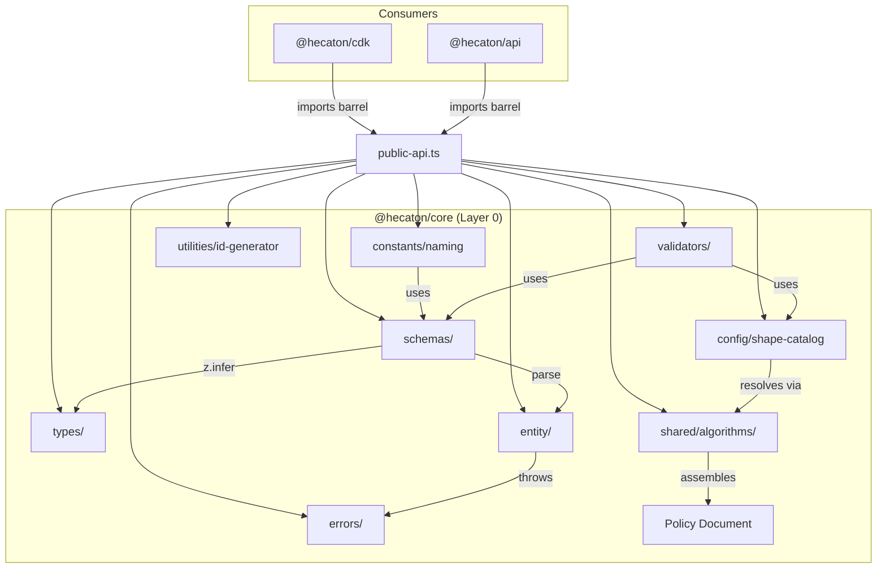

# Design Document: @hecaton/core Foundation

## Overview

This design covers Layer 0 of the Hecatoncheires governance platform — the pure domain layer implemented in the `@hecaton/core` package. It defines schemas (Zod), inferred TypeScript types, entity factories, domain errors, naming convention generators, shape resolution, policy assembly, validators, and a UUIDv7 identity utility.

The layer has zero I/O dependencies — its sole external dependency is Zod. Every function is testable by passing data and asserting return values.

**Key design decisions:**

1. **Zod as single source of truth** — schemas define both runtime validation and TypeScript types via `z.infer`. No separate interface files that can drift.
2. **Frozen objects from factories** — `Object.freeze` on every entity factory output guarantees immutability without a library.
3. **Fail-fast validation** — factories throw typed `ValidationError` on bad input; callers never receive a partially valid object.
4. **Parameterized shape templates** — capability shapes are data (templates + placeholder syntax), not code. Resolution is string substitution with validation.
5. **Deterministic policy assembly** — pure function from grant set → IAM policy JSON. No ordering ambiguity, no side effects.

## Architecture



All consumer packages import exclusively through the barrel (`public-api.ts`). Internal module paths are not exposed.

### Module Dependency Rules

| Module | May import from |
|--------|----------------|
| schemas | zod only |
| types | schemas |
| entity | schemas, errors, utilities |
| errors | (standalone) |
| constants | schemas (for validation of inputs) |
| config | schemas |
| shared/algorithms | schemas, config, errors |
| validators | schemas, config, errors |
| utilities | (standalone) |
| public-api | all of the above |

## Components and Interfaces

### 1. Schemas Module (`src/schemas/`)

Each schema is a Zod object exported by name. Files:

| File | Exports |
|------|---------|
| `agent-configuration.schema.ts` | `AgentConfigurationSchema` |
| `runtime-tunables.schema.ts` | `RuntimeTunablesSchema` |
| `shape-template.schema.ts` | `ShapeTemplateSchema` |
| `grant-record.schema.ts` | `GrantRecordSchema` |
| `iam-policy.schema.ts` | `IamPolicyDocumentSchema`, `IamStatementSchema` |
| `id.schema.ts` | `IdSchema` (UUIDv7 format validator) |
| `index.ts` | Re-exports all schemas |

#### AgentConfigurationSchema

```typescript
const ConfigNamePattern = /^[a-z][a-z0-9-]*[a-z0-9]$/;

export const AgentConfigurationSchema = z.object({
  configName: z.string().min(1).max(40).regex(ConfigNamePattern),
  agentType: z.enum(['agentcore-managed', 'openclaw', 'agentcore-runtime']),
  modelId: z.string().min(1),
  guardrailId: z.string().min(1),
  guardrailVersion: z.string().min(1).default('DRAFT'),
  owner: z.string().min(1),
});
```

#### RuntimeTunablesSchema

```typescript
export const RuntimeTunablesSchema = z.object({
  thresholds: z.object({
    outputTokensPerHour: z.number().int().positive(),
    guardrailBlocksPer10Min: z.number().int().positive(),
    guardrailObservationsPerHour: z.number().int().positive(),
  }),
  featureFlags: z.object({
    pipelineSpeedBreaker: z.boolean(),
    timeBoxedGrants: z.boolean(),
  }),
});
```

#### ShapeTemplateSchema

```typescript
export const ShapeTemplateSchema = z.object({
  shapeName: z.string().min(1),
  riskTier: z.enum(['low', 'medium', 'high', 'critical']),
  requiredParameters: z.array(z.string()),
  statements: z.array(IamStatementTemplateSchema),
});
```

#### GrantRecordSchema

```typescript
export const GrantRecordSchema = z.object({
  grantId: IdSchema.optional(), // generated if not provided
  configName: z.string().min(1).max(40).regex(ConfigNamePattern),
  shapeName: z.string().min(1),
  parameters: z.record(z.string(), z.string()),
  grantedAt: z.string().datetime(),
  grantedBy: z.string().min(1),
  expiresAt: z.string().datetime().optional(),
});
```

#### IamPolicyDocumentSchema

```typescript
export const IamStatementSchema = z.object({
  Effect: z.enum(['Allow', 'Deny']),
  Action: z.union([z.string(), z.array(z.string())]),
  Resource: z.union([z.string(), z.array(z.string())]),
  Condition: z.record(z.string(), z.record(z.string(), z.string())).optional(),
});

export const IamPolicyDocumentSchema = z.object({
  Version: z.literal('2012-10-17'),
  Statement: z.array(IamStatementSchema).min(1),
});
```

#### IdSchema

```typescript
const UUIDV7_REGEX = /^[0-9a-f]{8}-[0-9a-f]{4}-7[0-9a-f]{3}-[89ab][0-9a-f]{3}-[0-9a-f]{12}$/;

export const IdSchema = z.string().regex(UUIDV7_REGEX);
```

### 2. Types Module (`src/types/`)

Inferred types re-exported for ergonomic use:

```typescript
// types/index.ts
export type AgentConfiguration = z.infer<typeof AgentConfigurationSchema>;
export type RuntimeTunables = z.infer<typeof RuntimeTunablesSchema>;
export type ShapeTemplate = z.infer<typeof ShapeTemplateSchema>;
export type GrantRecord = z.infer<typeof GrantRecordSchema>;
export type IamPolicyDocument = z.infer<typeof IamPolicyDocumentSchema>;
export type IamStatement = z.infer<typeof IamStatementSchema>;
```

### 3. Entity Module (`src/entity/`)

Each entity factory:
1. Parses input through its schema (validation)
2. Applies defaults (e.g., `generateId()` for grantId)
3. Returns `Object.freeze(validated)`
4. Throws `ValidationError` on parse failure

| File | Export |
|------|--------|
| `agent-configuration.factory.ts` | `createAgentConfiguration(input): AgentConfiguration` |
| `runtime-tunables.factory.ts` | `createRuntimeTunables(input): RuntimeTunables` |
| `grant-record.factory.ts` | `createGrantRecord(input): GrantRecord` |
| `index.ts` | Re-exports all factories |

```typescript
// Signature pattern for all factories
export function createAgentConfiguration(input: unknown): AgentConfiguration {
  const result = AgentConfigurationSchema.safeParse(input);
  if (!result.success) {
    throw new ValidationError('Agent configuration validation failed', {
      fieldErrors: result.error.flatten().fieldErrors,
    });
  }
  return Object.freeze(result.data);
}
```

### 4. Errors Module (`src/errors/`)

```typescript
// Base class
export abstract class DomainError extends Error {
  abstract readonly code: string;
  readonly details?: Record<string, unknown>;

  constructor(message: string, details?: Record<string, unknown>) {
    super(message);
    this.name = this.constructor.name;
    this.details = details;
  }
}

// Concrete errors
export class ValidationError extends DomainError { readonly code = 'VALIDATION_ERROR'; }
export class ShapeNotFoundError extends DomainError { readonly code = 'SHAPE_NOT_FOUND'; }
export class InvalidShapeParametersError extends DomainError { readonly code = 'INVALID_SHAPE_PARAMETERS'; }
export class GrantConflictError extends DomainError { readonly code = 'GRANT_CONFLICT'; }
export class ConfigNotFoundError extends DomainError { readonly code = 'CONFIG_NOT_FOUND'; }
export class InternalError extends DomainError { readonly code = 'INTERNAL_ERROR'; }
```

### 5. Constants & Naming Module (`src/constants/`)

| File | Exports |
|------|---------|
| `naming.ts` | `NamingGenerator` class |
| `limits.ts` | `AWS_INLINE_POLICY_SIZE_LIMIT`, other AWS limits |
| `index.ts` | Re-exports |

```typescript
export class NamingGenerator {
  constructor(private readonly stage: string) {
    if (!stage || stage.trim().length === 0) {
      throw new ValidationError('Stage must be a non-empty string');
    }
  }

  roleName(configName: string): string;
  profileName(configName: string): string;
  guardrailName(configName: string): string;
  alarmNames(configName: string): { token: string; block: string; observation: string };
  queueNames(configName: string): { signals: string; dlq: string };
  lambdaName(handlerName: string): string;
  ruleName(configName: string, purpose: string): string;
  harnessName(configName: string): string;
  stackName(purpose: string): string;
  tableName(): string;
  tags(configName: string, options?: { phase?: string; harnessType?: string }): Record<string, string>;
}
```

### 6. Config Module (`src/config/`)

| File | Exports |
|------|---------|
| `shape-catalog.ts` | `SHAPE_CATALOG: readonly ShapeTemplate[]` |
| `index.ts` | Re-exports |

The catalog is a frozen array of `ShapeTemplate` objects — the built-in shapes the platform ships with.

### 7. Shared Algorithms (`src/shared/algorithms/`)

| File | Exports |
|------|---------|
| `resolve-shape.ts` | `resolveShape(template, parameters): IamStatement[]` |
| `assemble-policy.ts` | `assemblePolicy(grants, catalog): IamPolicyDocument` |
| `index.ts` | Re-exports |

#### Shape Resolution

```typescript
/**
 * Substitutes parameter placeholders in a shape template's statements.
 * Placeholder format: `${paramName}` within Resource ARN strings.
 *
 * @throws InvalidShapeParametersError if required parameters are missing
 */
export function resolveShape(
  template: ShapeTemplate,
  parameters: Record<string, string>
): IamStatement[];
```

#### Policy Assembly

```typescript
/**
 * Assembles an IAM policy document from a set of grant records.
 * - Empty grants → deny-by-default (single Deny * statement)
 * - Non-empty → resolves each grant's shape, unions all statements
 *
 * @throws ShapeNotFoundError if a grant references an unknown shapeName
 */
export function assemblePolicy(
  grants: GrantRecord[],
  catalog: readonly ShapeTemplate[]
): IamPolicyDocument;
```

### 8. Validators Module (`src/validators/`)

| File | Exports |
|------|---------|
| `grant.validator.ts` | `validateGrant(grant, catalog): ValidationResult` |
| `grant-set.validator.ts` | `validateGrantSet(grants): ValidationResult` |
| `policy-size.validator.ts` | `validatePolicySize(policy): ValidationResult` |
| `index.ts` | Re-exports |

```typescript
export type ValidationResult =
  | { valid: true }
  | { valid: false; error: DomainError };
```

### 9. Utilities Module (`src/utilities/`)

| File | Exports |
|------|---------|
| `id-generator.ts` | `generateId(): string` |
| `index.ts` | Re-exports |

The `generateId` function produces UUIDv7 strings. Implementation uses a lightweight UUIDv7 algorithm (timestamp + random bits) — no external dependency needed for this since we can implement the spec in ~20 lines.

### 10. Test Generators (`src/test-generators/`)

Arbitrary builders for property-based testing. These produce random valid instances of domain objects using `fast-check` arbitraries.

| File | Exports |
|------|---------|
| `agent-configuration.arb.ts` | `arbAgentConfiguration` |
| `runtime-tunables.arb.ts` | `arbRuntimeTunables` |
| `grant-record.arb.ts` | `arbGrantRecord` |
| `shape-template.arb.ts` | `arbShapeTemplate` |
| `index.ts` | Re-exports all arbitraries |

### 11. Public API Barrel (`src/public-api.ts`)

```typescript
// Schemas
export * from './schemas/index.js';
// Types
export * from './types/index.js';
// Entity factories
export * from './entity/index.js';
// Errors
export * from './errors/index.js';
// Constants & naming
export * from './constants/index.js';
// Config (shape catalog)
export * from './config/index.js';
// Validators
export * from './validators/index.js';
// Shared algorithms (shape resolution, policy assembly)
export * from './shared/algorithms/index.js';
// Utilities (ID generator)
export * from './utilities/index.js';
```

## Data Models

### Agent Configuration

| Field | Type | Constraints |
|-------|------|-------------|
| configName | string | 1-40 chars, pattern `^[a-z][a-z0-9-]*[a-z0-9]$` |
| agentType | enum | `agentcore-managed` \| `openclaw` \| `agentcore-runtime` |
| modelId | string | non-empty |
| guardrailId | string | non-empty |
| guardrailVersion | string | non-empty, defaults to `DRAFT` |
| owner | string | non-empty |

**Natural key:** `configName`

### Runtime Tunables

| Field | Type | Constraints |
|-------|------|-------------|
| thresholds.outputTokensPerHour | integer | positive |
| thresholds.guardrailBlocksPer10Min | integer | positive |
| thresholds.guardrailObservationsPerHour | integer | positive |
| featureFlags.pipelineSpeedBreaker | boolean | — |
| featureFlags.timeBoxedGrants | boolean | — |

### Shape Template

| Field | Type | Constraints |
|-------|------|-------------|
| shapeName | string | non-empty, unique within catalog |
| riskTier | enum | `low` \| `medium` \| `high` \| `critical` |
| requiredParameters | string[] | parameter names the template expects |
| statements | IamStatementTemplate[] | IAM statements with `${param}` placeholders in Resource |

### Grant Record

| Field | Type | Constraints |
|-------|------|-------------|
| grantId | string | UUIDv7 format, auto-generated if absent |
| configName | string | matches configName pattern |
| shapeName | string | non-empty, must reference a known shape |
| parameters | Record<string, string> | key-value pairs for shape resolution |
| grantedAt | string | ISO 8601 datetime |
| grantedBy | string | non-empty |
| expiresAt | string? | ISO 8601 datetime, must be > grantedAt |

**Primary key:** `grantId`
**Uniqueness constraint:** `configName + shapeName + parameters` (enforced by `Grant_Set_Validator`)

### IAM Policy Document

| Field | Type | Constraints |
|-------|------|-------------|
| Version | literal | `"2012-10-17"` |
| Statement | IamStatement[] | at least 1 statement |

### IAM Statement

| Field | Type | Constraints |
|-------|------|-------------|
| Effect | enum | `Allow` \| `Deny` |
| Action | string \| string[] | IAM action(s) |
| Resource | string \| string[] | ARN(s) |
| Condition | Record? | optional IAM condition block |

### Built-in Shape Catalog

| Shape Name | Risk Tier | Required Parameters | Purpose |
|------------|-----------|--------------------:|---------|
| `core-invocation` | medium | `inferenceProfileArn` | Bedrock InvokeModel scoped to profile |
| `s3-prefix-read` | low | `bucketArn`, `prefix` | S3 GetObject + ListBucket at prefix |
| `s3-prefix-write` | medium | `bucketArn`, `prefix` | S3 PutObject at prefix |
| `cloudwatch-logs-read` | low | `logGroupArn` | CloudWatch Logs read at log group |


## Correctness Properties

*A property is a characteristic or behavior that should hold true across all valid executions of a system — essentially, a formal statement about what the system should do. Properties serve as the bridge between human-readable specifications and machine-verifiable correctness guarantees.*

### Property 1: Factory produces frozen, equivalent output for valid input

*For any* valid input (conforming to the entity's schema constraints), the corresponding entity factory SHALL return a frozen object (`Object.isFrozen === true`) whose field values are identical to the input (with defaults applied where specified).

**Validates: Requirements 1.7, 2.6, 4.8**

### Property 2: Factory rejects all invalid input with ValidationError

*For any* input that violates one or more schema constraints (wrong type, missing required field, out-of-range value, pattern mismatch), the corresponding entity factory SHALL throw a `ValidationError` with a non-empty `details` record identifying the failing fields.

**Validates: Requirements 1.8, 2.7, 4.9**

### Property 3: GuardrailVersion defaults to DRAFT when omitted

*For any* valid Agent Configuration input where `guardrailVersion` is not provided, the factory output SHALL have `guardrailVersion === 'DRAFT'`.

**Validates: Requirements 1.5**

### Property 4: Grant Record factory auto-generates a valid UUIDv7 grantId

*For any* valid Grant Record input where `grantId` is not provided, the factory SHALL assign a `grantId` that conforms to the UUIDv7 format (`/^[0-9a-f]{8}-[0-9a-f]{4}-7[0-9a-f]{3}-[89ab][0-9a-f]{3}-[0-9a-f]{12}$/`).

**Validates: Requirements 4.1, 4.8, 10.1, 10.2**

### Property 5: Shape resolution substitutes all placeholders

*For any* shape template and a parameter set that supplies all `requiredParameters`, the resolved IAM statements SHALL contain no `${...}` placeholder patterns in any Resource field, and each placeholder SHALL be replaced by the corresponding parameter value.

**Validates: Requirements 3.5**

### Property 6: Shape resolution rejects incomplete parameter sets

*For any* shape template and a parameter set that is missing one or more `requiredParameters`, the resolver SHALL throw an `InvalidShapeParametersError` whose details list exactly the missing parameter names.

**Validates: Requirements 3.6**

### Property 7: Shape resolution rejects unknown shape names

*For any* shape name that does not exist in the provided catalog, the resolver SHALL throw a `ShapeNotFoundError` whose message contains the requested shape name.

**Validates: Requirements 3.7**

### Property 8: Policy assembly preserves all resolved statements without deduplication

*For any* non-empty set of valid grants (each referencing a known shape with complete parameters), the assembled policy's `Statement` array SHALL contain exactly the sum of all individually-resolved statements — including duplicates from overlapping grants.

**Validates: Requirements 5.2, 5.4**

### Property 9: Policy assembly always produces a valid IAM policy structure

*For any* set of grants (including empty), the assembled policy document SHALL conform to the `IamPolicyDocumentSchema` (Version = "2012-10-17", Statement array with at least one entry, each statement having valid Effect/Action/Resource).

**Validates: Requirements 5.3**

### Property 10: Naming generator produces pattern-conforming resource names

*For any* valid `configName` (matching `^[a-z][a-z0-9-]*[a-z0-9]$`, max 40 chars) and any non-empty `stage` string, all generated resource names SHALL match their documented patterns (e.g., `hecaton-{stage}-{configName}-agent-role`), and generated tags SHALL include all required key-value pairs.

**Validates: Requirements 7.2, 7.3, 7.4, 7.5, 7.6, 7.7, 7.8, 7.9, 7.10, 7.11, 7.12, 7.13, 7.14, 7.15**

### Property 11: Naming generator rejects empty or whitespace-only stage

*For any* empty string or string composed solely of whitespace, constructing a `NamingGenerator` SHALL throw a `ValidationError`.

**Validates: Requirements 7.1**

### Property 12: Grant validator rejects references to unknown shapes

*For any* grant record whose `shapeName` is not present in the provided shape catalog, the `Grant_Validator` SHALL return a validation failure.

**Validates: Requirements 8.1**

### Property 13: Grant validator rejects incomplete parameter sets

*For any* grant record whose `parameters` map is missing one or more parameters declared as `requiredParameters` by the referenced shape, the `Grant_Validator` SHALL return a validation failure.

**Validates: Requirements 8.2**

### Property 14: Grant validator rejects invalid expiry timestamps

*For any* grant record where `expiresAt` is present and less than or equal to `grantedAt`, the `Grant_Validator` SHALL return a validation failure.

**Validates: Requirements 4.7, 8.3**

### Property 15: Grant set validator detects duplicate grants

*For any* set of grant records containing two or more entries with the same `configName`, `shapeName`, and `parameters` (deep equality on parameters), the `Grant_Set_Validator` SHALL return a `GrantConflictError`.

**Validates: Requirements 8.4**

### Property 16: Policy size validator rejects oversized policies

*For any* IAM policy document whose JSON serialization exceeds the AWS inline policy size limit (10,240 bytes), the `Policy_Size_Validator` SHALL return a validation failure reporting the actual size and the limit.

**Validates: Requirements 8.5**

### Property 17: ID generator produces valid UUIDv7 format

*For any* invocation of `generateId()`, the returned string SHALL match the UUIDv7 regex pattern and pass `IdSchema` validation.

**Validates: Requirements 10.1, 10.2, 10.4**

### Property 18: ID generator produces time-sortable identifiers

*For any* two identifiers generated with a monotonically increasing timestamp, the first identifier SHALL sort lexicographically before the second.

**Validates: Requirements 10.3**

## Error Handling

### Error Propagation Strategy

All errors in `@hecaton/core` are synchronous exceptions (no async code in this layer). Errors propagate through the call stack to the consumer.

| Error Class | When Thrown | Typical Consumer Response |
|-------------|-----------|--------------------------|
| `ValidationError` | Schema parse failure in any factory | Return 400 with field errors |
| `ShapeNotFoundError` | Shape lookup/resolution with unknown name | Return 404 |
| `InvalidShapeParametersError` | Shape resolution with incomplete params | Return 400 with missing param list |
| `GrantConflictError` | Grant set contains duplicates | Return 409 |
| `ConfigNotFoundError` | Config lookup fails (used by adapters) | Return 404 |
| `InternalError` | Unexpected/unrecoverable state | Return 500 (sanitized) |

### Error Design Principles

1. **No transport coupling** — errors carry `code` + `message` + `details`, never HTTP status codes.
2. **Structured details** — `details` is always a `Record<string, unknown>` suitable for JSON serialization.
3. **Instanceof-safe** — all errors extend a common `DomainError` base for catch-all handling.
4. **No stack traces in details** — stack is on the Error object itself, never in the serializable `details`.

### Validation Error Detail Format

```typescript
// ValidationError.details shape:
{
  fieldErrors: Record<string, string[]>; // field name → array of error messages
}
```

### Validator Return Convention

Validators (cross-field checks) do NOT throw. They return a discriminated union:

```typescript
type ValidationResult =
  | { valid: true }
  | { valid: false; error: DomainError };
```

This allows callers to accumulate multiple validation failures before acting. Entity factories throw immediately; validators are composable.

## Testing Strategy

### Test Runner & Libraries

- **Runner:** Vitest 4.x (already configured in workspace)
- **Property-based testing:** `fast-check` (industry-standard PBT library for TypeScript)
- **Assertion style:** Vitest built-in `expect`

### Test File Co-location

Every module has its test file beside it:

```
src/entity/
├── agent-configuration.factory.ts
├── agent-configuration.factory.test.ts
├── grant-record.factory.ts
├── grant-record.factory.test.ts
...
```

### Dual Testing Approach

**Unit tests** (example-based):
- Specific happy-path examples for each factory
- Error class instantiation and code values (Req 6.1-6.7)
- Shape catalog contents (Req 9.1-9.6)
- Public API barrel exports (Req 11.1-11.9)
- Policy assembler empty-grants edge case (Req 5.1)

**Property tests** (universal, 100+ iterations each):
- All 18 correctness properties listed above
- Each tagged with: `// Feature: core-foundation, Property {N}: {title}`
- Use `fast-check` arbitraries from `src/test-generators/` for domain object generation

### Property Test Configuration

```typescript
import { fc } from 'fast-check';

// Minimum 100 iterations per property
const PBT_CONFIG = { numRuns: 100 };

// Example usage:
it('Property 1: Factory produces frozen, equivalent output', () => {
  fc.assert(
    fc.property(arbValidAgentConfigInput, (input) => {
      const result = createAgentConfiguration(input);
      expect(Object.isFrozen(result)).toBe(true);
      expect(result.configName).toBe(input.configName);
      // ... all fields
    }),
    PBT_CONFIG
  );
});
```

### Test Generator Design

Each arbitrary in `src/test-generators/` produces valid instances by default, with combinators for generating invalid variants:

```typescript
// Valid config name arbitrary
export const arbConfigName = fc.stringMatching(/^[a-z][a-z0-9-]*[a-z0-9]$/)
  .filter(s => s.length >= 2 && s.length <= 40);

// Valid agent configuration arbitrary
export const arbAgentConfiguration = fc.record({
  configName: arbConfigName,
  agentType: fc.constantFrom('agentcore-managed', 'openclaw', 'agentcore-runtime'),
  modelId: fc.string({ minLength: 1 }),
  guardrailId: fc.string({ minLength: 1 }),
  guardrailVersion: fc.string({ minLength: 1 }),
  owner: fc.string({ minLength: 1 }),
});
```

### Coverage Targets

| Module | Unit | Property | Notes |
|--------|------|----------|-------|
| schemas/ | Examples for edge cases | Schema round-trip via factories | Schemas are tested indirectly through factories |
| entity/ | Happy-path examples | Properties 1-4 | Core correctness |
| errors/ | Instantiation checks | — | Finite set, examples sufficient |
| constants/ | — | Properties 10-11 | Pattern conformance over random inputs |
| config/ | Catalog contents | — | Static data, examples sufficient |
| shared/algorithms/ | Empty-grants edge case | Properties 5-9 | Pure functions, ideal for PBT |
| validators/ | — | Properties 12-16 | Cross-field logic, ideal for PBT |
| utilities/ | — | Properties 17-18 | ID generation invariants |
| public-api | Import checks | — | Structural, examples sufficient |
