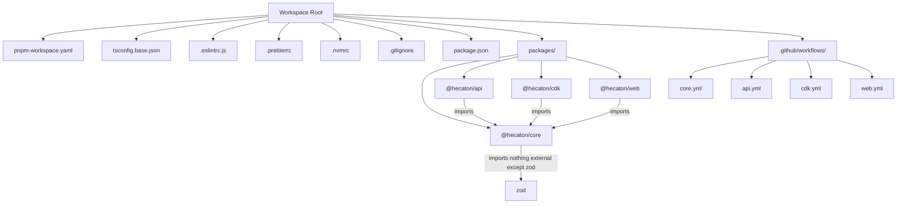
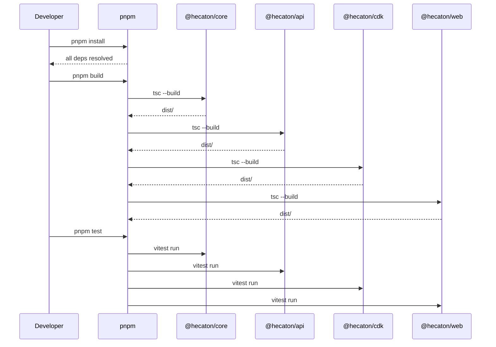

# Design Document: Initial Project Setup

## Overview

This spec covers the complete initial scaffolding of the Hecatoncheires monorepo — a CDK-deployed AWS governance platform for autonomous agent fleets. The goal is to produce a buildable, testable, lintable project skeleton with all four packages (`core`, `api`, `cdk`, `web`) wired into a pnpm workspace, shared tooling configured, and CI stubs in place. No application logic is implemented; only the structural skeleton and tooling that makes future implementation possible.

The output is a green build: `pnpm install && pnpm build && pnpm test && pnpm lint` all pass on an empty but correctly-typed project.

## Architecture



## Sequence Diagram: Build Pipeline



## Components and Interfaces

### Component 1: Workspace Root

**Purpose**: Orchestrates the monorepo — shared scripts, shared tooling config, workspace package resolution.

**Files**:
- `package.json` — workspace root scripts (build, test, lint, format, clean)
- `pnpm-workspace.yaml` — declares `packages: ['packages/*']`
- `tsconfig.base.json` — strict TypeScript 5.5+ base config
- `.eslintrc.js` — shared lint rules with import boundary enforcement
- `.prettierrc` — formatting config
- `.nvmrc` — pins Node 20 LTS
- `.gitignore` — standard ignores for Node/TS/CDK projects
- `vitest.workspace.ts` — Vitest workspace configuration

**Responsibilities**:
- Provide shared TypeScript compiler options inherited by all packages
- Enforce import boundary rules (core imports nothing; api/cdk never import each other; web never imports api/cdk)
- Define workspace-wide scripts that fan out to packages

### Component 2: @hecaton/core Package

**Purpose**: Pure domain engine. Zero AWS dependencies. Only external dep is `zod`.

**Interface** (package.json):
```json
{
  "name": "@hecaton/core",
  "version": "0.0.1",
  "type": "module",
  "main": "./dist/public-api.js",
  "types": "./dist/public-api.d.ts",
  "exports": {
    ".": {
      "types": "./dist/public-api.d.ts",
      "import": "./dist/public-api.js"
    }
  },
  "scripts": {
    "build": "tsc --build",
    "test": "vitest run",
    "lint": "eslint src/"
  },
  "dependencies": {
    "zod": "^3.23"
  }
}
```

**Directory Structure**:
```
src/
├── public-api.ts            # barrel export
├── schemas/                 # zod schemas
├── types/                   # re-exported types
├── entity/                  # factory functions
├── errors/                  # custom error classes
├── constants/               # thresholds, enums
├── config/                  # shape template defs
├── shared/
│   └── algorithms/          # policy assembly, shape merging
├── validators/              # cross-field, structural
├── test-generators/         # PBT builders
└── domain/
    ├── identity/            # role model, profile binding
    ├── capability/          # shape resolution, grant logic
    ├── telemetry/           # enrichment logic
    ├── signals/             # envelope validation
    └── fleet/               # config validation
```

### Component 3: @hecaton/api Package

**Purpose**: Use-cases + adapters. Lambda handlers that orchestrate domain logic through AWS adapters.

**Interface** (package.json):
```json
{
  "name": "@hecaton/api",
  "version": "0.0.1",
  "type": "module",
  "scripts": {
    "build": "tsc --build",
    "test": "vitest run",
    "lint": "eslint src/"
  },
  "dependencies": {
    "@hecaton/core": "workspace:*",
    "@aws-sdk/client-dynamodb": "^3.x",
    "@aws-sdk/client-iam": "^3.x",
    "@aws-sdk/client-eventbridge": "^3.x",
    "@aws-sdk/client-cloudwatch": "^3.x",
    "esbuild": "^0.21"
  }
}
```

**Directory Structure**:
```
src/
├── handlers/                # Lambda entry points
├── use-cases/               # workflow orchestration
└── adapters/
    ├── http/
    │   └── dto/
    ├── dynamo/
    │   └── dto/
    ├── iam/
    ├── eventbridge/
    │   └── dto/
    ├── appconfig/
    └── cloudwatch/
```

### Component 4: @hecaton/cdk Package

**Purpose**: CDK infrastructure constructs. Deploys all AWS resources.

**Interface** (package.json):
```json
{
  "name": "@hecaton/cdk",
  "version": "0.0.1",
  "type": "module",
  "scripts": {
    "build": "tsc --build",
    "test": "vitest run",
    "lint": "eslint lib/ bin/",
    "synth": "cdk synth"
  },
  "dependencies": {
    "@hecaton/core": "workspace:*",
    "aws-cdk-lib": "^2.258.0",
    "constructs": "^10.0"
  },
  "devDependencies": {
    "aws-cdk": "^2.258.0"
  }
}
```

**Directory Structure**:
```
cdk.json
bin/
└── app.ts                   # CDK app entry
lib/
├── stacks/
├── constructs/
└── config/
    └── seeds/
test/
├── constructs/
└── stacks/
```

### Component 5: @hecaton/web Package

**Purpose**: Placeholder SPA for Phase 3 operator dashboard.

**Interface** (package.json):
```json
{
  "name": "@hecaton/web",
  "version": "0.0.1",
  "type": "module",
  "scripts": {
    "build": "tsc --build",
    "test": "vitest run",
    "lint": "eslint src/"
  },
  "dependencies": {
    "@hecaton/core": "workspace:*"
  }
}
```

**Directory Structure**:
```
src/
├── ui/
├── state/
└── lib/
```

## Data Models

### tsconfig.base.json

```json
{
  "compilerOptions": {
    "target": "ES2022",
    "module": "Node16",
    "moduleResolution": "Node16",
    "lib": ["ES2022"],
    "strict": true,
    "noImplicitAny": true,
    "strictNullChecks": true,
    "noUnusedLocals": true,
    "noUnusedParameters": true,
    "declaration": true,
    "declarationMap": true,
    "sourceMap": true,
    "composite": true,
    "incremental": true,
    "skipLibCheck": true,
    "esModuleInterop": true,
    "forceConsistentCasingInFileNames": true,
    "resolveJsonModule": true,
    "isolatedModules": true,
    "outDir": "./dist",
    "rootDir": "./src"
  }
}
```

### .eslintrc.js Import Boundary Rules

```typescript
// Enforced rules:
// 1. @hecaton/core cannot import from @hecaton/api, @hecaton/cdk, or @hecaton/web
// 2. @hecaton/api cannot import from @hecaton/cdk or @hecaton/web
// 3. @hecaton/cdk cannot import from @hecaton/api or @hecaton/web
// 4. @hecaton/web cannot import from @hecaton/api or @hecaton/cdk
// 5. No deep imports into any package (must use barrel export)
```

### .gitignore

```
node_modules/
dist/
*.js.map
*.d.ts.map
cdk.out/
.cdk.staging/
*.tsbuildinfo
coverage/
.env
.env.*
```

## Correctness Properties

*A property is a characteristic or behavior that should hold true across all valid executions of a system — essentially, a formal statement about what the system should do. Properties serve as the bridge between human-readable specifications and machine-verifiable correctness guarantees.*

### Property 1: Import Boundary Confinement

*For any* TypeScript source file in any package, and *for any* import statement in that file, the import SHALL only resolve to packages permitted by the Dependency DAG (core imports nothing; api/cdk/web import only core) AND SHALL only reference bare package specifiers (no subpath imports like `@hecaton/core/domain/...` or `@hecaton/api/handlers/...`).

**Validates: Requirements 3.2, 3.3, 3.4, 3.5, 3.6, 8.1, 8.2**

### Property 2: Core Purity

*For any* key in `@hecaton/core`'s `package.json` `dependencies` field, that key SHALL equal `"zod"`. The dependency set contains exactly one entry, and no entry SHALL match `@aws-sdk/*` or `aws-cdk-lib`.

**Validates: Requirements 4.1, 8.1**

### Property 3: TypeScript Strict Compliance

*For all* `.ts` or `.tsx` files under the `packages/` directory, no file SHALL contain `// @ts-ignore`, `// @ts-expect-error`, or explicit `any` type annotations (including `as any`, `: any`, `<any>`, and generic parameters defaulting to `any`).

**Validates: Requirements 12.1, 12.2, 12.3**

### Property 4: Workspace Completeness

*For all* packages listed in `pnpm-workspace.yaml`, a corresponding directory with a valid `package.json` SHALL exist on disk, and *for all* directories in `packages/` with a `package.json`, that package SHALL be discoverable by the workspace.

**Validates: Requirements 1.5, 8.3**

### Property 5: Build Determinism

*For any* identical source tree and lockfile (`pnpm-lock.yaml`), executing `pnpm install --frozen-lockfile && pnpm build` SHALL produce semantically identical `dist/` outputs (declaration files byte-identical, JS identical modulo platform-dependent source-map paths).

**Validates: Requirements 9.2, 10.3**

### Property 6: Green-on-Empty

*For the* freshly scaffolded project with zero application logic, executing `pnpm install`, `pnpm build`, `pnpm test`, and `pnpm lint` in sequence SHALL each exit with code 0.

**Validates: Requirements 9.1, 9.2, 9.3, 9.4**

### Property 7: Dependency DAG Acyclicity

*For all* workspace packages, the compile-time TypeScript import-resolution graph SHALL form a strict DAG with no cycles and no lateral edges (`api` ↔ `cdk`, `api` ↔ `web`, `cdk` ↔ `web`). Core has zero inbound or outbound workspace edges; api, cdk, web each have exactly one outbound edge to core. No workspace package SHALL appear in both `dependencies` and `devDependencies` of another package except as the sole `@hecaton/core` reference.

**Validates: Requirements 8.1, 8.2, 8.4**

## Key Functions with Formal Specifications

### Function 1: Root build script

```typescript
// package.json script: "build"
// Command: pnpm -r --workspace-concurrency=1 run build
```

**Preconditions:**
- All packages have valid `tsconfig.json` extending `tsconfig.base.json`
- All workspace dependencies are installed (`pnpm install` completed)
- TypeScript project references are correctly configured

**Postconditions:**
- Each package's `dist/` directory contains compiled JavaScript + declaration files
- Build order respects dependency graph (core first, then api/cdk/web)
- Exit code 0 if all packages compile without errors

### Function 2: Root test script

```typescript
// package.json script: "test"
// Command: vitest run --workspace vitest.workspace.ts
```

**Preconditions:**
- All packages are built (or Vitest is configured with esbuild transform)
- Vitest workspace config includes all packages

**Postconditions:**
- All test files matching `**/*.test.ts` are discovered and executed
- Exit code 0 if all tests pass (initially: zero tests = pass)

### Function 3: Root lint script

```typescript
// package.json script: "lint"
// Command: eslint --ext .ts packages/
```

**Preconditions:**
- ESLint configuration is valid
- All source files are parseable TypeScript

**Postconditions:**
- Import boundary violations are caught and reported as errors
- No lint errors on a freshly scaffolded project
- Exit code 0 for clean codebase

## Example Usage

```typescript
// After scaffolding, a developer can:

// 1. Install all dependencies
// $ pnpm install

// 2. Build all packages (respects dependency order)
// $ pnpm build

// 3. Run all tests
// $ pnpm test

// 4. Lint the codebase
// $ pnpm lint

// 5. Format the codebase
// $ pnpm format

// 6. Work on a specific package
// $ pnpm --filter @hecaton/core build
// $ pnpm --filter @hecaton/core test

// 7. CDK synth (from cdk package)
// $ pnpm --filter @hecaton/cdk synth
```

## Error Handling

### Error Scenario 1: Missing workspace dependency

**Condition**: A package references another workspace package that doesn't exist
**Response**: pnpm install fails with a clear "workspace package not found" error
**Recovery**: Ensure all packages are listed in `pnpm-workspace.yaml` and have correct names

### Error Scenario 2: TypeScript compilation failure

**Condition**: A package has type errors or invalid imports
**Response**: `tsc --build` reports the error with file/line location
**Recovery**: Fix the type error; project references ensure correct build order

### Error Scenario 3: Import boundary violation

**Condition**: A package imports from a disallowed sibling package
**Response**: ESLint reports an error identifying the illegal import
**Recovery**: Remove the illegal import; use `@hecaton/core` barrel for shared types

## Testing Strategy

### Unit Testing Approach

All packages use Vitest ^4.0 with co-located test files (`*.test.ts` beside the module they test). For the scaffolding spec, we only need to verify that the test runner executes successfully — actual test content comes in later specs.

Initial smoke test per package: a single `src/index.test.ts` that imports the barrel and asserts it's defined.

### Property-Based Testing Approach

Property-based testing is NOT applicable to this scaffolding spec. This spec creates infrastructure/configuration files — there are no pure functions with varying inputs to test. PBT will be heavily used in the `@hecaton/core` package once domain logic is implemented.

**Property Test Library**: Vitest with `fast-check` (configured but not exercised in this spec)

### Integration Testing Approach

The CI workflows serve as the integration test for the scaffolding: if the GitHub Actions workflow passes (install → build → lint → test), the scaffolding is correct.

## Performance Considerations

- `pnpm` workspace with hoisted dependencies for fast installs
- TypeScript project references with `composite: true` and `incremental: true` for fast rebuilds
- Vitest workspace mode for parallel test execution across packages

## Security Considerations

- `.gitignore` excludes `.env` files and secrets
- No credentials or secrets in any scaffolding file
- GitHub Actions workflows don't reference external secrets (CI stubs only)

## Dependencies

| Dependency | Version | Package | Purpose |
|---|---|---|---|
| TypeScript | ^5.5 | all | Compiler |
| Vitest | ^4.0 | all (dev) | Test runner |
| ESLint | ^8.x | root (dev) | Linting |
| Prettier | ^3.x | root (dev) | Formatting |
| zod | ^3.23 | core | Schema validation |
| aws-cdk-lib | ^2.258.0 | cdk | CDK constructs |
| constructs | ^10.0 | cdk | CDK peer dep |
| @aws-sdk/* | ^3.x | api | AWS service clients |
| esbuild | ^0.21 | api (dev) | Handler bundling |
| fast-check | ^3.x | core (dev) | Property-based testing |
| @typescript-eslint/* | ^7.x | root (dev) | TS ESLint parser/plugin |
| eslint-plugin-import | ^2.x | root (dev) | Import boundary rules |
