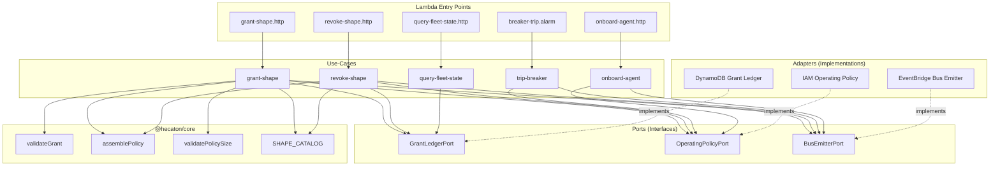
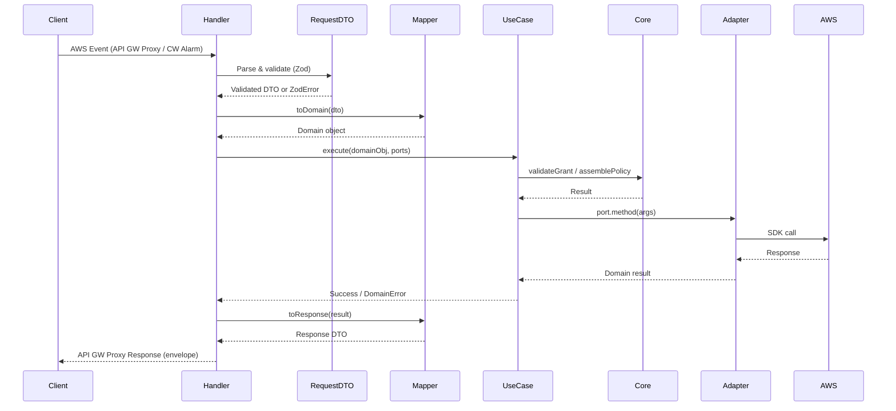
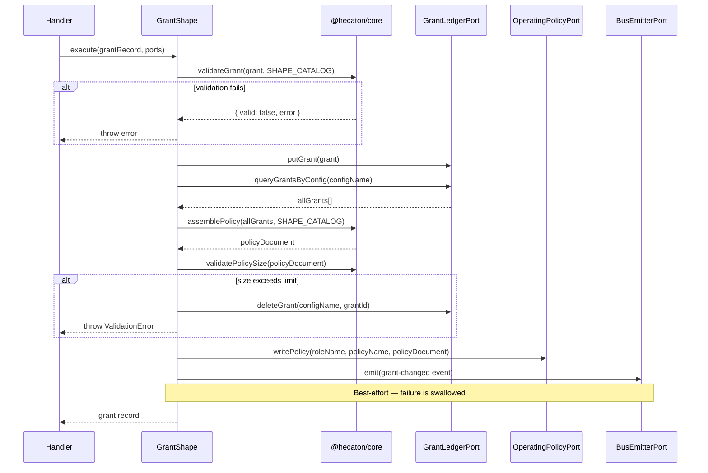
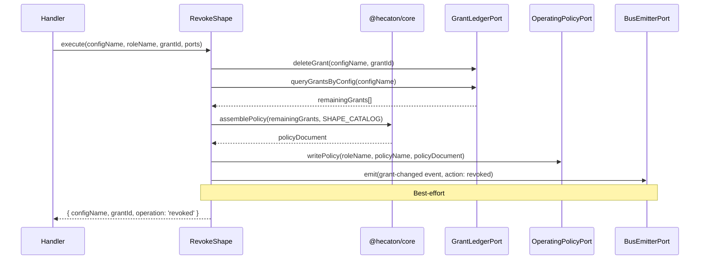

# Design Document: Phase 1 API Package Setup

## Overview

This design specifies the runtime layer (`packages/api`) for Hecatoncheires Phase 1. The API package implements the clean-architecture Layer 3: handlers, use-cases, and adapters that orchestrate pure domain logic from `@hecaton/core` into AWS-backed workflows.

The package exposes Lambda handlers for granting/revoking capability shapes, tripping the circuit breaker, querying fleet state, and onboarding agent configurations. Each handler delegates to a use-case that coordinates adapter calls (DynamoDB, IAM, EventBridge) and core domain functions (policy assembly, grant validation, policy size checks).

**Key design decisions:**
- Ports (interfaces) live in `src/ports/` and are the only dependency use-cases have on adapters
- Dependency injection via a lazy-evaluated factory (`createDependencies`) avoids cold-start overhead for unused paths
- Mappers are pure functions with co-located tests — the primary target for property-based testing
- Event emission is best-effort for all use-cases except onboard-agent (critical path)


## Architecture



**Data flow through the system:**




## Components and Interfaces

### Module Structure / File Layout

```
packages/api/src/
├── public-api.ts                          Barrel export (ports + response utilities)
├── ports/
│   ├── index.ts                           Re-exports all port interfaces
│   ├── grant-ledger.port.ts               GrantLedgerPort interface
│   ├── operating-policy.port.ts           OperatingPolicyPort interface
│   └── bus-emitter.port.ts                BusEmitterPort interface
├── handlers/
│   ├── grant-shape.http.ts                POST /grants - grant a capability shape
│   ├── revoke-shape.http.ts               POST /revocations - revoke a capability shape
│   ├── breaker-trip.alarm.ts              CW Alarm → trip circuit breaker
│   ├── query-fleet-state.http.ts          GET /fleet-state - all grants grouped by config
│   └── onboard-agent.http.ts             POST /onboard - initialize deny-all policy
├── use-cases/
│   ├── grant-shape.ts                     Grant-shape orchestration
│   ├── revoke-shape.ts                    Revoke-shape orchestration
│   ├── trip-breaker.ts                    Breaker-trip orchestration
│   ├── query-fleet-state.ts               Fleet state query
│   └── onboard-agent.ts                   Agent onboarding
├── adapters/
│   ├── dynamo/
│   │   ├── grant-ledger.adapter.ts        GrantLedgerPort implementation
│   │   └── dto/
│   │       └── grant-record.mapper.ts     toPersistence / fromPersistence
│   ├── iam/
│   │   └── operating-policy.adapter.ts    OperatingPolicyPort implementation
│   ├── eventbridge/
│   │   ├── bus-emitter.adapter.ts         BusEmitterPort implementation
│   │   └── dto/
│   │       └── event.mapper.ts            toEventEntry mapper
│   ├── http/
│   │   ├── dto/
│   │   │   ├── requests/
│   │   │   │   ├── grant-shape.request.ts         Zod schema + type
│   │   │   │   ├── revoke-shape.request.ts        Zod schema + type
│   │   │   │   └── onboard-agent.request.ts       Zod schema + type
│   │   │   ├── responses/
│   │   │   │   └── envelope.ts                    successResponse / errorResponse utilities
│   │   │   └── mappers/
│   │   │       ├── grant-shape.mapper.ts          toDomain / toResponse
│   │   │       ├── revoke-shape.mapper.ts         toResponse
│   │   │       └── onboard-agent.mapper.ts        toResponse
│   │   └── error-status-map.ts            Error code → HTTP status mapping
│   ├── appconfig/
│   │   └── .gitkeep
│   └── cloudwatch/
│       └── .gitkeep
└── shared/
    └── dependencies.ts                    createDependencies factory
```


### Port Interface Definitions

```typescript
// ports/grant-ledger.port.ts
import type { GrantRecord } from '@hecaton/core';

export interface GrantLedgerPort {
  putGrant(grant: GrantRecord): Promise<void>;
  deleteGrant(configName: string, grantId: string): Promise<void>;
  queryGrantsByConfig(configName: string): Promise<GrantRecord[]>;
  scanAllConfigs(): Promise<GrantRecord[]>;
}
```

```typescript
// ports/operating-policy.port.ts
import type { IamPolicyDocument } from '@hecaton/core';

export interface OperatingPolicyPort {
  writePolicy(roleName: string, policyName: string, policyDocument: IamPolicyDocument): Promise<void>;
  deletePolicy(roleName: string, policyName: string): Promise<void>;
}
```

```typescript
// ports/bus-emitter.port.ts
export interface BusEvent {
  source: string;
  detailType: string;
  detail: Record<string, unknown>;
  correlationId?: string;
}

export interface BusEmitterPort {
  emit(event: BusEvent): Promise<void>;
}
```

### Adapter Implementation Patterns

All adapters follow the same structure:
1. Constructor accepts AWS SDK client + configuration (table name, bus ARN, etc.)
2. Methods implement the port interface contract
3. SDK errors are caught and wrapped in `InternalError`
4. Mappers are pure functions imported from the co-located `dto/` folder

```typescript
// adapters/dynamo/grant-ledger.adapter.ts (pattern)
import { DynamoDBClient, PutItemCommand, DeleteItemCommand, QueryCommand, ScanCommand } from '@aws-sdk/client-dynamodb';
import type { GrantLedgerPort } from '../../ports/grant-ledger.port.js';
import type { GrantRecord } from '@hecaton/core';
import { InternalError } from '@hecaton/core';
import { toPersistence, fromPersistence } from './dto/grant-record.mapper.js';

export class GrantLedgerAdapter implements GrantLedgerPort {
  constructor(
    private readonly client: DynamoDBClient,
    private readonly tableName: string,
  ) {}

  async putGrant(grant: GrantRecord): Promise<void> { /* ... */ }
  async deleteGrant(configName: string, grantId: string): Promise<void> { /* ... */ }
  async queryGrantsByConfig(configName: string): Promise<GrantRecord[]> { /* ... */ }
  async scanAllConfigs(): Promise<GrantRecord[]> { /* ... */ }
}
```

```typescript
// adapters/iam/operating-policy.adapter.ts (pattern)
import { IAMClient, PutRolePolicyCommand, DeleteRolePolicyCommand } from '@aws-sdk/client-iam';
import type { OperatingPolicyPort } from '../../ports/operating-policy.port.js';
import type { IamPolicyDocument } from '@hecaton/core';
import { InternalError } from '@hecaton/core';

export class OperatingPolicyAdapter implements OperatingPolicyPort {
  constructor(
    private readonly client: IAMClient,
    private readonly defaultPolicyName: string = 'hecaton-operating-policy',
  ) {}

  async writePolicy(roleName: string, policyName: string, policyDocument: IamPolicyDocument): Promise<void> { /* ... */ }
  async deletePolicy(roleName: string, policyName: string): Promise<void> { /* ... */ }
}
```

```typescript
// adapters/eventbridge/bus-emitter.adapter.ts (pattern)
import { EventBridgeClient, PutEventsCommand } from '@aws-sdk/client-eventbridge';
import type { BusEmitterPort, BusEvent } from '../../ports/bus-emitter.port.js';
import { InternalError } from '@hecaton/core';

export class BusEmitterAdapter implements BusEmitterPort {
  constructor(
    private readonly client: EventBridgeClient,
    private readonly busArn: string,
  ) {}

  async emit(event: BusEvent): Promise<void> {
    // Retry on FailedEntryCount > 0 with exponential backoff (max 3 retries)
  }
}
```


### Use-Case Orchestration Flows

#### Grant-Shape Use-Case



#### Revoke-Shape Use-Case



#### Trip-Breaker Use-Case

```typescript
// Pseudocode — emergency path, no ledger query
async function tripBreaker(input: { configName: string; roleName: string; reason: string }, ports: Ports) {
  const denyAllPolicy = {
    Version: '2012-10-17',
    Statement: [{ Effect: 'Deny', Action: '*', Resource: '*' }],
  };
  await ports.operatingPolicy.writePolicy(input.roleName, policyName, denyAllPolicy);
  try {
    await ports.busEmitter.emit({ source: 'hecatoncheires.api', detailType: 'BreakerTripped', detail: { ... } });
  } catch { /* best-effort */ }
  return { configName, roleName, operation: 'breaker-tripped', trippedAt: new Date().toISOString() };
}
```

#### Query-Fleet-State Use-Case

```typescript
// Pseudocode
async function queryFleetState(ports: Ports) {
  const allGrants = await ports.grantLedger.scanAllConfigs();
  if (allGrants.length === 0) return {};
  return groupBy(allGrants, 'configName');
}
```

#### Onboard-Agent Use-Case

```typescript
// Pseudocode — event emission is CRITICAL (not best-effort)
async function onboardAgent(input: { configName: string; roleName: string }, ports: Ports) {
  const denyAllPolicy = { Version: '2012-10-17', Statement: [{ Effect: 'Deny', Action: '*', Resource: '*' }] };
  await ports.operatingPolicy.writePolicy(input.roleName, policyName, denyAllPolicy);
  // Critical — throws on failure
  await ports.busEmitter.emit({ source: 'hecatoncheires.api', detailType: 'CapabilityChanged', detail: { configName, action: 'onboarded', timestamp } });
  return { configName: input.configName };
}
```


### Handler Patterns

All HTTP handlers follow the same structural pattern:

```typescript
// handlers/grant-shape.http.ts (pattern)
import type { APIGatewayProxyEvent, APIGatewayProxyResult } from 'aws-lambda';
import { GrantShapeRequestSchema } from '../adapters/http/dto/requests/grant-shape.request.js';
import { toDomain } from '../adapters/http/dto/mappers/grant-shape.mapper.js';
import { successResponse, errorResponse } from '../adapters/http/dto/responses/envelope.js';
import { errorStatusMap } from '../adapters/http/error-status-map.js';
import { getDependencies } from '../shared/dependencies.js';
import { grantShape } from '../use-cases/grant-shape.js';
import { DomainError } from '@hecaton/core';

export async function handler(event: APIGatewayProxyEvent): Promise<APIGatewayProxyResult> {
  // 1. Parse request body
  const parseResult = GrantShapeRequestSchema.safeParse(JSON.parse(event.body ?? '{}'));
  if (!parseResult.success) {
    return errorResponse(400, 'VALIDATION_ERROR', 'Invalid request body', parseResult.error.issues);
  }

  // 2. Map to domain
  const grant = toDomain(parseResult.data);

  // 3. Execute use-case
  try {
    const deps = getDependencies();
    const result = await grantShape(grant, deps);
    return successResponse(201, result);
  } catch (err) {
    if (err instanceof DomainError) {
      const status = errorStatusMap[err.code] ?? 500;
      return errorResponse(status, err.code, err.message, err.details);
    }
    return errorResponse(500, 'INTERNAL_ERROR', 'An unexpected error occurred');
  }
}
```

The alarm handler differs — it receives a CloudWatch Alarm state change event:

```typescript
// handlers/breaker-trip.alarm.ts (pattern)
export async function handler(event: CloudWatchAlarmEvent): Promise<void> {
  if (event.detail.state.value !== 'ALARM') return; // no-op for OK/INSUFFICIENT_DATA
  const { configName, roleName } = extractFromAlarmDimensions(event);
  if (!configName || !roleName) {
    console.error('Cannot extract configName/roleName from alarm event', event);
    return; // Do not throw — alarm handlers must not retry on parse failures
  }
  const deps = getDependencies();
  await tripBreaker({ configName, roleName, reason: event.detail.state.reason }, deps);
}
```


### DTO Schemas and Mapper Function Signatures

#### HTTP Request DTOs (Zod schemas)

```typescript
// adapters/http/dto/requests/grant-shape.request.ts
import { z } from 'zod';
import { ConfigNamePattern } from '@hecaton/core';

export const GrantShapeRequestSchema = z.object({
  configName: z.string().regex(ConfigNamePattern),
  roleName: z.string().min(1),
  shapeName: z.string().min(1),
  parameters: z.record(z.string(), z.string()),
  grantedBy: z.string().min(1),
  expiresAt: z.string().datetime().optional(),
});

export type GrantShapeRequest = z.infer<typeof GrantShapeRequestSchema>;
```

```typescript
// adapters/http/dto/requests/revoke-shape.request.ts
import { z } from 'zod';
import { ConfigNamePattern } from '@hecaton/core';

const UuidV7Pattern = /^[0-9a-f]{8}-[0-9a-f]{4}-7[0-9a-f]{3}-[89ab][0-9a-f]{3}-[0-9a-f]{12}$/i;

export const RevokeShapeRequestSchema = z.object({
  configName: z.string().regex(ConfigNamePattern),
  roleName: z.string().min(1),
  grantId: z.string().regex(UuidV7Pattern),
});

export type RevokeShapeRequest = z.infer<typeof RevokeShapeRequestSchema>;
```

```typescript
// adapters/http/dto/requests/onboard-agent.request.ts
import { z } from 'zod';
import { ConfigNamePattern } from '@hecaton/core';

export const OnboardAgentRequestSchema = z.object({
  configName: z.string().regex(ConfigNamePattern),
  roleName: z.string().min(1),
});

export type OnboardAgentRequest = z.infer<typeof OnboardAgentRequestSchema>;
```

#### Response Envelope Utilities

```typescript
// adapters/http/dto/responses/envelope.ts
import type { APIGatewayProxyResult } from 'aws-lambda';

export function successResponse(statusCode: number, data: unknown): APIGatewayProxyResult {
  return {
    statusCode,
    headers: { 'Content-Type': 'application/json' },
    body: JSON.stringify({ success: true, data }),
  };
}

export function errorResponse(
  statusCode: number,
  code: string,
  message: string,
  details?: unknown,
): APIGatewayProxyResult {
  return {
    statusCode,
    headers: { 'Content-Type': 'application/json' },
    body: JSON.stringify({ success: false, error: { code, message, ...(details !== undefined && { details }) } }),
  };
}
```

#### HTTP Mapper Signatures

```typescript
// adapters/http/dto/mappers/grant-shape.mapper.ts
import type { GrantRecord } from '@hecaton/core';
import type { GrantShapeRequest } from '../requests/grant-shape.request.js';

/** Maps validated HTTP request DTO to domain GrantRecord (generates grantId + grantedAt) */
export function toDomain(dto: GrantShapeRequest): GrantRecord;

/** Maps domain GrantRecord to the response payload shape */
export function toResponse(grant: GrantRecord): Record<string, unknown>;
```

#### DynamoDB Persistence Mapper Signatures

```typescript
// adapters/dynamo/dto/grant-record.mapper.ts
import type { GrantRecord } from '@hecaton/core';
import type { AttributeValue } from '@aws-sdk/client-dynamodb';

/** Converts domain GrantRecord to DynamoDB item (all values as AttributeValue) */
export function toPersistence(grant: GrantRecord): Record<string, AttributeValue>;

/** Converts DynamoDB item to domain GrantRecord. Throws ValidationError on missing fields. */
export function fromPersistence(item: Record<string, AttributeValue>): GrantRecord;
```

#### EventBridge Event Types

```typescript
// adapters/eventbridge/dto/event.mapper.ts
import type { BusEvent } from '../../ports/bus-emitter.port.js';

export interface GrantChangedDetail {
  configName: string;
  grantId: string;
  shapeName: string;
  action: 'granted' | 'revoked';
  timestamp: string;
}

export interface CapabilityChangedDetail {
  configName: string;
  action: 'onboarded';
  timestamp: string;
}

export interface BreakerTrippedDetail {
  configName: string;
  roleName: string;
  reason: string;
  timestamp: string;
}

/** Builds a BusEvent for the grant-changed event */
export function toGrantChangedEvent(detail: GrantChangedDetail, correlationId?: string): BusEvent;

/** Builds a BusEvent for the capability-changed event */
export function toCapabilityChangedEvent(detail: CapabilityChangedDetail): BusEvent;

/** Builds a BusEvent for the breaker-tripped event */
export function toBreakerTrippedEvent(detail: BreakerTrippedDetail): BusEvent;
```


### Dependency Injection / Factory Pattern

```typescript
// shared/dependencies.ts
import { DynamoDBClient } from '@aws-sdk/client-dynamodb';
import { IAMClient } from '@aws-sdk/client-iam';
import { EventBridgeClient } from '@aws-sdk/client-eventbridge';
import { InternalError } from '@hecaton/core';
import { GrantLedgerAdapter } from '../adapters/dynamo/grant-ledger.adapter.js';
import { OperatingPolicyAdapter } from '../adapters/iam/operating-policy.adapter.js';
import { BusEmitterAdapter } from '../adapters/eventbridge/bus-emitter.adapter.js';
import type { GrantLedgerPort } from '../ports/grant-ledger.port.js';
import type { OperatingPolicyPort } from '../ports/operating-policy.port.js';
import type { BusEmitterPort } from '../ports/bus-emitter.port.js';

export interface Dependencies {
  grantLedger: GrantLedgerPort;
  operatingPolicy: OperatingPolicyPort;
  busEmitter: BusEmitterPort;
}

let cached: Dependencies | undefined;

/**
 * Lazy-evaluated factory. Called on first handler invocation, not at module load.
 * Throws InternalError if required environment variables are missing.
 */
export function getDependencies(): Dependencies {
  if (cached) return cached;

  const tableName = requireEnv('GRANT_LEDGER_TABLE_NAME');
  const busArn = requireEnv('OPS_BUS_ARN');
  const policyName = process.env['OPERATING_POLICY_NAME'] ?? 'hecaton-operating-policy';

  const dynamo = new DynamoDBClient({});
  const iam = new IAMClient({});
  const eventbridge = new EventBridgeClient({});

  cached = {
    grantLedger: new GrantLedgerAdapter(dynamo, tableName),
    operatingPolicy: new OperatingPolicyAdapter(iam, policyName),
    busEmitter: new BusEmitterAdapter(eventbridge, busArn),
  };

  return cached;
}

function requireEnv(name: string): string {
  const value = process.env[name];
  if (!value) {
    throw new InternalError(`Missing required environment variable: ${name}`, { variable: name });
  }
  return value;
}

/** Reset for testing — allows injecting mock dependencies */
export function resetDependencies(): void {
  cached = undefined;
}
```

**Design rationale:**
- Lazy evaluation avoids SDK client initialization overhead when the module is imported but not invoked (e.g., during testing)
- `resetDependencies()` enables unit tests to inject mocks without complex DI frameworks
- Use-cases accept a `Dependencies` object rather than importing `getDependencies` directly — this makes them pure orchestration functions testable with mock ports


### Error Code to HTTP Status Map

```typescript
// adapters/http/error-status-map.ts
export const errorStatusMap: Record<string, number> = {
  VALIDATION_ERROR: 400,
  INVALID_SHAPE_PARAMETERS: 400,
  SHAPE_NOT_FOUND: 404,
  CONFIG_NOT_FOUND: 404,
  GRANT_CONFLICT: 409,
  INTERNAL_ERROR: 500,
};
```


## Data Models

### Domain Types (from @hecaton/core)

| Type | Fields | Source |
|------|--------|--------|
| `GrantRecord` | `grantId` (UUIDv7), `configName`, `shapeName`, `parameters` (Record<string, string>), `grantedAt` (ISO), `grantedBy`, `expiresAt?` (ISO) | `GrantRecordSchema` |
| `IamPolicyDocument` | `Version` ('2012-10-17'), `Statement` (IamStatement[]) | `IamPolicyDocumentSchema` |
| `IamStatement` | `Effect` ('Allow'|'Deny'), `Action` (string|string[]), `Resource` (string|string[]), `Condition?` | `IamStatementSchema` |
| `ShapeTemplate` | `shapeName`, `riskTier`, `requiredParameters` (string[]), `statements` (IamStatementTemplate[]) | `ShapeTemplateSchema` |

### DynamoDB Grant Ledger Table Schema

| Attribute | Key | Type | Example |
|-----------|-----|------|---------|
| `configName` | PK | S | `"sre-ops"` |
| `grantId` | SK | S | `"01912345-6789-7abc-8def-0123456789ab"` |
| `shapeName` | — | S | `"s3-prefix-read"` |
| `parameters` | — | S (JSON) | `"{\"bucketArn\":\"arn:aws:s3:::my-bucket\",\"prefix\":\"work/\"}"` |
| `grantedAt` | — | S | `"2026-07-20T12:00:00.000Z"` |
| `grantedBy` | — | S | `"admin@company.com"` |
| `expiresAt` | — | S (optional) | `"2026-08-20T12:00:00.000Z"` |

**Design decision:** `parameters` is stored as a JSON-serialized string rather than a DynamoDB map to avoid attribute name restrictions and keep the mapper logic simpler (single serialize/parse).

### EventBridge Event Schemas

```
Source: hecatoncheires.api
Detail-Type: GrantChanged | CapabilityChanged | BreakerTripped

GrantChanged:
  { configName, grantId, shapeName, action: 'granted'|'revoked', timestamp }

CapabilityChanged:
  { configName, action: 'onboarded', timestamp }

BreakerTripped:
  { configName, roleName, reason, timestamp }
```

### Response Envelope

```typescript
// Success
{ success: true, data: T }

// Error
{ success: false, error: { code: string, message: string, details?: unknown } }
```


## Correctness Properties

*A property is a characteristic or behavior that should hold true across all valid executions of a system — essentially, a formal statement about what the system should do. Properties serve as the bridge between human-readable specifications and machine-verifiable correctness guarantees.*

### Property 1: Persistence mapper round-trip

*For any* valid `GrantRecord` object, converting it via `toPersistence` and then back via `fromPersistence` SHALL produce an object equivalent to the original.

**Validates: Requirements 18.3, 2.6, 2.7**

### Property 2: HTTP-to-domain mapper correctness

*For any* valid `GrantShapeRequest` DTO, the `toDomain` mapper SHALL produce a `GrantRecord` that passes `GrantRecordSchema` validation, contains a valid UUIDv7 `grantId`, contains a valid ISO 8601 `grantedAt` timestamp, and preserves the `configName`, `shapeName`, `parameters`, `grantedBy`, and `expiresAt` fields from the input.

**Validates: Requirements 13.2**

### Property 3: Success envelope structure

*For any* status code (100–599) and any JSON-serializable data value, `successResponse(statusCode, data)` SHALL produce an API Gateway proxy response where the parsed body has `success === true` and `data` equals the input data.

**Validates: Requirements 11.1, 11.3**

### Property 4: Error envelope structure

*For any* status code, error code string, message string, and optional details object, `errorResponse(statusCode, code, message, details)` SHALL produce an API Gateway proxy response where the parsed body has `success === false`, `error.code` equals the input code, `error.message` equals the input message, and `error.details` equals the input details (or is absent when details is undefined).

**Validates: Requirements 11.2, 11.4**

### Property 5: Event mapper output consistency

*For any* valid event detail (GrantChangedDetail, CapabilityChangedDetail, or BreakerTrippedDetail), the corresponding mapper function SHALL produce a `BusEvent` with `source` equal to `'hecatoncheires.api'` and `detailType` equal to the expected value (`'GrantChanged'`, `'CapabilityChanged'`, or `'BreakerTripped'` respectively).

**Validates: Requirements 19.2, 19.3**

### Property 6: Invalid grant rejection without ledger write

*For any* `GrantRecord` that fails `validateGrant` (shape not in catalog, missing required parameters, or expiresAt <= grantedAt), the grant-shape use-case SHALL return the validation error AND the `GrantLedgerPort.putGrant` method SHALL NOT be called.

**Validates: Requirements 5.1, 5.2**

### Property 7: Best-effort emission independence

*For any* grant-shape, revoke-shape, or trip-breaker operation where the `BusEmitterPort.emit` call throws an error, the use-case SHALL still complete successfully and return its normal result.

**Validates: Requirements 5.9, 6.5, 7.2**

### Property 8: Fleet-state grouping correctness

*For any* set of `GrantRecord` objects returned by `scanAllConfigs`, the query-fleet-state use-case SHALL return a record where each key is a `configName` present in the input, each value contains exactly the grants with that `configName`, and the union of all values equals the input set.

**Validates: Requirements 8.2, 8.3**

### Property 9: Validation failure produces 400 VALIDATION_ERROR

*For any* request body that fails Zod schema validation (malformed JSON, missing fields, type mismatches, pattern failures), the HTTP handler SHALL return status code 400 with error code `'VALIDATION_ERROR'` in the error envelope.

**Validates: Requirements 10.4**

### Property 10: Onboard-agent critical emission failure propagation

*For any* onboard-agent operation where the policy write succeeds but the `BusEmitterPort.emit` call throws an error, the use-case SHALL propagate that error to the caller (NOT swallow it).

**Validates: Requirements 9.3**


## Error Handling

### Error Flow Architecture

```
Domain logic (@hecaton/core)        →  throws DomainError subclass
  ↓
Use-case (packages/api/use-cases)   →  catches specific domain errors for control flow
                                       (e.g., policy size → rollback grant)
                                       re-throws domain errors to handler
  ↓
Handler (packages/api/handlers)     →  catches DomainError → maps to HTTP status via errorStatusMap
                                       catches unknown errors → returns 500 INTERNAL_ERROR
                                       wraps response in standard envelope
  ↓
API Gateway                         →  returns JSON body to caller
```

### Domain Error Classes (from @hecaton/core)

| Error Class | Code | Typical Cause |
|-------------|------|---------------|
| `ValidationError` | `VALIDATION_ERROR` | Schema/cross-field validation failure |
| `ShapeNotFoundError` | `SHAPE_NOT_FOUND` | Grant references non-existent shape |
| `InvalidShapeParametersError` | `INVALID_SHAPE_PARAMETERS` | Missing required shape params |
| `GrantConflictError` | `GRANT_CONFLICT` | Duplicate grant |
| `ConfigNotFoundError` | `CONFIG_NOT_FOUND` | Config not in system |
| `InternalError` | `INTERNAL_ERROR` | AWS SDK failures, unexpected errors |

### Adapter Error Wrapping

All adapters follow the same error-handling pattern:

```typescript
try {
  await this.client.send(command);
} catch (err) {
  throw new InternalError(
    `Failed to ${operationDescription}`,
    { originalError: err instanceof Error ? err.message : String(err) },
  );
}
```

**Design decision:** Original error messages are preserved in `details` for debugging. Stack traces are NOT included in error details to avoid leaking internal paths. In Phase 3, `details` may be redacted for external-facing responses.

### Use-Case Error Handling Patterns

**Pattern 1: Rollback on failure (Grant-Shape)**
```
validate → write grant → query → assemble → check size
  ↓ (size exceeded)
  delete the newly written grant → throw ValidationError
```

**Pattern 2: Best-effort emission (Grant-Shape, Revoke-Shape, Trip-Breaker)**
```
core operations... → try { emit event } catch { /* swallow */ }
```

**Pattern 3: Critical emission (Onboard-Agent)**
```
write policy → emit event (throws on failure — NO try/catch)
```

### Handler-Level Error Handling

```typescript
// Uniform error handling in every HTTP handler:
try {
  const result = await useCase(input, deps);
  return successResponse(statusCode, result);
} catch (err) {
  if (err instanceof DomainError) {
    const status = errorStatusMap[err.code] ?? 500;
    return errorResponse(status, err.code, err.message, err.details);
  }
  // Unknown error — sanitize
  return errorResponse(500, 'INTERNAL_ERROR', 'An unexpected error occurred');
}
```

### Alarm Handler Error Handling

The breaker-trip alarm handler has different error semantics:
- Parse failures: log and return silently (alarm handlers must not retry on bad events)
- Non-ALARM state transitions: no-op return
- Use-case failures: allowed to throw (Lambda will retry, which is desired for breaker trips)


## Testing Strategy

### Testing Framework

- **Runner:** Vitest 4.x (native ESM, co-located test files)
- **Property-based testing:** `fast-check` library
- **Test generators:** `@hecaton/core` exports `arbGrantRecord`, `arbConfigName`, `arbUuidV7`, `arbIsoDatetime`, `arbShapeTemplate` for use in property tests
- **Mocking:** Vitest's built-in `vi.fn()` for port interface mocks

### Test Categories

| Layer | What's Tested | How | Mocks |
|-------|--------------|-----|-------|
| Mappers (pure) | toPersistence, fromPersistence, toDomain, toResponse, event mappers | Property-based tests (100+ iterations) | None — pure functions |
| Response utilities | successResponse, errorResponse | Property-based tests | None — pure functions |
| Use-cases | Orchestration logic, error handling, rollback | Unit tests with mocked ports | All three port interfaces |
| Handlers | Request parsing, delegation, response formatting | Unit tests with mocked use-cases/deps | Dependencies factory |
| Adapters | SDK call patterns, error wrapping | Unit tests with mocked AWS SDK clients | AWS SDK clients |

### Property-Based Testing Configuration

- Library: `fast-check` (well-maintained, TypeScript-native, ESM-compatible)
- Minimum iterations: 100 per property
- Each test tagged with: `Feature: phase-1-api-package-setup, Property {N}: {title}`
- Custom arbitraries built from `@hecaton/core` test generators where applicable

### What Gets Mocked

| Component | Mocked By | Purpose |
|-----------|-----------|---------|
| `GrantLedgerPort` | `vi.fn()` implementations | Isolate use-case logic from DynamoDB |
| `OperatingPolicyPort` | `vi.fn()` implementations | Isolate use-case logic from IAM |
| `BusEmitterPort` | `vi.fn()` implementations | Isolate use-case logic from EventBridge |
| `DynamoDBClient` | Mocked `send` method | Test adapter SDK call patterns |
| `IAMClient` | Mocked `send` method | Test adapter SDK call patterns |
| `EventBridgeClient` | Mocked `send` method | Test adapter retry logic |

### What Gets Tested Pure (No Mocks)

- `toPersistence` / `fromPersistence` — round-trip property
- `toDomain` — DTO → domain mapping correctness
- `toResponse` — domain → response mapping
- `successResponse` / `errorResponse` — envelope building
- `toGrantChangedEvent` / `toCapabilityChangedEvent` / `toBreakerTrippedEvent` — event building
- `errorStatusMap` — lookup correctness

### Test File Locations (co-located)

```
adapters/dynamo/dto/grant-record.mapper.test.ts        ← Property 1 (round-trip)
adapters/http/dto/mappers/grant-shape.mapper.test.ts   ← Property 2 (toDomain)
adapters/http/dto/responses/envelope.test.ts           ← Properties 3, 4 (envelope)
adapters/eventbridge/dto/event.mapper.test.ts          ← Property 5 (event source/type)
use-cases/grant-shape.test.ts                          ← Properties 6, 7 (rejection, best-effort)
use-cases/revoke-shape.test.ts                         ← Property 7 (best-effort)
use-cases/trip-breaker.test.ts                         ← Property 7 (best-effort)
use-cases/query-fleet-state.test.ts                    ← Property 8 (grouping)
use-cases/onboard-agent.test.ts                        ← Property 10 (critical emission)
handlers/grant-shape.http.test.ts                      ← Property 9 (validation → 400)
handlers/revoke-shape.http.test.ts                     ← Property 9 (validation → 400)
handlers/onboard-agent.http.test.ts                    ← Property 9 (validation → 400)
```

### Dual Testing Balance

- **Property tests** cover universal correctness of pure mappers and envelope utilities (Properties 1–5), use-case invariants (Properties 6–8, 10), and validation behavior (Property 9)
- **Unit tests (example-based)** cover:
  - Adapter SDK call patterns (verify correct commands sent)
  - Handler orchestration (happy path end-to-end with mocked deps)
  - Error mapping table (all 7 codes → statuses)
  - Edge cases: missing env vars, alarm non-ALARM states, empty ledger optimization
  - Retry behavior (EventBridge backoff)
