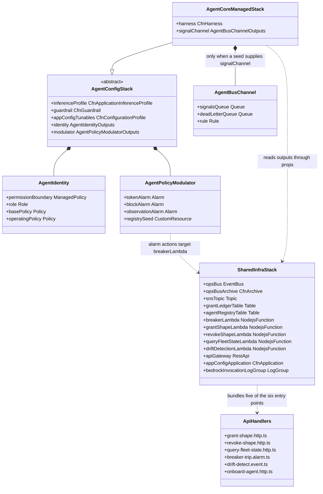
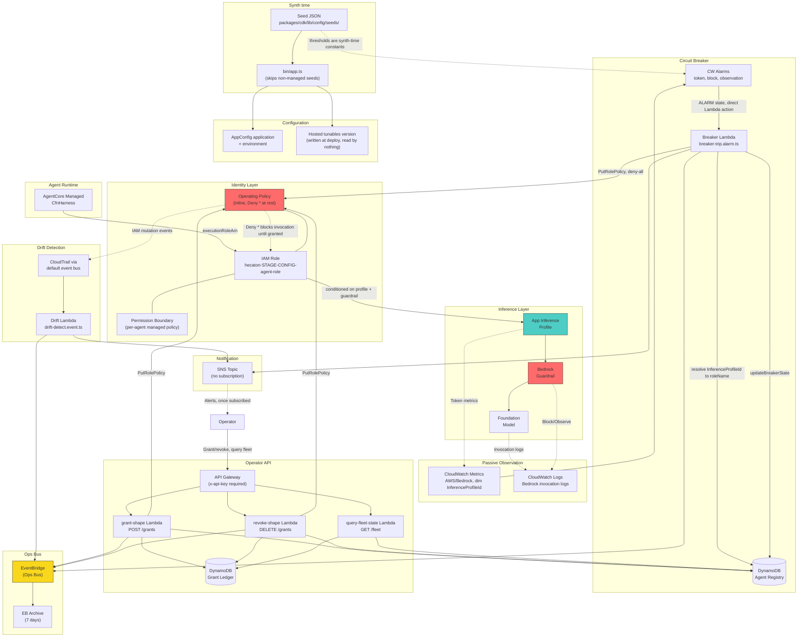

# Design Document

## Overview

This is a documentation edit, so the design settles editorial mechanics rather than software architecture. Four decisions carry most of the risk: the annotation format used on the diagrams, the text of the four steering blocks, the section shape of the new decisions record, and what replaces each interface specification deleted from the architecture document. Each is settled here in full so implementation is transcription.

Five files change. Nothing under `packages/` changes.

| File | Change |
|---|---|
| `.initial-planning/decisions.md` | Created. Frontmatter, steering block, seven decision sections. |
| `.initial-planning/architecture.md` | Steering block, `revised` date, five deletions with replacements, two gap annotations, three targeted path fixes. |
| `.initial-planning/diagrams.md` | Steering block, nine status annotations, diagrams 3 and 9 rewritten. |
| `.initial-planning/Hecatoncheires.md` | Steering block, one closed TBD retired, three links to the decisions record. |
| `.kiro/steering/structure.md` | One table cell. |

## Architecture

The unit of architecture here is a set of documents, not a set of runtime components. Five files change, and three things hold them together: which document owns which kind of content, which document links to which, and the order the edits have to happen in.

### Content ownership

Four documents in `.initial-planning/` and one steering file, each owning one kind of content after the triage.

| File | Owns |
|---|---|
| `Hecatoncheires.md` | Outcome, success criteria, milestones, weekly log. The brief. |
| `architecture.md` | Layering rules, decisions still in force, rationale. No interface specifications. |
| `diagrams.md` | Nine Mermaid diagrams, each labelled built or specification. |
| `decisions.md` | Closed decisions, newest appended last. New file. |
| `.kiro/steering/structure.md` | Agent-facing repository conventions. One cell corrected. |

The split matters because the triage framework routes content by owner. An interface specification leaves `architecture.md` and is not rehomed anywhere, because `packages/` owns it. A resolved open question leaves whichever document recorded it as open and lands in `decisions.md`. An aspirational diagram stays where it is and gains a label. Nothing moves between the first three documents.

### The canonicality rule

The repository copy of each Planning_Doc is authoritative and the Obsidian vault copy is a read-only archive that is no longer synchronised. That is a rule about the documents, so it is stated in the documents: every steering block opens with the same line and every steering block says it, per requirement 1.6. It is not recorded in frontmatter, because requirement 1.5 forbids introducing a `canonical` key.

The rule has a consequence for the edit itself. The triage writes only to the repository working tree and never opens the vault copy, which is what the final diff check under `## Verification` confirms.

### The link graph

After the triage, links between the four planning documents run as below. Every edge is a relative Markdown link resolved against `.initial-planning/`.

| From | To | Sites |
|---|---|---|
| `decisions.md` | `Hecatoncheires.md`, `architecture.md`, `diagrams.md` | The `Related:` line under the intro. |
| `architecture.md` | `decisions.md` | Steering block, `## Stacks`, the grant ledger sentence under `## Configuration schemas`, the `## Decisions` section replacing `## Open questions`. |
| `diagrams.md` | `decisions.md` | Steering block, intro line. |
| `diagrams.md` | `Hecatoncheires.md` | The diagram 8 annotation, pointing at the milestone table. |
| `Hecatoncheires.md` | `decisions.md` | Steering block, the retired TBD in the Phase 1 task line, note under `## Tasks`, `### In this repository` list entry. |

`structure.md` neither gains nor loses a link. The three inbound edges to `decisions.md` are what requirement 2.12 asks for, one per pre-existing document.

### The ordering dependency

`decisions.md` is the only new file and the only link target that does not exist before the triage starts. Three documents link to it, so it has to be written first, or an intermediate state carries a dead link, which is requirement 9.3 failing partway through rather than only at the end. Its own three outbound links point at files that already exist, so it is link-valid the moment it is written.

That single dependency fixes the whole order. `## Edit sequencing` sets it out step by step, with `structure.md` deliberately last because it is independent of the other four and a failure there should not leave the planning documents half-edited.

## Components and Interfaces

Each of the five files is a component. Its interface is the contract constraining how a future edit may touch it: the rules in its steering block, plus the outbound links it is expected to carry. The four steering blocks are drafted in full under `## Steering blocks`; this section says what each one commits its document to.

### `Hecatoncheires.md`, the brief

Interface: reviewed at each milestone date and again whenever a milestone moves, with the status line, the progress figure, and the weekly log updated in the same pass. Checkbox state records the plan as it stood when each list was written, so a stale checkbox is not a defect. Closed decisions belong in `decisions.md`, not here.

Outbound: four links to `decisions.md`, one of them the phrase replacing the closed TBD.

Changes in this triage: the steering block, one closed TBD retired, the note under `## Tasks`, the `### In this repository` entry. Set out under `## Brief document`.

### `architecture.md`, the layering document

Interface: holds decisions, layering rules, and rationale. Does not hold construct props, construct outputs, file inventories, handler inventories, adapter inventories, or folder decompositions. When the code contradicts the document, the sentence gets fixed or a decision gets recorded, and the code's current shape does not get pasted back in. This is the strongest of the four contracts, because it is the one that failed and caused the triage.

Outbound: four links to `decisions.md`, plus the pointers into `packages/` that replace each deleted interface specification. The pointer form is fixed under `## Pointer form for deleted interface specifications` and names a folder rather than a file wherever the replaced content spanned more than one file, so adding or renaming a file cannot falsify it.

Changes in this triage: the `revised` date, five deletions with replacements, two gap annotations, three path fixes, one renamed section. The disposition of all 21 sections plus frontmatter is the table under `## Architecture document, section by section`.

### `diagrams.md`, the diagram set

Interface: every diagram carries a status callout above its Mermaid block. When a specified path gets implemented, what it says moves from the `Specification:` line to the `Built:` line in the same commit that lands the code. Diagrams 3 and 9 are transcriptions of the code and get rewritten from the code rather than annotated.

Outbound: two links to `decisions.md`, one to `Hecatoncheires.md`.

Changes in this triage: the steering block, nine status annotations, two rewritten fences, one changed heading and lead line. Set out under `## Diagrams document`.

### `decisions.md`, the decisions record

Interface: grows by appending, newest at the bottom, in the field order the existing sections use. A closed decision is never edited to say something different. A reversal or a narrowing is a new section naming the section it supersedes, so the record reads in the order things actually happened.

Outbound: one `Related:` line carrying three links.

Changes in this triage: created, with frontmatter, steering block, header, intro, and seven decision sections. Set out under `## Decisions record`.

### `.kiro/steering/structure.md`, the structure steering file

The only component with no steering block, because it is not a Planning_Doc and requirement 7.1 does not reach it. Its interface is narrower and comes straight from requirement 8.2: one cell changes and no other naming pattern does, including the inference profile row, which carries the same unstaged form and stays wrong for now. Set out under `## Structure steering correction`.

## Data Models

Four text structures in this triage are fixed rather than free prose, which is what makes them checkable. Each is specified in full elsewhere in this document. This section says what each structure is for and where its specification lives, so all four can be found from one place.

### Frontmatter key sets

One key set per document, and for the three pre-existing documents the set is not the triage's to change. Requirement 1.3 preserves every key and value except `revised`, and requirement 1.5 forbids adding a key.

| Document | Keys | `revised` |
|---|---|---|
| `Hecatoncheires.md` | `tags`, `due`, `created`, `area`, `progress`, `status` | Not defined. Not added. |
| `architecture.md` | `tags`, `created`, `revised`, `parent`, `status`, `version` | Defined. The only frontmatter value the triage changes. |
| `diagrams.md` | `tags`, `created`, `parent`, `status` | Not defined. Not added. |
| `decisions.md` | `tags`, `created`, `parent`, `status` | Not defined. New file, so requirement 1.5 does not bind it. |

Three of these values are Deliberate_Wikilinks and survive byte for byte, quotation marks and display alias included: `parent:` in `architecture.md`, `parent:` in `diagrams.md`, `area:` in `Hecatoncheires.md`. The `decisions.md` block is given under `## Decisions record`. Property 1 is the check.

### The status annotation grammar

A fixed callout type, a fixed title vocabulary of three words, and a fixed set of body lead-ins in a fixed order. Specified under `## Annotation format`, which also settles placement, the standalone gap variant used outside `diagrams.md`, how the form degrades on GitHub, and why no lead-in is bold. Property 3 is the check.

### The decision section template

Five fields, one per line, in the order `Question:`, `Decision:`, `Decided:`, `Code:`, `Supersedes:`, with `Supersedes:` omitted where the decision replaced nothing. Specified under `## Decisions record`, along with how each `Decided:` date was resolved. Property 11 is the check.

### The pointer form

One sentence shape reused at every site where an interface specification was deleted, naming the authoritative location in `packages/` rather than summarising what was there. Specified with its two rules and five worked instances under `## Pointer form for deleted interface specifications`. Property 9 is the check for its presence in every host section.

## Facts verified against the code

Everything asserted in the new document text was read out of the repository during design. The findings that shaped the design:

The role name pattern is `hecaton-{stage}-{configName}-agent-role`, from `NamingGenerator.roleName` in `packages/core/src/constants/naming.ts`. The naming table in the architecture document already carries this pattern, which is why requirement 3.7 can leave it alone. The structure steering file carries the unstaged form, which is what requirement 8 corrects.

Three constructs exist, all with a `.construct.ts` suffix: `agent-identity.construct.ts`, `agent-policy-modulator.construct.ts`, `agent-bus-channel.construct.ts`. The twelve-file inventory in the architecture document matches none of them by filename.

Three stacks exist: `shared-infra.stack.ts`, `agent-config.stack.ts` (abstract), `agentcore-managed.stack.ts`.

Six handler files exist. `grant-shape.http.ts`, `revoke-shape.http.ts`, and `query-fleet-state.http.ts` are wired to `POST /grants`, `DELETE /grants`, and `GET /fleet`. `breaker-trip.alarm.ts` is the shared breaker Lambda. `drift-detect.event.ts` is the target of a CloudTrail rule on the default event bus. `onboard-agent.http.ts` has no Lambda resource and no route; `packages/cdk/` contains no reference to it at all.

The breaker path is: a CloudWatch alarm dimensioned on `InferenceProfileId` names the shared breaker Lambda directly as its alarm action, the handler resolves that dimension to a role name through the agent registry table, and `packages/api/src/use-cases/trip-breaker.ts` writes a deny-all policy to the role's inline operating policy. Registry update, ops bus emit, and SNS publish are all best-effort after the IAM write.

`AgentBusChannel` is unreachable from `packages/cdk/bin/app.ts`. It is instantiated only when a seed supplies `signalChannel.signalsBusArn`, and the single seed in `packages/cdk/lib/config/seeds/` supplies no such value.

`SharedInfraStack` creates the SNS topic with no subscription, so the notification path terminates at the topic.

The grant ledger table has TTL on `expiresAt`, so DynamoDB deletes expired grant rows, but nothing rewrites the operating policy when that happens. No expiry sweep handler exists anywhere.

`packages/api/src/adapters/appconfig/` and `packages/api/src/adapters/cloudwatch/` contain only a `.gitkeep`. AppConfig hosted tunables are written at deploy time by `AgentConfigStack` and read by nothing.

All five `packages/core/src/domain/` folders exist and contain only a `.gitkeep`. `resolve-shape.ts` and `assemble-policy.ts` live in `packages/core/src/shared/algorithms/`. Two path references in the architecture document point at the wrong place because of this, and requirement 9.4 requires both to be fixed.

## Annotation format

### Grammar

One format covers every annotation, at whole-diagram scale and single-element scale alike. It is an Obsidian callout with a fixed title vocabulary and a fixed set of body lead-ins in a fixed order.

```
> [!note] Status: <built | partly built | specification>
> Built: <prose>
> Specification: <prose>
> Gap: <prose>
```

Rules:

The callout type is always `note` for a status annotation. The title is always `Status: ` followed by one of three words. `built` means every element in the diagram is implemented. `specification` means the diagram is largely or wholly unbuilt. `partly built` is everything between.

`Built:` and `Specification:` are both always present, in that order, even when one of them is empty. An empty one reads `Specification: none.` Keeping the pair present in all nine annotations is what makes them scan as one format rather than nine variations.

`Gap:` is present only where there is a Known_Gap_Annotation to record. It is the last line.

Scale is handled by what the prose names, not by changing the format. A whole-diagram annotation names the diagram or a subgraph. A single-element annotation names the element by its rendered label text in quotes, or names the edge by its endpoints. Diagram 5 and diagram 7 use the whole-diagram voice, diagram 2 and diagram 6 name a single node, and diagram 4 names a note on the diagram. Same four-line shape in all of them.

The annotation never edits the Mermaid source. It sits outside the fence and refers to elements by label. That keeps requirement 5.1 (original diagram content retained) and requirement 9.2 (every fence parses) both trivially true, because no fence is touched on the seven annotated diagrams.

### Placement

Immediately before the Mermaid fence, after any existing prose under the heading. The reader meets the status before the diagram, which is the point of the exercise. Diagram 6 has three sentences of rationale under its heading; the annotation goes after those, still directly above the fence.

### Standalone gap annotations

Outside `diagrams.md` there is nothing to mark built or specified, so a gap annotation stands alone in a different callout type with prose rather than lead-ins:

```
> [!warning] Known gap
> <prose stating the gap and nothing else>
```

Two of these go into `architecture.md`. They carry no proposed remedy and no plan, per requirement 6.3. The format has no field for one.

### Rendered form

In Obsidian, `> [!note] Status: partly built` renders as a collapsible Note callout titled "Status: partly built", with the three body lines as its content. `> [!warning] Known gap` renders as a Warning callout. Both types are in Obsidian's built-in set.

On GitHub, alert parsing requires the type marker alone on its line, so a marker with an inline title falls back to a plain blockquote. The annotation renders as a bordered quote block reading:

> [!note] Status: partly built
> Built: the grant path.
> Specification: the time-boxed grant block.

That is a correct render, not a broken one, and it stays readable. This degradation is already accepted house style: requirement 7.2 mandates `> [!note] Maintaining this document` on one line, and the brief already carries `> [!info] Definition`, `> [!question] Why are we doing this?`, and four more of the same shape. Matching house style was chosen over optimising for GitHub's alert box.

Two constraints follow from wanting the fallback to read well. Callout types are drawn only from the five that both tools recognise (`note`, `tip`, `important`, `warning`, `caution`), so the literal text a GitHub reader sees names a sensible category. And the title is written to make sense as plain text, which `Status: partly built` does.

Blank continuation lines are not used inside annotations. All lines are consecutive `> ` lines, so both renderers wrap them into one paragraph per line break in Obsidian and a single quote block on GitHub, with no lazy-continuation surprises.

### Bold

None of these use bold. The lead-ins are plain text followed by a colon, not `- **Built:**` bullets. This is deliberate: the repository's writing rule bans the inline-bold list-header shape, and a status block reads fine without it.

## Steering blocks

Four blocks, one per document. Each opens with the exact required line, sits immediately after the closing `---` of frontmatter and before any other content, states that the repository copy is the one to edit, and then carries rules specific to that document. Each is three or four body paragraphs, which is short enough to be read.

Paragraphs inside a block are separated by a bare `>` line so both renderers break them.

Note on placement in the brief: `Hecatoncheires.md` currently opens with a `> [!info] Definition` callout before its first heading. The steering block goes above that callout, because requirement 7.3 says immediately after frontmatter and before the first heading or body content. The Definition callout follows unchanged.

### Brief_Doc

Review cadence tied to the milestones satisfies requirement 7.4.

````markdown
> [!note] Maintaining this document
> The copy in this repository is the one to edit. The Obsidian vault copy is a read-only archive and is no longer synchronised.
>
> Review this document at each milestone date in the milestone table, and again whenever a milestone moves. Update the status line, the progress figure, and the weekly log in the same pass, or the three drift apart.
>
> Task and success-criteria checkboxes below record the plan as it stood when each list was written. Some items were superseded rather than completed. Closed decisions live in [decisions.md](./decisions.md).
````

### Architecture_Doc

Requirement 7.5 needs both statements: interface specifications are not to be reintroduced, and `packages/` is the specification.

````markdown
> [!note] Maintaining this document
> The copy in this repository is the one to edit. The Obsidian vault copy is a read-only archive and is no longer synchronised.
>
> This document holds decisions, layering rules, and rationale. It does not hold construct props, construct outputs, file inventories, handler inventories, adapter inventories, or folder decompositions. Those were removed because every one of them had drifted from the code. The code in `packages/` is the specification. Do not reintroduce them here.
>
> When the code contradicts something recorded here, fix the sentence or record a new decision in [decisions.md](./decisions.md). Do not paste the code's current shape back into this file.
````

### Diagrams_Doc

Requirement 7.6 needs the built and specification labelling kept accurate as implementation advances.

````markdown
> [!note] Maintaining this document
> The copy in this repository is the one to edit. The Obsidian vault copy is a read-only archive and is no longer synchronised.
>
> Every diagram carries a status callout above its Mermaid block saying what is built and what is still specification. When you implement one of the specified paths, move it from the `Specification:` line to the `Built:` line in the same commit that lands the code. A stale status line is worse than an undated diagram, because it reads as current.
>
> Diagrams 3 and 9 are transcriptions of the code. Rewrite them from the code rather than annotating them. Closed decisions live in [decisions.md](./decisions.md).
````

### Decisions_Doc

Requirement 7.7 needs the append rule and the supersede-by-new-section rule.

````markdown
> [!note] Maintaining this document
> The copy in this repository is the one to edit. The Obsidian vault copy is a read-only archive and is no longer synchronised.
>
> This document grows by appending. Add a section when a decision closes, newest at the bottom, and keep the field order used by the sections already here.
>
> A closed decision is never edited to say something different. If one is reversed or narrowed, append a new section and name the section it supersedes. The old section stays as written, so the record reads in the order things actually happened.
````

## Decisions record

### Frontmatter

`decisions.md` is a new file, so requirement 1.5 does not bind it. Frontmatter is modelled on its two siblings so the vault treats it the same way. The `parent:` wikilink matches the form used in `architecture.md` and `diagrams.md`.

```yaml
---
tags: [core/project, topic/ai, topic/aws, topic/cdk, topic/architecture]
created: 2026-08-25
parent: "[[Hecatoncheires]]"
status: Active
---
```

Set `created` to the date the file lands if that is later than the date above.

### Section template

Five fields, in fixed order, one per line. Plain lead-ins, matching the annotation format, no bold.

```
### <sentence-case statement of what was decided>

Question: <the question this closed, phrased as a question>
Decision: <what was decided, in one or two sentences>
Decided: <YYYY-MM-DD>
Code: `<path under packages/ where the decision now lives>`
Supersedes: <the arrangement this replaced>
```

`Supersedes:` is omitted where the decision replaced nothing, which applies to the first two sections only.

`Decided:` is the date the deciding code first landed, taken from `git log -S` on the identifier that carries the decision. Every date below was resolved that way, so no section needs a hedge about an unknown date.

### The seven sections

Ordered oldest first, so the file already reads the way the steering block says to extend it. Requirement mapping is given here for traceability and is not written into the document.

Header and intro, above the first section:

````markdown
# Decisions

Decisions that have closed, with the question each one answered and where the answer now lives in code. The three sibling documents in this folder describe the design; this one records what was settled and when.

Related: [Hecatoncheires.md](./Hecatoncheires.md), [architecture.md](./architecture.md), [diagrams.md](./diagrams.md).
````

Section 1, requirement 2.6:

````markdown
### The capability shape catalog is four frozen shapes carrying risk tiers

Question: What is the starting set of capability shapes, and where does the catalog live?
Decision: Four shapes, each carrying a risk tier: `core-invocation` (medium), `s3-prefix-read` (low), `s3-prefix-write` (medium), `cloudwatch-logs-read` (low). The catalog is a frozen array, so nothing can add a shape at runtime. Shapes are added by editing the file and deploying.
Decided: 2026-07-20
Code: `packages/core/src/config/shape-catalog.ts`
````

Section 2, requirement 2.4:

````markdown
### The grant ledger is DynamoDB keyed on configName and grantId

Question: What is the grant ledger's data architecture?
Decision: One DynamoDB table, partition key `configName`, sort key `grantId`, on-demand billing. TTL on `expiresAt`, point-in-time recovery enabled, and `RemovalPolicy.RETAIN` so a stack teardown cannot destroy the grant history.
Decided: 2026-07-22
Code: `packages/cdk/lib/stacks/shared-infra.stack.ts`
````

Section 3, requirement 2.8:

````markdown
### The permission boundary is per agent, not one ceiling for the fleet

Question: Is the permission boundary a single shared managed policy for the whole fleet, or one per agent?
Decision: One managed policy per agent, created inside the `AgentIdentity` construct and attached to that agent's role as its boundary. The boundary allows Bedrock inference only under condition keys binding the assigned inference profile and guardrail, plus a narrow floor of logging and `hecaton-*` S3 access.
Decided: 2026-07-22
Code: `packages/cdk/lib/constructs/agent-identity.construct.ts`
Supersedes: The earlier plan for one shared fleet boundary deployed by the shared infrastructure stack and referenced by every agent role.
````

Section 4, requirement 2.9:

````markdown
### The harness abstraction is CDK stack inheritance, not an L3 construct

Question: How do the three harness types share governance wiring without duplicating it?
Decision: Stack inheritance. An abstract `AgentConfigStack` creates the inference profile, the guardrail, the identity, the modulator, and the AppConfig tunables. A concrete `AgentCoreManagedStack` extends it and adds the `CfnHarness` resource. The deployment unit is one CloudFormation stack per agent config.
Decided: 2026-07-22
Code: `packages/cdk/lib/stacks/agent-config.stack.ts`, `packages/cdk/lib/stacks/agentcore-managed.stack.ts`
Supersedes: The L3 construct named `AgentTypeHarness` with three subclass constructs (`AgentCoreManagedHarness`, `OpenClawHarness`, `AgentCoreRuntimeHarness`) composed inside a shared stack. The two subclasses for OpenClaw and AgentCore Runtime have no equivalent yet; `packages/cdk/bin/app.ts` skips any seed whose `agentType` is not `agentcore-managed`.
````

Section 5, requirement 2.5:

````markdown
### A second DynamoDB table holds the agent registry

Question: How does a CloudWatch alarm, which only knows an inference profile ID, reach the IAM role it needs to modulate?
Decision: A second DynamoDB table, separate from the grant ledger, using a single-table `pk`/`sk` key schema with an inverted global secondary index named `gsi1` that swaps the two. The inversion is what makes profile-to-role lookup a query rather than a scan. Records are written by a custom resource at deploy time and carry the config name, role name, profile entity ID, profile ARN, agent type, model ID, guardrail ID, and breaker state.
Decided: 2026-08-24
Code: `packages/cdk/lib/stacks/shared-infra.stack.ts`, `packages/cdk/lib/lambda/registry-seed.handler.ts`, `packages/api/src/adapters/dynamo/agent-registry.adapter.ts`
Supersedes: Nothing. The table was never in the planning documents, which is why it is recorded here.
````

Section 6, requirement 2.7:

````markdown
### There is one breaker Lambda for the whole fleet

Question: Is the modulator Lambda deployed once per account or once per agent config?
Decision: Shared. One breaker Lambda in `SharedInfraStack`, invoked directly as the alarm action of every agent's three alarms. Per-agent stacks pass the function ARN into their alarms; the invoke permission is granted once in the shared stack, because granting it per agent creates a circular cross-stack dependency.
Decided: 2026-08-24
Code: `packages/cdk/lib/stacks/shared-infra.stack.ts`, `packages/api/src/handlers/breaker-trip.alarm.ts`
Supersedes: The plan for a modulator Lambda inside each `AgentPolicyModulator` instance, which would have deployed one per agent config.
````

Section 7, requirement 2.10:

````markdown
### The AgentTelemetry construct was dropped

Question: Where does the inference profile ID to config name mapping live?
Decision: In the agent registry table. The `AgentTelemetry` construct existed to hold that mapping and to wire a log subscription filter in a later phase. The registry now holds the mapping for every agent, so the construct had nothing left to own and was never built.
Decided: 2026-08-24
Code: `packages/api/src/adapters/dynamo/agent-registry.adapter.ts`
Supersedes: The `AgentTelemetry` L3 construct, which the architecture document specified props for and which no file ever implemented.
````

## Pointer form for deleted interface specifications

Requirement 3.6 wants each deletion replaced by a reference to the authoritative location rather than a shorter summary, because a summary drifts the same way the original did. One form, reused at every site:

```
The specification is the code. See `<path>`, where <one clause naming what to read there>.
```

Two rules keep it honest. The path is a folder, not a file, wherever the content being replaced covered more than one file, so adding or renaming a file does not falsify the pointer. And the clause names the kind of thing to look for, never the current contents, so nothing in it can go stale.

Worked instances:

```
The specification is the code. See `packages/cdk/lib/constructs/`, where the exported props and outputs interfaces define each construct's contract.

The specification is the code. See `packages/cdk/lib/stacks/`, where each stack's constructor shows what it creates and what it exposes to the stacks that depend on it.

The specification is the code. See `packages/api/src/handlers/`, where the filename suffix gives the trigger type and the imports show which use-case each one delegates to.

The specification is the code. See `packages/api/src/adapters/`, where each I/O boundary owns a folder with its DTOs and mappers.

The specification is the code. See `packages/core/src/`, where the folder names carry the layering.
```

## Architecture document, section by section

Requirement 3 names five deletion categories. The document holds more instances than five, because four of the five live inside one Markdown block and because the construct interface section specifies eight constructs, of which only three exist. The full disposition:

| Section | Requirement | Disposition |
|---|---|---|
| Frontmatter | 1.3 | `revised` updated. Every other key and value untouched, including `version: 2`. |
| `## Harness development order` | none | Keep. Build-order rationale. |
| `## Monorepo layout` | 3.2, 3.3, 3.4, 3.5 | Delete the directory tree. Replace with a package table and a pointer. |
| `## Layer dependencies` | 3.8 | Keep. Dependency rules are decisions. |
| `## Role model: boundary, base, operating policy` | 3.8, 9.4 | Keep the three-layer rationale verbatim. Repoint one path. |
| `## Stacks (packages/cdk)` | 3.3, 2.11 | Delete all three subsections. Replace with retained decisions and a pointer. |
| `## Construct interfaces` | 3.1, 3.6 | Delete all eight props and outputs blocks. Keep the rationale prose. Rename the section. Add a pointer and one gap annotation. |
| `## Handler convention (packages/api)` | none | Keep. A naming convention, not an inventory. |
| `## DTO flow` | none | Keep. |
| `## Configuration schemas (packages/core)` | 6.1, 6.2, 2.11 | Keep both schema blocks. Add a gap annotation. Retire one closed TBD. Reword one dead type reference. |
| `## Governance layering: platform vs harness-native` | 3.8 | Keep. |
| `## Naming conventions` | 3.7 | Unchanged, byte for byte. |
| `## Deployment flow` | 3.3 | Keep. Drop the one line deploying a stack that does not exist. |
| `## Phase 1 scope` | none | Keep as written. |
| `## Testing strategy` | 9.4 | Keep. Repoint the co-location example. |
| `## Error handling and response contract` | none | Keep as written. |
| `## API authentication` | none | Keep. Matches the code. |
| `## Environment and stage strategy` | none | Keep. |
| `## Dependency versions` | none | Keep. |
| `## packages/web status` | none | Keep. |
| `## Open questions` | 2.11, 2.12 | Delete the list. Replace with the decisions link. |
| `## Next steps` | none | Keep as written. |

### Monorepo layout

The directory tree is four of the five deletion categories at once. It carries the twelve-file construct inventory including `agent-telemetry.ts` and four harness constructs, the stack inventory including `telemetry.stack.ts`, the nine-handler inventory, the adapter inventory, and the five-folder `domain/` decomposition. Only the four-package split is a decision, and that survives without a file listing.

Replacement:

````markdown
## Monorepo layout

pnpm workspaces. Four packages, clean-architecture layered as described below.

| Package | Layers | Role |
|---|---|---|
| `packages/core` | 0 to 2 | The engine. Pure domain logic. zod is its only external dependency. |
| `packages/api` | 3 | Use-cases and adapters. The Lambda runtime. |
| `packages/cdk` | 3 | Constructs and stacks. The infrastructure adapter. |
| `packages/web` | 4 | Operator dashboard. Placeholder until Phase 3. |

The specification is the code. See `packages/core/src/`, where the folder names carry the layering. This document previously carried the full directory tree of every package, and the tree drifted from the repository within weeks, so it is not restated here.
````

### Stacks

The section names a `TelemetryStack` that was never built and omits `AgentCoreManagedStack`, and its shared-infrastructure bullet list carries a TBD that requirement 2.11 removes. What is worth keeping is the deployment cardinality, which is a decision.

Replacement:

````markdown
## Stacks (packages/cdk)

Two kinds of stack. One shared stack per account and stage holds everything the whole fleet references: the ops bus, the notification topic, the permission-boundary-independent shared resources, the two DynamoDB tables, the API Gateway and its handler Lambdas, the shared breaker Lambda, drift detection, and Bedrock invocation logging. One stack per agent configuration holds that agent's identity, inference profile, guardrail, alarms, and tunables. The deployment unit is one CloudFormation stack per agent config, which is recorded in [decisions.md](./decisions.md).

The specification is the code. See `packages/cdk/lib/stacks/`, where each stack's constructor shows what it creates and what it exposes to the stacks that depend on it.
````

### Constructs

Eight props and outputs blocks go. Requirement 3.1 names three of them. The other five specify `AgentTelemetry`, `AgentTypeHarness`, `AgentCoreManagedHarness`, `OpenClawHarness`, and `AgentCoreRuntimeHarness`, none of which is a file in the repository, and two of which are recorded as superseded in the decisions record. Leaving them would leave interface specifications for constructs that do not exist, which is the exact failure requirement 3 is written to end.

The rationale prose between the code blocks is retained under requirement 3.8: the condition keys on Bedrock inference actions, the trust policy varying by harness type, the one-IAM-mutation-engine argument, and the FIFO ordering reason for the signals queue. The claim that the emergency path revokes the invocation shape gets a gap annotation rather than a rewrite, matching how the same claim is handled on diagram 4.

Replacement:

````markdown
## Constructs (packages/cdk)

Constructs live in `packages/cdk/lib/constructs/` and import `@hecaton/core` for seed validation and resource naming. They reference `packages/api` handler entry points for Lambda bundling.

The specification is the code. See `packages/cdk/lib/constructs/`, where the exported props and outputs interfaces define each construct's contract. This document previously restated them and the copies drifted, so they are not restated here.

### Identity

The role carries condition keys on all Bedrock inference actions:

- `bedrock:InferenceProfileArn` must equal the assigned profile
- `bedrock:GuardrailIdentifier` must equal the assigned guardrail

Trust policy shape varies by harness type:

- AgentCore Managed: trusts `bedrock-agentcore.amazonaws.com`
- OpenClaw: trusts the principal where the instance runs, supplied per config
- AgentCore Runtime: trusts `bedrock-agentcore.amazonaws.com`

### Policy modulation

One IAM-mutation engine. The breaker is the coarsest operation; a capability gate is a narrower operation. Both are the same operation against the same inline policy, which is why there is no separate breaker subsystem.

Two trigger sources reach that policy. A grant or revoke request queries the grant ledger for the config's current grants, resolves each against the shape templates, and rewrites the operating policy. A breaker alarm state change writes directly, with no ledger query, because the emergency path cannot depend on a read succeeding. Both paths then emit an event to the ops bus and publish a notification to SNS.

> [!warning] Known gap
> The emergency path does not revoke the invocation shape. It writes a deny-all policy to the operating policy, so a trip removes every granted shape rather than only invocation. The published notification reaches the SNS topic, which currently has no subscription.

The grant ledger is the source of truth for what a config is allowed to do. AppConfig is not involved in grant state.

### Signal delivery

The signals queue is SQS FIFO and the rule sets `MessageGroupId` from the event's `correlationId`, which gives causal ordering per chain rather than per queue.
````

### Configuration schemas

Both JSON blocks stay. A configuration schema is not an Interface_Specification under the glossary, and the deletion list does not reach it. Three edits:

The `> **Note:**` blockquote under the agent configuration block references `OpenClawHarnessProps.eventBridgeChannel`, a props type whose specification is being deleted two sections up. The sentence keeps its decision and drops the dead type name: "They have been moved to the OpenClaw harness configuration, since delivery is a concern specific to that harness type."

The sentence "It lives in the grant ledger (DynamoDB, data architecture TBD)" carries a TBD that is now closed. It becomes: "It lives in the grant ledger, whose schema is recorded in [decisions.md](./decisions.md)."

A gap annotation goes directly under the runtime tunables block, whose heading promises change without deploy. It carries both requirement 6.1 and requirement 6.2:

````markdown
> [!warning] Known gap
> Nothing reads these tunables. `AgentConfigStack` writes them as an AppConfig hosted configuration version at deploy time, and alarm thresholds are set from the seed JSON at synth time, so changing a threshold requires a deployment. `packages/api/src/adapters/appconfig/` and `packages/api/src/adapters/cloudwatch/` contain only a `.gitkeep`.
````

### Three path fixes required by requirement 9.4

The role model section says the policy-document assembly algorithm lives in `packages/core/src/domain/capability/`. That folder exists but holds only a `.gitkeep`. The code is in `packages/core/src/shared/algorithms/`. The sentence is repointed there.

The testing strategy section illustrates test co-location with a tree rooted at `packages/core/src/domain/capability/` containing `resolve-shape.ts`, `resolve-shape.test.ts`, `assemble-policy.ts`, and `assemble-policy.test.ts`. None of those paths exists. The example is repointed to `packages/core/src/shared/algorithms/`, where all four files do exist, and the tree is otherwise unchanged.

The deployment flow block deploys `Hecaton-Dev-Telemetry`. No such stack exists and the stack inventory that introduced it is being deleted. The line goes; the other three lines and the `--all` alternative stay.

### Open questions

The list goes, per requirement 2.11. Five of its seven entries are answered in the decisions record. Two are still genuinely open, the metric namespace conventions and the frontend framework, and the framework question survives in prose under `## packages/web status`. The replacement is one line, which is also where requirement 2.12's link lives for this document:

````markdown
## Decisions

Questions that have closed, with what was decided and where the answer lives in code, are recorded in [decisions.md](./decisions.md).
````

### Left as written

Four things in this document are stale and are deliberately not touched, because no requirement reaches them and correcting them would exceed a documentation triage's remit.

`## Phase 1 scope` lists a thirteen-step build order naming `AgentCoreManagedHarness` and the other superseded constructs. It is a record of the plan at the time of writing, and the decisions record now carries what changed.

`## Next steps` lists seven steps, most of them done. Same reasoning.

The typed error class list under `## Error handling and response contract` names six classes; `packages/core/src/errors/` holds seven, with `PolicySizeExceededError` missing from the document.

The agent configuration JSON block does not match the shape of `packages/cdk/lib/config/seeds/example-agentcore-managed.json`, which carries `thresholds` and `harnessConfig` and no `owner`.

## Brief document

Four edits.

The steering block goes in above the Definition callout.

The Phase 1 task line `- [ ] Grant ledger (DynamoDB likely, data architecture TBD) for live capability-shape state` carries a closed TBD. It becomes `- [ ] Grant ledger for live capability-shape state (schema recorded in [decisions.md](./decisions.md))`. This is the reading of requirement 2.11 that the design adopts: remove TBD sections and lists, and where a retained line carries a TBD that has since closed, replace the TBD phrase with the decision link. The `TBD` cells in the milestone table's date column are dates that genuinely are not set, and they stay.

A one-line note goes directly under the `## Tasks` heading, above the first task list:

````markdown
Decisions that closed after these lists were written are recorded in [decisions.md](./decisions.md). Some items below were superseded rather than completed.
````

The `### In this repository` list under `## References` gains a third entry alongside the other two:

````markdown
- [decisions.md](./decisions.md) -- decisions record: closed questions, what was decided, where the code lives
````

Checkbox states are not reconciled. Milestone-cadence review is what the steering block exists to schedule.

## Diagrams document

### Scope

All nine diagrams get a status annotation, not the seven that requirement 5.1 names. Diagrams 3 and 9 are rewritten from the code, and giving them the same callout as the other seven is what makes requirement 5.8's one consistent format actually hold across the document. Their annotations are honest without strain: both are transcriptions, so both read `Status: built`, and both carry a `Gap:` line for what the code does not do.

Requirement 2.12's link for this document sits in the steering block and again in the intro line under `# Architecture diagrams`. That line currently reads "Mermaid diagrams for the Hecatoncheires platform. Renders natively in Obsidian." It becomes:

```markdown
Mermaid diagrams for the Hecatoncheires platform. Renders natively in Obsidian. Closed decisions are recorded in [decisions.md](./decisions.md).
```

### Diagram 3 rewritten

The original is a class diagram of an abstract `AgentTypeHarness` composing four constructs with three harness subclasses. Seven of its eight classes describe files that do not exist. The rewrite keeps the class diagram form, because stack inheritance is the fact the diagram exists to communicate, and inheritance is what a class diagram shows.

Heading and lead line stay as they are. The replacement fence:

````markdown

````

Annotation, placed above that fence:

````markdown
> [!note] Status: built
> Built: everything drawn. The diagram is a transcription of `packages/cdk/lib/` and `packages/api/src/handlers/`, so it carries no specification content by construction.
> Specification: none.
> Gap: `onboard-agent.http.ts` is in the handler folder and `packages/cdk/` contains no reference to it. There is no Lambda for it and no route to it. `AgentBusChannel` is drawn as a conditional child because the one seed in the repository supplies no signals bus ARN, so it is never synthesised.
````

### Diagram 9 rewritten

The original draws steady state after Phase 3, including an enrichment pipeline, a dashboard, S3 retention, and three AppConfig read edges. The rewrite draws what deploys today. Removed content is not redrawn as future work; the annotation points at diagrams 5 and 7, which is where the unbuilt paths already live.

Requirement 4.3 is met by the registry participant. Requirement 4.4 is met by the absence of any edge from an AppConfig node to an alarm or a Lambda. Requirement 4.5 is met inside the diagram by the labelled edge from the seed node to the alarms, so the statement survives even when the fence is read on its own.

Subgraphs use the quoted-title form the other eight diagrams use, rather than the newer identifier form, for the widest renderer compatibility.

````markdown

````

Annotation:

````markdown
> [!note] Status: built
> Built: everything drawn, on the same transcription basis as diagram 3. Alarm thresholds are synth-time constants taken from the seed JSON, so the alarms have no runtime configuration input.
> Specification: the telemetry pipeline, the fleet dashboard, and S3 retention are removed from this diagram rather than drawn as future work. They are in diagram 5. The signals bus is in diagram 7.
> Gap: the AppConfig nodes are written at deploy time and read by nothing. The SNS topic has no subscription, so the operator edge from it delivers nothing yet.
````

The heading and lead line of diagram 9 also change, since "steady state after Phase 3" no longer describes the content. The heading becomes `## 9. Data flow overview (as deployed)` and the lead line becomes "Every component and edge that a `cdk deploy --all` currently creates."

### Annotations for the seven retained diagrams

Each goes immediately above its existing fence. No fence is edited.

Diagram 1, system context:

````markdown
> [!note] Status: partly built
> Built: the operator, the platform, the AgentCore Managed harness leg, Bedrock, and the guardrail enforcement edge. Bedrock invocation logging is enabled by `packages/cdk/lib/stacks/shared-infra.stack.ts` and writes to a log group the platform owns.
> Specification: the OpenClaw and AgentCore Runtime legs. `AgentIdentity` builds a trust policy for both types, but neither has a stack, and `packages/cdk/bin/app.ts` skips any seed whose `agentType` is not `agentcore-managed`.
> Gap: two edges run one way in practice. "Reads invocation logs" does not happen; the log group exists and Bedrock writes to it, and nothing consumes it. "Stores/retrieves agent configs & tunables" stores only.
````

Diagram 2, agent invocation path:

````markdown
> [!note] Status: built
> Built: all six numbered steps. `AgentIdentity` conditions every Bedrock inference action on `bedrock:InferenceProfileArn` and `bedrock:GuardrailIdentifier`, so the profile and guardrail hops are enforced rather than conventional. Per-profile metrics and invocation logs are both live.
> Specification: none.
> Gap: the diagram reads as though assuming the role is enough to reach the model. The operating policy that `AgentIdentity` attaches is `Deny *` at rest, so no model invocation is possible until a `core-invocation` grant is written into that policy. Steps 3 to 6 describe the ceiling, not the resting state.
````

Diagram 4, circuit breaker flow:

````markdown
> [!note] Status: partly built
> Built: the alarm to Lambda to IAM to SNS sequence. The three alarms in `AgentPolicyModulator` are dimensioned on `InferenceProfileId` and name the shared breaker Lambda directly as their alarm action. `packages/api/src/handlers/breaker-trip.alarm.ts` resolves that dimension to a role name through the agent registry table, a participant the diagram does not show.
> Specification: nothing automates the reset. Re-granting is a manual `POST /grants` call, which is what the diagram's closing notes already say.
> Gap: the diagram says the breaker revokes the invocation shape. `packages/api/src/use-cases/trip-breaker.ts` writes a full deny-all policy to the operating policy instead, so a trip removes every granted shape rather than only invocation. The SNS publish happens, but the topic has no subscription, so no email is delivered.
````

Diagram 5, telemetry pipeline:

````markdown
> [!note] Status: specification
> Built: two edges. Bedrock to CloudWatch Logs, which the shared stack enables through the Bedrock model invocation logging configuration, and the ops bus to its archive, a seven-day EventBridge archive. The ops bus itself exists and receives events from the breaker, grant, revoke, and drift Lambdas.
> Specification: every other edge. There is no subscription filter, no enrichment Lambda, no S3 export, no profile-ID mapping lookup, and no dashboard. The rule feeding a policy modulator consumer does not exist either; the Lambdas publish to the ops bus rather than consuming from it.
> Gap: the AppConfig node implies a runtime read of sensitive-tool patterns. `packages/api/src/adapters/appconfig/` contains only a `.gitkeep`.
````

Diagram 6, capability control flow:

````markdown
> [!note] Status: partly built
> Built: the grant path. The participant labelled "Policy Modulator" is API Gateway fronting a grant-shape Lambda: `POST /grants` reaches `packages/api/src/handlers/grant-shape.http.ts`, which resolves the agent through the registry, writes the grant to the ledger, and rewrites the operating policy. `DELETE /grants` is the revoke half. The deny-by-default resting state and the absence of any pause-resume step are both accurate.
> Specification: the time-boxed grant block at the end. There is no expiry sweep and no scheduler.
> Gap: the grant ledger has TTL on `expiresAt`, so DynamoDB deletes an expired grant row, and no code rewrites the operating policy when that happens. An expired grant keeps its IAM permissions after its ledger row is gone.
````

Diagram 7, event augmentation module:

````markdown
> [!note] Status: specification
> Built: the per-agent leg only. `AgentBusChannel` creates the FIFO queue, the dead-letter queue, and the rule, with `MessageGroupId` taken from the event's `correlationId`.
> Specification: the shared signals bus, its archive, the non-agent peers, and the observability edge to the ops bus. None of it is deployed.
> Gap: `AgentBusChannel` is unreachable from `packages/cdk/bin/app.ts`. It is instantiated only when a seed supplies a signals bus ARN, and the one seed in `packages/cdk/lib/config/seeds/` supplies none. The per-agent leg is written and never synthesised.
````

Diagram 8, phase deployment progression:

````markdown
> [!note] Status: partly built
> Built: the Phase 1 bars for IAM roles and boundaries, inference profiles and guardrails, the policy modulator, and drift detection with SNS. The AppConfig bar is built as a deploy-time write only.
> Specification: every Phase 2, Phase 3, and Phase 4 bar, and the signals bus infrastructure bar.
> Gap: the dates are the plan as drafted in June and are not maintained. Current milestone status is in the milestone table in [Hecatoncheires.md](./Hecatoncheires.md).
````

## Structure steering correction

One cell in the naming table at `.kiro/steering/structure.md`:

```
| IAM role | `hecaton-{configName}-agent-role` |
```

becomes

```
| IAM role | `hecaton-{stage}-{configName}-agent-role` |
```

The other five rows are untouched, including the inference profile row, which carries the same unstaged form. Requirement 8.2 says change no other pattern, so it stays wrong for now.

## Requirement conflicts resolved

Requirement 5.4 originally named `packages/api/src/handlers/trip-breaker.ts`, which is not a file. The handler is `packages/api/src/handlers/breaker-trip.alarm.ts` and the deny-all policy is written in `packages/api/src/use-cases/trip-breaker.ts`. Requirement 9.4 requires every referenced path to exist, so the annotation names the use-case file, where `DENY_ALL_POLICY` actually is, and requirement 5.4 has since been corrected to name the same file. The substance of 5.4 is unchanged either way.

Requirement 3.4 calls the handler list a nine-handler inventory, which is the right count. Five of the nine names match real files, `drift-detected.event.ts` is a near miss for `drift-detect.event.ts`, and three name nothing.

Requirement 3.2 calls the construct list a twelve-file inventory, which is also the right count. None of the twelve filenames matches a real file, because all three real constructs use a `.construct.ts` suffix the document never adopted.

Requirement 3.5 asks for the five-folder `domain/` decomposition to go. All five folders do exist, which makes the listing look accurate, and all five contain only a `.gitkeep`. Deleting the listing is right for a second reason the requirement does not give.

Requirement 1.3 preserves every frontmatter value except `revised`, so `version: 2` in the architecture document stays at 2 even though the document changes substantially. Bumping it would violate 1.3.

Requirement 2.11 removes every TBD list. A TBD inside an otherwise live list item is not a TBD list, so those items are kept with the TBD phrase replaced by a link to the decision that closed it. The `TBD` date cells in the brief's milestone table are dates that are genuinely unset and stay as they are.

## Edit sequencing

Ordered so that no intermediate state has a relative link pointing at a file that does not exist yet, which is requirement 9.3 applied to the work in progress rather than only to the result.

1. Create `.initial-planning/decisions.md` complete: frontmatter, steering block, header, seven sections. Its own outbound links point at three files that already exist, so it is link-valid the moment it is written, and nothing yet links to it.
2. Edit `.initial-planning/architecture.md`. Every `./decisions.md` link added here resolves, because step 1 created the target.
3. Edit `.initial-planning/diagrams.md`. Rewrite the two fences first, then add the nine annotations, so the annotations are written against final diagram content.
4. Edit `.initial-planning/Hecatoncheires.md`.
5. Edit `.kiro/steering/structure.md`. Independent of the other four, ordered last so a failure there cannot leave the planning documents half-edited.
6. Run the verification pass below.

Within step 3, the annotations for diagrams 1, 2, 4, 5, 6, 7, and 8 are inserted without touching the fences below them. Anything that opens a fence for editing risks requirement 5.1, and byte equality of those seven fence bodies is the check that catches it.

## Error Handling

The failure modes worth planning for are verification failures, since the checks under `## Verification` exist to catch a class of defect that reads as fine. Handling is the same in every case: fix forward in the working tree, then re-run the check that failed and anything downstream of it. What each failure means:

A frontmatter check failure means a key or value was changed that requirement 1.3 preserves. `git show HEAD:<path>` holds the correct block, so the fix is to restore it from there and re-apply only the `revised` change.

A link check failure means a `./decisions.md` link was written before the file existed, which the order under `## Edit sequencing` is designed to prevent. If it happens anyway, the file gets created rather than the link removed.

A `packages/` path check failure means new text names something that is not on disk. The fix is to repoint the text, never to create the file, because requirement 6.4 forbids touching `packages/`.

A byte-equality failure on one of the seven retained fences means a fence was opened for editing when the annotation was inserted above it. The fence body is restored from `git show HEAD:.initial-planning/diagrams.md` and the annotation above it stays.

A Mermaid parse failure will be in one of the two rewritten fences, since the other seven are unchanged from a document that already rendered. The fix is inside the fence, not in the annotation above it.

A diff scope failure means a sixth file was touched. Reverting that one file is the whole fix.

### Rollback

This is a five-file working-tree change against a clean HEAD. Nothing is deployed, generated, or migrated, and no state exists outside the files themselves. So rollback is `git checkout` on one file or on all five, with no partial state to reconcile afterwards. `decisions.md` is untracked rather than modified, so a full rollback deletes it rather than reverting it.

That is part of why the order puts `structure.md` last. It is the one file outside `.initial-planning/`, and editing it after the four planning documents means a failure there is a single-file revert rather than a reason to unwind the triage.

## Testing Strategy

No code is under test, so testing here means checking document text and the git index. Two layers do it.

The first layer is six mechanical checks, set out in full under `## Verification`: frontmatter preserved against `git show HEAD:<path>`, relative links resolve, referenced `packages/` paths exist, all nine Mermaid fences parse, the seven retained fence bodies are byte-identical, and the working-tree diff touches exactly five files with nothing under `packages/`. They are worth running rather than eyeballing because three of them found real defects while this design was being written: two references to `packages/core/src/domain/capability/` that point at a folder holding only a `.gitkeep`, and one requirement naming a handler file that does not exist.

The second layer is twelve correctness properties, set out under `## Correctness Properties`. What separates the layers is what each one ranges over. A check is a procedure run once against the finished documents. A property quantifies over a set the triage can enlarge without noticing: frontmatter keys, Markdown links, path references, Mermaid fences, status annotations, diff entries. Those are the sets where one missed instance is invisible on read and decisive on render, which is why they are stated as properties rather than left to a walkthrough. The per-document content requirements are example checks and stay in `## Verification` rather than being restated.

The checks run in place rather than as a committed script. A script file would be a sixth path in the diff, which Property 12 forbids and requirement 1.1 implies. So where a check needs tooling, it uses tooling that leaves nothing behind: `git show`, `git diff`, `git status --short`, and `npx @mermaid-js/mermaid-cli`, which parses the fences without being added to `package.json`. Renderer confirmation is manual in Obsidian preview and GitHub preview, because requirement 4.6 names both tools and neither render is scriptable here.

Both layers run after all five files are edited, as step 6 of `## Edit sequencing`. Running them earlier would fail the link check by design, since three documents link to a file the first step creates.

## Verification

Requirements 9.1 to 9.4 are all mechanically checkable, and three of them found real defects during design, so they are worth running rather than eyeballing.

Frontmatter parses and is preserved. Extract the block between the first two `---` lines of each of the four documents, parse it as YAML, and for the three pre-existing documents compare the key set and every value against `git show HEAD:<path>`.

Relative links resolve. Collect every `](./...)` target in the four documents and test each against the containing folder.

Referenced `packages/` paths exist. Collect every backticked string beginning `packages/` from the four documents and test each on disk. Run this against the pre-triage documents too, to confirm the three known failures are the only ones.

Mermaid fences parse. Nine fences, and the seven untouched bodies matter as much as the two rewritten ones. Open the document in Obsidian preview and on GitHub and confirm all nine render. `npx @mermaid-js/mermaid-cli` will parse them from the command line without being added to `package.json`, if a scripted check is wanted.

Retained fences are byte-identical. `git diff` on `diagrams.md` should show additions above fences and changes only inside the diagram 3 and diagram 9 fences. Any hunk inside another fence is a defect.

The diff touches five files, none under `packages/`. `git status --short` after the work should list exactly the four planning documents and `.kiro/steering/structure.md`.

## Correctness Properties

*A property is a characteristic or behavior that should hold true across all valid executions of a system, essentially a formal statement about what the system should do. Properties serve as the bridge between human-readable specifications and machine-verifiable correctness guarantees.*

The subjects here are documents rather than functions, so each property quantifies over a set the triage can enlarge without noticing: frontmatter keys, Markdown links, path references, Mermaid fences, annotations, diff entries. Those are the sets where a single missed instance is invisible on read and decisive on render. The per-document content requirements are example checks and are covered by the verification pass above rather than restated as properties.

### Property 1: Frontmatter survives the triage intact

For all four Planning_Docs, the text between the opening and closing frontmatter delimiters parses as YAML and is followed by non-empty body content. For each of the three Planning_Docs that existed before the Triage, the set of frontmatter keys after the Triage equals the set before, and for every key other than `revised` the value after is byte-identical to the value before, including quotation marks and any wikilink display alias.

**Validates: Requirements 1.3, 1.4, 1.5, 9.1**

### Property 2: Every Planning_Doc opens with a conforming Steering_Block

For all four Planning_Docs, the first non-blank line after the closing frontmatter delimiter is byte-identical to `> [!note] Maintaining this document`, and the callout that line opens contains a statement that the repository copy is the copy to edit.

**Validates: Requirements 1.6, 7.1, 7.2, 7.3**

### Property 3: Every diagram annotation matches one grammar

For all status annotations in Diagrams_Doc, the annotation opens with `> [!note] Status: ` followed by one of `built`, `partly built`, or `specification`, contains exactly one line beginning `> Built: ` and exactly one line beginning `> Specification: ` in that order, contains at most one line beginning `> Gap: ` and that line is last, and contains no line whose lead-in is outside that set.

**Validates: Requirements 5.2, 5.8**

### Property 4: Annotated diagrams keep their Mermaid bodies byte for byte

For all of diagrams 1, 2, 4, 5, 6, 7, and 8, the text between the opening and closing delimiters of the diagram's Mermaid fence is byte-identical to the same text before the Triage.

**Validates: Requirements 5.1**

### Property 5: Every Mermaid fence parses

For all Mermaid code fences in Diagrams_Doc after the Triage, the fence body parses without a syntax error.

**Validates: Requirements 4.6, 9.2**

### Property 6: Every relative link between Planning_Docs resolves

For all relative Markdown link targets in the four Planning_Docs, resolving the target against the folder containing the linking document yields a path that exists.

**Validates: Requirements 2.12, 9.3**

### Property 7: Every referenced repository path exists

For all backticked strings in the four Planning_Docs that name a path beginning `packages/`, the named file or folder exists in the repository.

**Validates: Requirements 9.4**

### Property 8: Every identifier in the rewritten diagrams maps to a real file

For all Hecatoncheires construct classes, stack classes, and handler filenames named inside the Mermaid fences of diagrams 3 and 9, a file implementing that identifier exists under `packages/`. Grouping nodes that exist only to organise the diagram, and type names imported from `aws-cdk-lib` or `constructs`, are outside the set. In the current fences that exempts the grouping class `ApiHandlers` and the library types `EventBus`, `CfnArchive`, `Topic`, `Table`, `NodejsFunction`, `RestApi`, `CfnApplication`, `LogGroup`, `ManagedPolicy`, `Role`, `Policy`, `Alarm`, `CustomResource`, `Queue`, `Rule`, `CfnHarness`, `CfnApplicationInferenceProfile`, `CfnGuardrail`, and `CfnConfigurationProfile`.

**Validates: Requirements 4.1, 4.2**

### Property 9: No deleted Interface_Specification survives, and every host section carries a pointer

For all Interface_Specification content deleted from Architecture_Doc, no identifier unique to that content appears anywhere in Architecture_Doc after the Triage; and for all sections of Architecture_Doc that previously carried deleted Interface_Specification content, the section after the Triage contains at least one backticked path beginning `packages/` that exists in the repository.

**Validates: Requirements 3.1, 3.2, 3.3, 3.4, 3.5, 3.6**

### Property 10: No TBD list or open-question list survives

For all Markdown list items in Brief_Doc, Architecture_Doc, and Diagrams_Doc after the Triage, no item contains the token `TBD`; and no heading in those documents names an open-questions or TBD section.

**Validates: Requirements 2.11**

### Property 11: Every Decisions_Doc section matches the template

For all decision sections in Decisions_Doc, the section carries a `Question:` line whose content is a question, a `Decision:` line, a `Decided:` line holding a `YYYY-MM-DD` date, and a `Code:` line holding at least one backticked path beginning `packages/` that exists in the repository.

**Validates: Requirements 2.2, 2.3**

### Property 12: The Triage touches only the five intended files

For all paths in the working-tree diff after the Triage, the path is one of the four files in `.initial-planning/` or `.kiro/steering/structure.md`, and no path begins with `packages/`.

**Validates: Requirements 1.1, 6.4**
