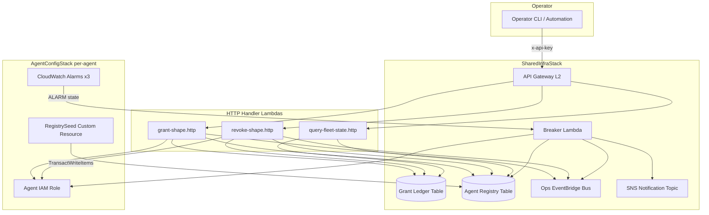
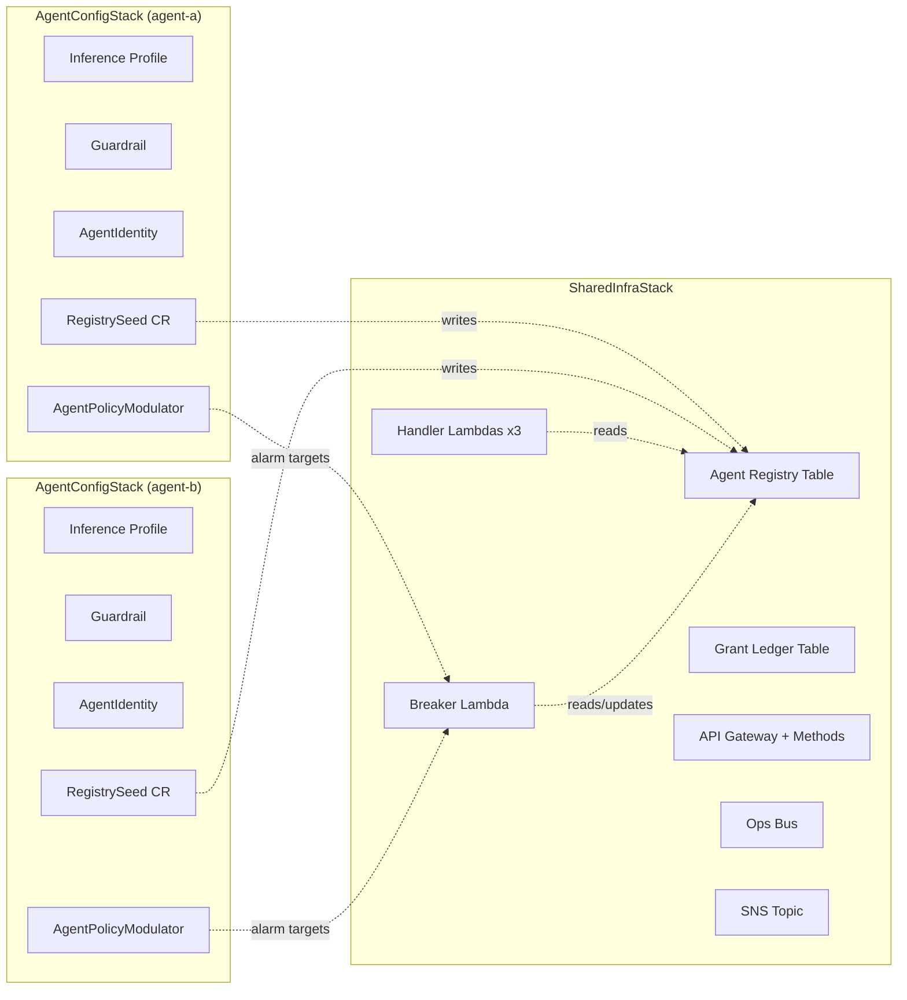
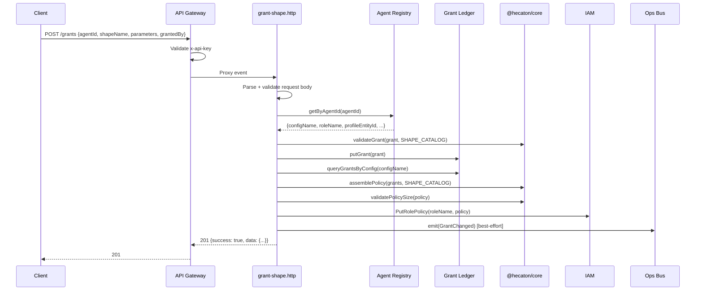
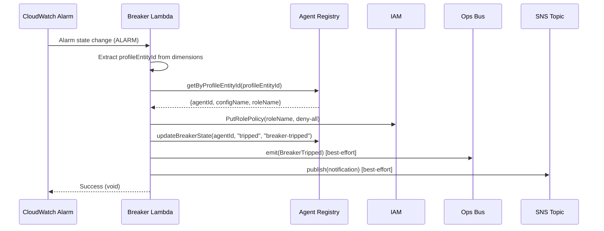

# Design Document: Policy Modulator Lambda Wiring

## Overview

This design covers Bundle A of Hecatoncheires Phase 1 remaining work: the AgentPolicyModulator CDK construct, shared Breaker Lambda, Agent Registry table, API Gateway L2 upgrade with method wiring, and the runtime plumbing connecting these pieces.

The bundle introduces three key capabilities:
1. **Per-agent CloudWatch alarms** that monitor token usage and guardrail violations, targeting a **single shared Breaker Lambda** in SharedInfraStack that resolves alarm dimensions to agent identity via a new Agent Registry table.
2. **Agent Registry** — a DynamoDB single-table design with overloaded keys that stores agent metadata, profile-to-agent reverse lookups (for breaker resolution), and config-to-agent reverse lookups (for internal identity resolution). A CDK Provider-based custom resource Lambda (RegistrySeed) manages the registry lifecycle.
3. **API Gateway upgrade** from L1 CfnRestApi to L2 RestApi with method integrations (POST /grants, DELETE /grants, GET /fleet), API key authentication, and proper deployment stage management.

### Key Design Decisions

| Decision | Rationale |
|----------|-----------|
| Single shared Breaker Lambda (not per-config) | Reduces Lambda count; alarm resolution happens via registry lookup rather than dedicated Lambdas |
| Agent Registry (DynamoDB single-table) over tag-based resolution | Sub-millisecond lookups, atomic multi-record transactions, extensible key schema for future record types |
| RegistrySeed as CDK Provider (not AwsCustomResource) | TransactWriteItems + UUIDv7 generation + conditional writes require custom logic beyond what AwsCustomResource supports |
| agentId (UUIDv7) as external identifier | K-sortable, globally unique, decouples external API surface from internal addressing (configName, roleName) |
| API Gateway L2 upgrade | Enables proper method integration, automatic deployment management, and usage plan association via CDK's type-safe APIs |
| Onboard-agent endpoint deferred to Phase 4 | Phase 1 agents are registered exclusively via CDK deploy; self-service provisioning is a Phase 4 concern |

---

## Architecture

### System Context Diagram



### Deployment Topology



### Request Flow: Grant Shape



### Request Flow: Breaker Trip



---

## Components and Interfaces

### 1. packages/core — NamingGenerator Extension

The `NamingGenerator` class gains one new method:

```typescript
/** Pattern: hecaton-{stage}-agent-registry */
agentRegistryTableName(): string {
  return `hecaton-${this.stage}-agent-registry`;
}
```

No other core changes. The feature is entirely an infrastructure + adapter concern.

---

### 2. packages/api — AgentRegistryPort

New port interface for agent identity resolution:

```typescript
// src/ports/agent-registry.port.ts

export interface AgentRegistryRecord {
  agentId: string;
  configName: string;
  roleName: string;
  profileEntityId: string;
  profileArn: string;
  agentType: string;
  modelId: string;
  guardrailId: string;
  status: string;
  breakerState: string;
}

export interface AgentRegistryPort {
  /** Resolve by external agentId (PK = AGENT#{agentId}, SK = #META) */
  getByAgentId(agentId: string): Promise<AgentRegistryRecord | null>;

  /** Resolve by inference profile entity ID (PK = PROFILE#{profileEntityId}) */
  getByProfileEntityId(profileEntityId: string): Promise<AgentRegistryRecord | null>;

  /** Resolve by configName (PK = CONFIG#{configName}) */
  getByConfigName(configName: string): Promise<AgentRegistryRecord | null>;

  /** Update breaker state + status + updatedAt on the metadata record */
  updateBreakerState(agentId: string, breakerState: string, status: string): Promise<void>;
}
```

---

### 3. packages/api — AgentRegistryAdapter

```typescript
// src/adapters/dynamo/agent-registry.adapter.ts

import { DynamoDBClient, GetItemCommand, QueryCommand, UpdateItemCommand } from '@aws-sdk/client-dynamodb';
import { InternalError } from '@hecaton/core';
import type { AgentRegistryPort, AgentRegistryRecord } from '../../ports/agent-registry.port.js';

export class AgentRegistryAdapter implements AgentRegistryPort {
  constructor(
    private readonly client: DynamoDBClient,
    private readonly tableName: string,
  ) {}

  async getByAgentId(agentId: string): Promise<AgentRegistryRecord | null> {
    const result = await this.client.send(new GetItemCommand({
      TableName: this.tableName,
      Key: { pk: { S: `AGENT#${agentId}` }, sk: { S: '#META' } },
    }));
    if (!result.Item) return null;
    return this.mapToRecord(result.Item);
  }

  async getByProfileEntityId(profileEntityId: string): Promise<AgentRegistryRecord | null> {
    // Query PK = PROFILE#{profileEntityId}, get agentId from first result
    const result = await this.client.send(new QueryCommand({
      TableName: this.tableName,
      KeyConditionExpression: 'pk = :pk',
      ExpressionAttributeValues: { ':pk': { S: `PROFILE#${profileEntityId}` } },
      Limit: 1,
    }));
    if (!result.Items || result.Items.length === 0) return null;
    const agentId = result.Items[0]['agentId']?.S;
    if (!agentId) return null;
    // Follow up with full metadata lookup
    return this.getByAgentId(agentId);
  }

  async getByConfigName(configName: string): Promise<AgentRegistryRecord | null> {
    const result = await this.client.send(new QueryCommand({
      TableName: this.tableName,
      KeyConditionExpression: 'pk = :pk',
      ExpressionAttributeValues: { ':pk': { S: `CONFIG#${configName}` } },
      Limit: 1,
    }));
    if (!result.Items || result.Items.length === 0) return null;
    const agentId = result.Items[0]['agentId']?.S;
    if (!agentId) return null;
    return this.getByAgentId(agentId);
  }

  async updateBreakerState(agentId: string, breakerState: string, status: string): Promise<void> {
    const now = new Date().toISOString();
    await this.client.send(new UpdateItemCommand({
      TableName: this.tableName,
      Key: { pk: { S: `AGENT#${agentId}` }, sk: { S: '#META' } },
      UpdateExpression: 'SET breakerState = :bs, #st = :s, updatedAt = :u',
      ExpressionAttributeNames: { '#st': 'status' },
      ExpressionAttributeValues: {
        ':bs': { S: breakerState },
        ':s': { S: status },
        ':u': { S: now },
      },
    }));
  }

  private mapToRecord(item: Record<string, { S?: string }>): AgentRegistryRecord {
    return {
      agentId: item['agentId']?.S ?? '',
      configName: item['configName']?.S ?? '',
      roleName: item['roleName']?.S ?? '',
      profileEntityId: item['profileEntityId']?.S ?? '',
      profileArn: item['profileArn']?.S ?? '',
      agentType: item['agentType']?.S ?? '',
      modelId: item['modelId']?.S ?? '',
      guardrailId: item['guardrailId']?.S ?? '',
      status: item['status']?.S ?? '',
      breakerState: item['breakerState']?.S ?? '',
    };
  }
}
```

---

### 4. packages/api — Dependencies Extension

```typescript
// src/shared/dependencies.ts (extended)

export interface Dependencies {
  grantLedger: GrantLedgerPort;
  operatingPolicy: OperatingPolicyPort;
  busEmitter: BusEmitterPort;
  agentRegistry: AgentRegistryPort;  // NEW
}
```

The `getDependencies()` factory instantiates `AgentRegistryAdapter` using `AGENT_REGISTRY_TABLE_NAME` env var.

A separate `getBreakerDependencies()` factory provides the breaker-specific dependency set including an `SnsNotifierPort` for SNS publishing:

```typescript
export interface BreakerDependencies extends Dependencies {
  snsNotifier: SnsNotifierPort;
}

export function getBreakerDependencies(): BreakerDependencies {
  // ... instantiates with SNS_TOPIC_ARN env var
}
```

---

### 5. packages/api — SNS Notifier Port + Adapter

```typescript
// src/ports/sns-notifier.port.ts
export interface SnsNotifierPort {
  publish(subject: string, message: string): Promise<void>;
}

// src/adapters/sns/sns-notifier.adapter.ts
import { SNSClient, PublishCommand } from '@aws-sdk/client-sns';

export class SnsNotifierAdapter implements SnsNotifierPort {
  constructor(
    private readonly client: SNSClient,
    private readonly topicArn: string,
  ) {}

  async publish(subject: string, message: string): Promise<void> {
    await this.client.send(new PublishCommand({
      TopicArn: this.topicArn,
      Subject: subject,
      Message: message,
    }));
  }
}
```

---

### 6. packages/api — Refactored Breaker Handler

The existing `breaker-trip.alarm.ts` handler is refactored to resolve via Agent Registry instead of alarm dimensions:

```typescript
// src/handlers/breaker-trip.alarm.ts (refactored)

export async function handler(event: CloudWatchAlarmEvent): Promise<void> {
  // 1. No-op for non-ALARM transitions
  if (event.detail.state.value !== 'ALARM') return;

  // 2. Extract profileEntityId from alarm metric dimensions
  const profileEntityId = extractProfileEntityId(event);
  if (!profileEntityId) {
    console.error('Cannot extract profileEntityId from alarm event', JSON.stringify(event));
    return; // Do not throw — prevents retry on parse failures
  }

  // 3. Resolve agent identity via registry
  const deps = getBreakerDependencies();
  const agent = await deps.agentRegistry.getByProfileEntityId(profileEntityId);
  if (!agent) {
    console.error('Cannot resolve profileEntityId to agent', { profileEntityId });
    return; // Do not throw
  }

  // 4. Invoke trip-breaker use-case (throws on IAM write failure → Lambda retries)
  await tripBreaker(
    {
      configName: agent.configName,
      roleName: agent.roleName,
      agentId: agent.agentId,
      reason: event.detail.state.reason,
      alarmName: event.detail.alarmName,
    },
    deps,
  );
}

function extractProfileEntityId(event: CloudWatchAlarmEvent): string | undefined {
  const metrics = event.detail.configuration?.metrics;
  if (!metrics || metrics.length === 0) return undefined;
  const dimensions = metrics[0]?.metricStat?.metric?.dimensions;
  return dimensions?.['InferenceProfileId'];
}
```

---

### 7. packages/api — Extended trip-breaker Use-Case

```typescript
// src/use-cases/trip-breaker.ts (extended)

export interface TripBreakerInput {
  configName: string;
  roleName: string;
  agentId: string;       // NEW
  reason: string;
  alarmName: string;     // NEW
}

export async function tripBreaker(
  input: TripBreakerInput,
  deps: BreakerDependencies,
): Promise<TripBreakerResult> {
  const trippedAt = new Date().toISOString();

  // 1. Write deny-all policy (MUST succeed — propagate error for retry)
  await deps.operatingPolicy.writePolicy(input.roleName, POLICY_NAME, DENY_ALL_POLICY);

  // 2. Update registry breaker state (best-effort)
  try {
    await deps.agentRegistry.updateBreakerState(input.agentId, 'tripped', 'breaker-tripped');
  } catch { /* best-effort */ }

  // 3. Emit breaker-tripped event (best-effort)
  try {
    await deps.busEmitter.emit(toBreakerTrippedEvent({
      configName: input.configName,
      roleName: input.roleName,
      alarmName: input.alarmName,
      reason: input.reason,
      timestamp: trippedAt,
    }));
  } catch { /* best-effort */ }

  // 4. Publish SNS notification (best-effort)
  try {
    await deps.snsNotifier.publish(
      `Breaker tripped: ${input.configName}`,
      `Agent ${input.configName} breaker tripped by alarm ${input.alarmName}. Reason: ${input.reason}`,
    );
  } catch { /* best-effort */ }

  return { configName: input.configName, roleName: input.roleName, operation: 'breaker-tripped', trippedAt };
}
```

---

### 8. packages/api — Grant/Revoke Handler agentId Resolution

Both handlers gain an agentId resolution step before calling the use-case:

```typescript
// src/handlers/grant-shape.http.ts (updated flow)

export async function handler(event: APIGatewayProxyEvent): Promise<APIGatewayProxyResult> {
  // 1. Parse request body (now includes agentId instead of configName/roleName)
  const parseResult = GrantShapeRequestSchema.safeParse(JSON.parse(event.body ?? '{}'));
  if (!parseResult.success) {
    return errorResponse(400, 'VALIDATION_ERROR', 'Invalid request body', parseResult.error.issues);
  }

  // 2. Resolve agentId → configName + roleName via registry
  const deps = getDependencies();
  const agent = await deps.agentRegistry.getByAgentId(parseResult.data.agentId);
  if (!agent) {
    return errorResponse(404, 'AGENT_NOT_FOUND', `Agent not found: ${parseResult.data.agentId}`);
  }

  // 3. Map to domain (using resolved configName)
  const grant = toDomain(parseResult.data, agent.configName);

  // 4. Execute use-case with resolved roleName
  try {
    const result = await grantShape(grant, agent.roleName, deps);
    return successResponse(201, toResponse(result, agent.agentId));
  } catch (err) {
    if (err instanceof DomainError) {
      const status = errorStatusMap[err.code] ?? 500;
      return errorResponse(status, err.code, err.message, err.details);
    }
    return errorResponse(500, 'INTERNAL_ERROR', 'An unexpected error occurred');
  }
}
```

The `GrantShapeRequestSchema` is updated:

```typescript
export const GrantShapeRequestSchema = z.object({
  agentId: z.string().uuid(),       // NEW: external agent identifier
  shapeName: z.string().min(1),
  parameters: z.record(z.string(), z.string()),
  grantedBy: z.string().min(1),
  expiresAt: z.string().datetime().optional(),
});
```

---

### 9. packages/cdk — Agent Registry Table (SharedInfraStack)

Added to `SharedInfraStack`:

```typescript
// DynamoDB table: hecaton-{stage}-agent-registry
const registryTable = new dynamodb.Table(this, 'AgentRegistryTable', {
  tableName: naming.agentRegistryTableName(),
  partitionKey: { name: 'pk', type: dynamodb.AttributeType.STRING },
  sortKey: { name: 'sk', type: dynamodb.AttributeType.STRING },
  billingMode: dynamodb.BillingMode.PAY_PER_REQUEST,
  pointInTimeRecovery: true,
  removalPolicy: cdk.RemovalPolicy.RETAIN,
});

// GSI for fleet queries (SK → PK inversion)
registryTable.addGlobalSecondaryIndex({
  indexName: 'gsi1',
  partitionKey: { name: 'sk', type: dynamodb.AttributeType.STRING },
  sortKey: { name: 'pk', type: dynamodb.AttributeType.STRING },
});

this.agentRegistryTable = registryTable;
```

---

### 10. packages/cdk — Breaker Lambda (SharedInfraStack)

```typescript
import { NodejsFunction } from 'aws-cdk-lib/aws-lambda-nodejs';
import * as lambda from 'aws-cdk-lib/aws-lambda';

const breakerLambda = new NodejsFunction(this, 'BreakerLambda', {
  functionName: naming.lambdaName('breaker-trip'),
  entry: path.join(__dirname, '../../../../packages/api/src/handlers/breaker-trip.alarm.ts'),
  runtime: lambda.Runtime.NODEJS_20_X,
  architecture: lambda.Architecture.ARM_64,
  memorySize: 256,
  timeout: cdk.Duration.seconds(30),
  environment: {
    AGENT_REGISTRY_TABLE_NAME: registryTable.tableName,
    OPS_BUS_ARN: bus.eventBusArn,
    SNS_TOPIC_ARN: topic.topicArn,
    OPERATING_POLICY_NAME: 'hecaton-operating-policy',
  },
});

// IAM permissions (least-privilege)
registryTable.grant(breakerLambda, 'dynamodb:Query', 'dynamodb:GetItem', 'dynamodb:UpdateItem');
bus.grantPutEventsTo(breakerLambda);
topic.grantPublish(breakerLambda);

// IAM PutRolePolicy scoped to agent roles
breakerLambda.addToRolePolicy(new iam.PolicyStatement({
  actions: ['iam:PutRolePolicy'],
  resources: [`arn:aws:iam::${this.account}:role/hecaton-${stage}-*-agent-role`],
}));

this.breakerLambda = breakerLambda;
```

---

### 11. packages/cdk — API Gateway L2 Upgrade (SharedInfraStack)

Replace the existing L1 `CfnRestApi` with an L2 `RestApi`:

```typescript
const api = new apigateway.RestApi(this, 'ApiGateway', {
  restApiName: naming.apiGatewayName(),
  apiKeySourceType: apigateway.ApiKeySourceType.HEADER,
  deploy: true,
  deployOptions: { stageName: stage },
});

// Resources
const grantsResource = api.root.addResource('grants');
const fleetResource = api.root.addResource('fleet');

// Handler Lambdas
const grantLambda = new NodejsFunction(this, 'GrantShapeLambda', {
  functionName: naming.lambdaName('grant-shape'),
  entry: 'packages/api/src/handlers/grant-shape.http.ts',
  runtime: lambda.Runtime.NODEJS_20_X,
  architecture: lambda.Architecture.ARM_64,
  memorySize: 256,
  timeout: cdk.Duration.seconds(30),
  environment: {
    GRANT_LEDGER_TABLE_NAME: grantLedgerTable.tableName,
    AGENT_REGISTRY_TABLE_NAME: registryTable.tableName,
    OPS_BUS_ARN: bus.eventBusArn,
    OPERATING_POLICY_NAME: 'hecaton-operating-policy',
  },
});

// ... (revokeLambda, fleetLambda similarly)

// Method integrations
grantsResource.addMethod('POST', new apigateway.LambdaIntegration(grantLambda), {
  apiKeyRequired: true,
});
grantsResource.addMethod('DELETE', new apigateway.LambdaIntegration(revokeLambda), {
  apiKeyRequired: true,
});
fleetResource.addMethod('GET', new apigateway.LambdaIntegration(fleetLambda), {
  apiKeyRequired: true,
});

// Usage plan + API key
const plan = api.addUsagePlan('UsagePlan', {
  name: `${naming.apiGatewayName()}-plan`,
  apiStages: [{ api, stage: api.deploymentStage }],
});
const apiKey = api.addApiKey('ApiKey');
plan.addApiKey(apiKey);
```

---

### 12. packages/cdk — AgentPolicyModulator Construct

```typescript
// lib/constructs/agent-policy-modulator.construct.ts

export interface AgentPolicyModulatorProps {
  configName: string;
  profileEntityId: string;
  profileArn: string;
  modelId: string;
  agentRole: iam.IRole;
  agentType: string;
  guardrailId: string;
  breakerLambda: lambda.IFunction;
  agentRegistryTable: dynamodb.ITable;
  stage: string;
  thresholds: {
    outputTokensPerHour: number;
    guardrailBlocksPer10Min: number;
    guardrailObservationsPerHour: number;
  };
}

export interface AgentPolicyModulatorOutputs {
  tokenAlarm: cloudwatch.IAlarm;
  blockAlarm: cloudwatch.IAlarm;
  observationAlarm: cloudwatch.IAlarm;
}

export class AgentPolicyModulator extends Construct {
  readonly outputs: AgentPolicyModulatorOutputs;

  constructor(scope: Construct, id: string, props: AgentPolicyModulatorProps) {
    super(scope, id);

    // --- Validation ---
    if (!props.configName || props.configName.trim().length === 0) {
      throw new Error('AgentPolicyModulator: configName must be non-empty');
    }
    if (!props.profileEntityId || props.profileEntityId.trim().length === 0) {
      throw new Error('AgentPolicyModulator: profileEntityId must be non-empty');
    }
    this.validateThresholds(props.thresholds);

    const naming = new NamingGenerator(props.stage);
    const alarmNames = naming.alarmNames(props.configName);

    // --- CloudWatch Alarms ---
    const metricDimension = { InferenceProfileId: props.profileEntityId };

    const tokenAlarm = new cloudwatch.Alarm(this, 'TokenAlarm', {
      alarmName: alarmNames.token,
      metric: new cloudwatch.Metric({
        namespace: 'AWS/Bedrock',
        metricName: 'OutputTokenCount',
        dimensionsMap: metricDimension,
        statistic: 'Sum',
        period: cdk.Duration.seconds(3600),
      }),
      threshold: props.thresholds.outputTokensPerHour,
      evaluationPeriods: 1,
      datapointsToAlarm: 1,
      comparisonOperator: cloudwatch.ComparisonOperator.GREATER_THAN_OR_EQUAL_TO_THRESHOLD,
      treatMissingData: cloudwatch.TreatMissingData.NOT_BREACHING,
    });

    const blockAlarm = new cloudwatch.Alarm(this, 'BlockAlarm', {
      alarmName: alarmNames.block,
      metric: new cloudwatch.Metric({
        namespace: 'AWS/Bedrock',
        metricName: 'GuardrailBlocked',
        dimensionsMap: metricDimension,
        statistic: 'Sum',
        period: cdk.Duration.seconds(600),
      }),
      threshold: props.thresholds.guardrailBlocksPer10Min,
      evaluationPeriods: 1,
      datapointsToAlarm: 1,
      comparisonOperator: cloudwatch.ComparisonOperator.GREATER_THAN_OR_EQUAL_TO_THRESHOLD,
      treatMissingData: cloudwatch.TreatMissingData.NOT_BREACHING,
    });

    const observationAlarm = new cloudwatch.Alarm(this, 'ObservationAlarm', {
      alarmName: alarmNames.observation,
      metric: new cloudwatch.Metric({
        namespace: 'AWS/Bedrock',
        metricName: 'GuardrailObserved',
        dimensionsMap: metricDimension,
        statistic: 'Sum',
        period: cdk.Duration.seconds(3600),
      }),
      threshold: props.thresholds.guardrailObservationsPerHour,
      evaluationPeriods: 1,
      datapointsToAlarm: 1,
      comparisonOperator: cloudwatch.ComparisonOperator.GREATER_THAN_OR_EQUAL_TO_THRESHOLD,
      treatMissingData: cloudwatch.TreatMissingData.NOT_BREACHING,
    });

    // --- Alarm actions → Breaker Lambda ---
    const alarmAction = new cw_actions.LambdaAction(props.breakerLambda);
    tokenAlarm.addAlarmAction(alarmAction);
    blockAlarm.addAlarmAction(alarmAction);
    observationAlarm.addAlarmAction(alarmAction);

    // --- Lambda invoke permission (cross-stack) ---
    props.breakerLambda.addPermission(`AllowAlarm-${props.configName}`, {
      principal: new iam.ServicePrincipal('lambda.amazonaws.com'),
      sourceArn: tokenAlarm.alarmArn,
    });
    // Note: CDK LambdaAction handles permissions automatically, but explicit
    // permissions scoped per alarm ARN provide tighter control.

    // --- RegistrySeed Custom Resource ---
    const registrySeedHandler = new NodejsFunction(this, 'RegistrySeedHandler', {
      runtime: lambda.Runtime.NODEJS_20_X,
      architecture: lambda.Architecture.ARM_64,
      memorySize: 128,
      timeout: cdk.Duration.seconds(30),
      entry: path.join(__dirname, '../../lambda/registry-seed.handler.ts'),
      environment: {
        AGENT_REGISTRY_TABLE_NAME: props.agentRegistryTable.tableName,
      },
    });

    // Grant DynamoDB permissions to seed handler
    props.agentRegistryTable.grant(
      registrySeedHandler,
      'dynamodb:PutItem',
      'dynamodb:GetItem',
      'dynamodb:DeleteItem',
      'dynamodb:TransactWriteItems',
    );

    const provider = new cr.Provider(this, 'RegistrySeedProvider', {
      onEventHandler: registrySeedHandler,
    });

    const registrySeedCR = new cdk.CustomResource(this, 'RegistrySeed', {
      serviceToken: provider.serviceToken,
      properties: {
        configName: props.configName,
        roleName: props.agentRole.roleName,
        profileEntityId: props.profileEntityId,
        profileArn: props.profileArn,
        agentType: props.agentType,
        modelId: props.modelId,
        guardrailId: props.guardrailId,
      },
    });

    // Expose agentId as CfnOutput
    const agentId = registrySeedCR.getAttString('agentId');
    new cdk.CfnOutput(this, 'AgentId', {
      value: agentId,
      exportName: `${cdk.Stack.of(this).stackName}-agentId`,
    });

    // --- Tags ---
    const tags = NamingGenerator.prototype.tags.call(naming, props.configName, { phase: '1' });
    for (const [key, value] of Object.entries(tags)) {
      cdk.Tags.of(this).add(key, value);
    }

    // --- Outputs ---
    this.outputs = { tokenAlarm, blockAlarm, observationAlarm };
  }

  private validateThresholds(thresholds: AgentPolicyModulatorProps['thresholds']): void {
    const entries = Object.entries(thresholds) as [string, number][];
    for (const [key, value] of entries) {
      if (!Number.isInteger(value) || value <= 0) {
        throw new Error(`AgentPolicyModulator: thresholds.${key} must be a positive integer, got ${value}`);
      }
    }
  }
}
```

---

### 13. packages/cdk — RegistrySeed Lambda Handler

```typescript
// lib/lambda/registry-seed.handler.ts

import { DynamoDBClient, TransactWriteItemsCommand, GetItemCommand } from '@aws-sdk/client-dynamodb';
import { v7 as uuidv7 } from 'uuid';

interface CdkCustomResourceEvent {
  RequestType: 'Create' | 'Update' | 'Delete';
  ResourceProperties: {
    configName: string;
    roleName: string;
    profileEntityId: string;
    profileArn: string;
    agentType: string;
    modelId: string;
    guardrailId: string;
  };
  OldResourceProperties?: Record<string, string>;
  PhysicalResourceId?: string;
}

interface CdkCustomResourceResponse {
  PhysicalResourceId: string;
  Data?: Record<string, string>;
}

const client = new DynamoDBClient({});
const TABLE_NAME = process.env.AGENT_REGISTRY_TABLE_NAME!;

export async function handler(event: CdkCustomResourceEvent): Promise<CdkCustomResourceResponse> {
  switch (event.RequestType) {
    case 'Create': return onCreate(event);
    case 'Update': return onUpdate(event);
    case 'Delete': return onDelete(event);
  }
}

async function onCreate(event: CdkCustomResourceEvent): Promise<CdkCustomResourceResponse> {
  const props = event.ResourceProperties;
  const agentId = uuidv7();
  const now = new Date().toISOString();

  await client.send(new TransactWriteItemsCommand({
    TransactItems: [
      {
        Put: {
          TableName: TABLE_NAME,
          Item: {
            pk: { S: `AGENT#${agentId}` },
            sk: { S: '#META' },
            agentId: { S: agentId },
            configName: { S: props.configName },
            roleName: { S: props.roleName },
            profileEntityId: { S: props.profileEntityId },
            profileArn: { S: props.profileArn },
            agentType: { S: props.agentType },
            modelId: { S: props.modelId },
            guardrailId: { S: props.guardrailId },
            status: { S: 'active' },
            breakerState: { S: 'armed' },
            createdAt: { S: now },
            updatedAt: { S: now },
          },
          ConditionExpression: 'attribute_not_exists(pk)',
        },
      },
      {
        Put: {
          TableName: TABLE_NAME,
          Item: {
            pk: { S: `PROFILE#${props.profileEntityId}` },
            sk: { S: `AGENT#${agentId}` },
            agentId: { S: agentId },
            configName: { S: props.configName },
            roleName: { S: props.roleName },
          },
        },
      },
      {
        Put: {
          TableName: TABLE_NAME,
          Item: {
            pk: { S: `CONFIG#${props.configName}` },
            sk: { S: `AGENT#${agentId}` },
            agentId: { S: agentId },
          },
        },
      },
    ],
  }));

  return {
    PhysicalResourceId: agentId,
    Data: { agentId },
  };
}

async function onUpdate(event: CdkCustomResourceEvent): Promise<CdkCustomResourceResponse> {
  const props = event.ResourceProperties;
  const agentId = event.PhysicalResourceId!;

  // Read existing metadata to check if profileEntityId changed
  const existing = await client.send(new GetItemCommand({
    TableName: TABLE_NAME,
    Key: { pk: { S: `AGENT#${agentId}` }, sk: { S: '#META' } },
  }));

  const oldProfileEntityId = existing.Item?.['profileEntityId']?.S;
  const createdAt = existing.Item?.['createdAt']?.S ?? new Date().toISOString();
  const now = new Date().toISOString();

  const transactItems: any[] = [
    {
      Put: {
        TableName: TABLE_NAME,
        Item: {
          pk: { S: `AGENT#${agentId}` },
          sk: { S: '#META' },
          agentId: { S: agentId },
          configName: { S: props.configName },
          roleName: { S: props.roleName },
          profileEntityId: { S: props.profileEntityId },
          profileArn: { S: props.profileArn },
          agentType: { S: props.agentType },
          modelId: { S: props.modelId },
          guardrailId: { S: props.guardrailId },
          status: { S: existing.Item?.['status']?.S ?? 'active' },
          breakerState: { S: existing.Item?.['breakerState']?.S ?? 'armed' },
          createdAt: { S: createdAt },
          updatedAt: { S: now },
        },
      },
    },
    {
      Put: {
        TableName: TABLE_NAME,
        Item: {
          pk: { S: `PROFILE#${props.profileEntityId}` },
          sk: { S: `AGENT#${agentId}` },
          agentId: { S: agentId },
          configName: { S: props.configName },
          roleName: { S: props.roleName },
        },
      },
    },
    {
      Put: {
        TableName: TABLE_NAME,
        Item: {
          pk: { S: `CONFIG#${props.configName}` },
          sk: { S: `AGENT#${agentId}` },
          agentId: { S: agentId },
        },
      },
    },
  ];

  // Clean up stale profile reverse-lookup if profileEntityId changed
  if (oldProfileEntityId && oldProfileEntityId !== props.profileEntityId) {
    transactItems.push({
      Delete: {
        TableName: TABLE_NAME,
        Key: {
          pk: { S: `PROFILE#${oldProfileEntityId}` },
          sk: { S: `AGENT#${agentId}` },
        },
      },
    });
  }

  await client.send(new TransactWriteItemsCommand({ TransactItems: transactItems }));

  return {
    PhysicalResourceId: agentId,
    Data: { agentId },
  };
}

async function onDelete(event: CdkCustomResourceEvent): Promise<CdkCustomResourceResponse> {
  const props = event.ResourceProperties;
  const agentId = event.PhysicalResourceId!;

  await client.send(new TransactWriteItemsCommand({
    TransactItems: [
      {
        Delete: {
          TableName: TABLE_NAME,
          Key: { pk: { S: `AGENT#${agentId}` }, sk: { S: '#META' } },
        },
      },
      {
        Delete: {
          TableName: TABLE_NAME,
          Key: { pk: { S: `PROFILE#${props.profileEntityId}` }, sk: { S: `AGENT#${agentId}` } },
        },
      },
      {
        Delete: {
          TableName: TABLE_NAME,
          Key: { pk: { S: `CONFIG#${props.configName}` }, sk: { S: `AGENT#${agentId}` } },
        },
      },
    ],
  }));

  return { PhysicalResourceId: agentId };
}
```

---

### 14. packages/cdk — AgentConfigStack Updates

The abstract `AgentConfigStack` exposes the profile entity ID and instantiates the `AgentPolicyModulator`:

```typescript
// Additions to agent-config.stack.ts

// After creating the inference profile:
const profileEntityId = inferenceProfile.attrInferenceProfileId;

// Store as class property:
readonly profileEntityId: string;

// In constructor:
this.profileEntityId = profileEntityId;

// Instantiate AgentPolicyModulator (after AgentIdentity):
const modulator = new AgentPolicyModulator(this, 'PolicyModulator', {
  configName,
  profileEntityId,
  profileArn,
  modelId,
  agentRole: agentIdentity.outputs.role,
  agentType,
  guardrailId,
  breakerLambda: props.sharedInfra.breakerLambda,
  agentRegistryTable: props.sharedInfra.agentRegistryTable,
  stage,
  thresholds: props.thresholds,
});

// CfnOutput for profileEntityId:
new cdk.CfnOutput(this, 'ProfileEntityId', {
  value: profileEntityId,
  exportName: `${this.stackName}-profileEntityId`,
});
```

The `AgentConfigStackProps` gains:
```typescript
thresholds: {
  outputTokensPerHour: number;
  guardrailBlocksPer10Min: number;
  guardrailObservationsPerHour: number;
};
```

And `sharedInfra` gains:
```typescript
sharedInfra: {
  // ... existing
  breakerLambda: lambda.IFunction;
  agentRegistryTable: dynamodb.ITable;
};
```

---

## Data Models

### Agent Registry Table Schema

**Table Name:** `hecaton-{stage}-agent-registry`
**Key Schema:** `pk` (String, HASH), `sk` (String, RANGE)
**GSI:** `gsi1` — `sk` (HASH), `pk` (RANGE)

#### Record Types

| Record Type | PK Pattern | SK Pattern | Fields |
|-------------|-----------|-----------|--------|
| Agent Metadata | `AGENT#{agentId}` | `#META` | agentId, configName, roleName, profileEntityId, profileArn, agentType, modelId, guardrailId, status, breakerState, createdAt, updatedAt |
| Profile Reverse-Lookup | `PROFILE#{profileEntityId}` | `AGENT#{agentId}` | agentId, configName, roleName |
| Config Reverse-Lookup | `CONFIG#{configName}` | `AGENT#{agentId}` | agentId |

#### Access Patterns

| Access Pattern | Key Condition | Used By |
|---------------|--------------|---------|
| Get agent by agentId | PK = `AGENT#{agentId}`, SK = `#META` | HTTP handlers (agentId resolution) |
| Get agent by profileEntityId | PK = `PROFILE#{profileEntityId}` | Breaker Lambda (alarm resolution) |
| Get agent by configName | PK = `CONFIG#{configName}` | Internal consumers |
| List all agents (fleet) | GSI1: PK = `#META` | query-fleet-state handler |
| Update breaker state | PK = `AGENT#{agentId}`, SK = `#META` | Breaker Lambda |

#### GSI1 Usage

The inverted index (`sk` → `pk`) enables fleet-level queries without scanning. Querying GSI1 with PK = `#META` returns all agent metadata records ordered by agentId (the original PK value), enabling efficient fleet state queries.

### Updated Grant Shape Request DTO

```typescript
{
  agentId: string;        // UUIDv7 — replaces configName/roleName
  shapeName: string;
  parameters: Record<string, string>;
  grantedBy: string;
  expiresAt?: string;     // ISO 8601
}
```

### Updated Revoke Shape Request DTO

```typescript
{
  agentId: string;        // UUIDv7
  grantId: string;
}
```

### Fleet State Response DTO

```typescript
{
  success: true;
  data: {
    agents: Array<{
      agentId: string;
      configName: string;
      agentType: string;
      modelId: string;
      status: string;
      breakerState: string;
      grants: GrantRecord[];
    }>;
  };
}
```

### CloudWatch Alarm Metric Dimensions

Each alarm uses the `InferenceProfileId` dimension to scope metrics to a single agent's inference profile:

```typescript
{
  InferenceProfileId: profileEntityId  // From CfnApplicationInferenceProfile.attrInferenceProfileId
}
```

This is the dimension the Breaker Lambda extracts to perform the registry reverse-lookup.

---

## Error Handling

### Handler-Level Error Strategy

All handlers follow the existing pattern: catch `DomainError` subclasses and map to HTTP status codes. New error codes:

| Error Code | HTTP Status | Trigger |
|-----------|------------|---------|
| `AGENT_NOT_FOUND` | 404 | agentId lookup returns no registry record |
| `POLICY_SIZE_EXCEEDED` | 400 | Assembled policy > 10,240 bytes |
| `SHAPE_NOT_FOUND` | 404 | Grant references unknown shapeName |
| `VALIDATION_ERROR` | 400 | Request body fails schema validation |

The `errorStatusMap` is extended:
```typescript
export const errorStatusMap: Record<string, number> = {
  // ... existing
  AGENT_NOT_FOUND: 404,
  POLICY_SIZE_EXCEEDED: 400,
};
```

### Breaker Lambda Error Strategy

The breaker Lambda follows a **fail-open-on-parse, fail-closed-on-write** strategy:

1. **Parse/resolution failures** → log at ERROR, return successfully (no retry). This prevents infinite retries on malformed events.
2. **IAM policy write failure** → propagate error (throw). Lambda runtime retries the invocation, ensuring the breaker eventually fires.
3. **Registry update, event emission, SNS publish failures** → swallowed (best-effort). The critical path (deny-all policy write) already succeeded.

### RegistrySeed Lambda Error Strategy

- **Conditional write conflict on Create** (ConditionalCheckFailedException): Indicates a retry of a previously successful create. The handler returns the existing agentId from the physical resource ID — CDK Provider framework handles idempotency.
- **GetItem failure on Update/Delete**: Propagate error. CDK will surface it as a stack update failure.
- **TransactWriteItems failure**: Propagate error. CDK rolls back the stack operation.

### Grant Rollback on Policy Size Violation

When `assemblePolicy` produces a document exceeding 10,240 bytes:
1. The newly written grant is deleted from the ledger (`deleteGrant`)
2. A `PolicySizeExceededError` (extends `DomainError`, code: `POLICY_SIZE_EXCEEDED`) is thrown
3. The handler catches it and returns HTTP 400

---

## Correctness Properties

The following invariants must hold across all system states. While this feature is predominantly infrastructure and I/O adapters (not suitable for traditional property-based testing with random input generation), these properties serve as correctness contracts verified through example-based tests and CDK assertions.

### Property 1: Registry Consistency

**Validates: Requirements 6.6, 6.8, 6.9, 13.2**

After any RegistrySeed lifecycle event (create, update, delete), querying the Agent_Registry by agentId, profileEntityId, or configName must resolve to the same agent record. The three record types (metadata, profile reverse-lookup, config reverse-lookup) must remain in sync — no orphaned reverse-lookup records pointing to nonexistent metadata, and no metadata records unreachable via either reverse-lookup path.

**Verification:** Unit tests on RegistrySeed handler exercising create→update→delete sequences, asserting all three records are consistent after each operation.

### Property 2: Breaker Safety (Fail-Closed on Write)

**Validates: Requirements 3.3, 3.9, 4.1, 4.2**

If a CloudWatch alarm transitions to ALARM state AND the inference profile entity ID resolves to a valid agent in the registry, the agent's operating policy MUST be rewritten to deny-all within a single Lambda invocation. The IAM write is the only non-best-effort operation — its failure MUST propagate (causing Lambda retry) rather than being swallowed.

**Verification:** Handler unit tests asserting that IAM write errors propagate while registry/event/SNS errors are swallowed. Integration test deploying + triggering an alarm and verifying the deny-all policy appears on the role.

### Property 3: agentId Stability

**Validates: Requirements 6.6, 6.7, 15.2**

Once generated for a given agent configuration (on first CDK deploy), the agentId never changes across subsequent stack updates. The RegistrySeed's `onUpdate` handler preserves the existing agentId from the physical resource ID and the metadata record — it never regenerates.

**Verification:** Unit tests on RegistrySeed handler: create returns an agentId, then update with changed props returns the same agentId. CDK assertion test verifying the custom resource's physical resource ID is used as the agentId on updates.

### Property 4: Grant-Policy Coherence

**Validates: Requirements 2.2, 2.3, 2.4, 2.5, 2.7**

After any successful grant or revoke operation, the operating policy on the agent's IAM role reflects EXACTLY the set of grants currently in the ledger for that configName. Zero grants → deny-all. N grants → union of all resolved shape statements. No stale grants remain in the policy, and no grants are missing from it.

**Verification:** Existing property verified by `assemblePolicy` unit tests in core (already implemented). Handler-level tests verify the full flow: write grant → query all → assemble → write policy. Rollback tests verify that a failed size validation results in the grant being removed AND the policy reflecting the pre-operation state.

---

## Testing Strategy

### Why PBT Does Not Apply

This feature is predominantly Infrastructure as Code (CDK constructs, CloudWatch alarms, DynamoDB tables, API Gateway configuration) combined with I/O adapters (DynamoDB reads/writes, IAM policy writes, SNS publishes). The code is:
- **Declarative configuration** — CDK constructs describe desired state, not computed outputs
- **Side-effect-only operations** — adapter methods call AWS SDK clients with no return-value transformation to assert universal properties on
- **External service integration** — testing "does DynamoDB return the record I wrote?" is an integration concern, not a property

The appropriate testing strategies are **CDK assertion tests** (snapshot-based template verification) and **example-based unit tests** with mocked adapters.

### Test Categories

#### CDK Assertion Tests (packages/cdk/test/)

| Test Suite | What It Verifies |
|-----------|------------------|
| `constructs/agent-policy-modulator.construct.test.ts` | 3 alarms with correct metrics/periods/thresholds, alarm actions target Breaker Lambda, RegistrySeed custom resource with correct properties, RegistrySeed Lambda IAM policy |
| `stacks/shared-infra.stack.test.ts` (extended) | Agent Registry table (pk/sk keys, GSI, PITR, billing), Breaker Lambda (env vars, runtime, memory), API Gateway methods (POST/DELETE/GET), usage plan + API key, Lambda permissions |
| `stacks/agent-config.stack.test.ts` | AgentPolicyModulator instantiated, profileEntityId output, thresholds passed through |

#### Unit Tests — Use-Cases (packages/api)

| Test File | What It Verifies |
|----------|------------------|
| `use-cases/trip-breaker.test.ts` | Deny-all policy written, registry updated, event emitted (best-effort), SNS published (best-effort), IAM failure propagates |
| `use-cases/grant-shape.test.ts` (extended) | Policy size rollback, unknown shape error |
| `use-cases/revoke-shape.test.ts` (extended) | Zero-grants → deny-all |

#### Unit Tests — Handlers (packages/api)

| Test File | What It Verifies |
|----------|------------------|
| `handlers/breaker-trip.alarm.test.ts` | Profile entity ID extraction, registry resolution, non-ALARM no-op, missing dimensions logged + returns, use-case error propagates |
| `handlers/grant-shape.http.test.ts` (extended) | agentId resolution, 404 on unknown agent, existing grant flow |
| `handlers/revoke-shape.http.test.ts` (extended) | agentId resolution, 404 on unknown agent |
| `handlers/query-fleet-state.http.test.ts` (extended) | Response includes agentId, configName, status, breakerState per agent |

#### Unit Tests — Adapters (packages/api)

| Test File | What It Verifies |
|----------|------------------|
| `adapters/dynamo/agent-registry.adapter.test.ts` | getByAgentId, getByProfileEntityId (two-step), getByConfigName (two-step), updateBreakerState, null returns on missing items |
| `adapters/sns/sns-notifier.adapter.test.ts` | PublishCommand sent with correct params, error wrapping |

#### Integration Tests (test/)

| Test | What It Verifies |
|------|------------------|
| Deploy + invoke (test account) | End-to-end: alarm fires → breaker trips → policy written → registry updated |

### Test Patterns

- **CDK tests**: `Template.fromStack()` with `hasResourceProperties`, `resourceCountIs`, `Match.arrayWith` (consistent with existing `shared-infra.stack.test.ts`)
- **Handler tests**: Mock `getDependencies()` / `getBreakerDependencies()`, assert call sequences
- **Adapter tests**: Mock AWS SDK clients at the `send()` level, verify command construction
- **Use-case tests**: Inject mock `Dependencies` objects, verify orchestration order and error handling
